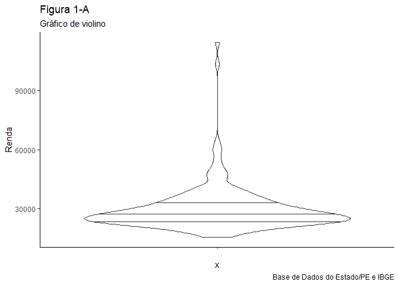
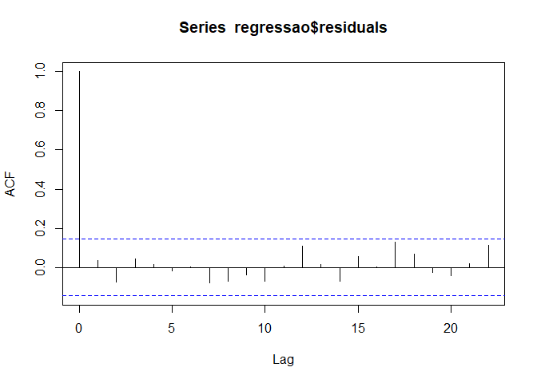

Trabalho final
================
Artur Gueiros
08/10/2020

### Universidade Federal de Pernambuco

### Programa de Pós-graduação em Ciência Política

### Departamento de Ciência Política

### Análise de Dados 2020.1

### Prof.: Rodrigo Martins

### DESIGUALDADE E VIOLÊNCIA EM PERNAMBUCO

### APRESENTAÇÃO

Este trabalho tem por objetivo principal demonstrar e aplicar os
conhecimentos adquiridos durante a disciplina de Análise de Dados do
mestrado em ciência política da UFPE, no primeiro semestre de 2020. No
texto em formato de artigo serão utilizados os conceitos de pesquisa
científica, de estatística, os métodos e técnicas de análise
quantitativa e a linguagem de programação estatística R aprendidos ao
longo do curso. Naturalmente, nem todos os conhecimentos de R e de
análise de dados aprendidos puderam ser utilizados, uma vez que cada
desenho de pesquisa requer o uso de modelos específicos e diferentes
entre si. Os comandos em R foram deliberadamente explicitados para
facilitar a avaliação do uso da ferramenta, por tratar-se de um trabalho
disciplinar.

### CONTEXTUALIZAÇÃO, JUSTIFICATIVA E FUNDAMENTAÇÃO TEÓRICA

A história da violência no Brasil é uma das chagas de nossa realidade
social, tendo entre suas principais causas a situação de pobreza,
desamparo e desigualdade econômica presentes em nosso país. Várias
pesquisas no Brasil costumam apontar uma associação entre a violência
por homicídio e as variáveis e indicadores de desigualdade social(1-4).

O Brasil se encontra no topo do ranking de desigualdade, entre os dez
mais desiguais(5), e da mesma forma, segundo o Atlas da Violência de
2018, produzido pelo Instituto de Pesquisa Econômica Aplicada (Ipea) e o
Fórum Brasileiro de Segurança Pública, em 2016, “Pela primeira vez na
história, o número de homicídios no Brasil superou a casa dos 60 mil por
ano. Foram 62.517 assassinatos registrados em 2016, superando o patamar
de 30 mortes por 100.000 habitantes. Esse dado coloca o Brasil entre os
dez países mais violentos do mundo, com uma taxa de homicídios 30 vezes
maior que o da Europa.”(6).

Sendo assim, optamos por abordar neste trabalho a desigualdade de
distribuição de renda e sua associação com a taxa de CVLI (crimes
violentos letais intencionais) especificamente no Estado de Pernambuco,
por meio dos seus mais de cento e oitenta municípios. Lembramos que o
Estado de Pernambuco desenvolveu o programa Pacto pela Vida, política
pública transversal, que reconhece os indicadores sociais como parte
importante do problema da violência no Estado.

A pesquisa se justifica pela relevância e atualidade do tema, que
envolve duas fragilidades brasileiras desde seus tempos fundacionais: a
desigualdade social e a violência. Os dois tópicos são como elefantes na
sala, que envergonham o país diante das outras nações e de si mesmo.
Neste sentido, todos os esforços no intuito de prover mais luz a essa
realidade, são não apenas válidos como necessários. A correlação entre
esses dois fatores é conhecida e alvo de muitos e variados estudos,
contudo o que se procura realizar neste trabalho é aplicar as técnicas
de análise de dados quantitativos a uma realidade específica, o Estado
de Pernambuco, de modo a tentar confirmar neste grupo a teoria que
indica que quanto mais desigual é uma comunidade, mais violenta ela se
torna.

A realidade social da violência, por ter sua origem nas relações
humanas, se expressa de várias formas, deriva de diversos fatores e pode
ser mais bem compreendida conjuntamente por abordagens nas perspectivas
históricas, culturais, econômicas, políticas e sociais. Neste sentido, a
teoria causal proposta é a de que existe uma relação entre os
indicadores socioeconômicos dos municípios e os seus índices de mortes
intencionais, de modo que quanto melhores fossem esses indicadores, mais
baixos seriam os índices de assassinatos naquele município.

A questão que se coloca na pesquisa é: Qual a importância da
desigualdade econômica na geração da violência na sociedade? Quais as
possíveis nuances desta correlação?

Teoria causal: O aumento da desigualdade econômica causa a subida nos
números da violência.

Desigualdade (Conceito) ——-Teoria——-\> Violência (Conceito)

—–\> Operacionalização —–\>

Índice Gini (Mensurada) ——Hipótese——-\> Taxa de CVLI (Mensurada)

Além de levar a preocupação geral sobre os efeitos da realidade
socioeconômica na violência para o Nordeste brasileiro, a pesquisa
utiliza uma cesta de variáveis independentes particular e foca
especificamente nos Crimes Violentos Letais Intencionais enquanto
variável dependente e busca respostas para a realidade dos municípios,
podendo auxiliar nas políticas públicas sociais e de segurança.

### DESENHO DE PESQUISA

Trabalharemos com a hipótese de que municípios mais desiguais
economicamente apresentarão taxas de CVLI mais elevadas que aqueles com
pouca desigualdade. Ou seja, de que haverá uma correlação positiva entre
desigualdade e violência, operacionalizadas pelo índice Gini e a taxa de
CVLI por cem mil habitantes. Quanto maior o Gini (mais desigualdade de
renda), maior o CVLI.

O desenho de pesquisa do trabalho será observacional de corte
transversal, com dados do último censo (2010) levantado pelo IBGE -
Instituto Brasileiro de Geografia e Estatística, e terá como unidade de
análise os 185 municípios pernambucanos, como variável dependente a taxa
de CVLI (crimes violentos letais intencionais) por 100 mil habitantes e
utilizará como variável independente ou explicativa o coeficiente de
Gini, ambas contínuas.

De modo a controlar por outras variáveis que podem ter efeito na taxa de
CVLI e interferir no modelo, faremos uso de mais quatro variáveis
preditivas: o IDH dos municípios, a densidade demográfica, a taxa de
urbanização e o índice de vulnerabilidade social (% de mulheres entre 15
e 17 com filhos), alguns destes amplamente utilizados em pesquisas com
temática semelhante. Todas as variáveis independentes são numéricas e
contínuas. Vale ressaltar que todas as variáveis do modelo além de
possuírem clareza conceitual e serem mensuráveis, suas construções
lógicas são defensáveis e se adequam à representação honesta dos
conceitos teóricos propostos; elas são também válidas e confiáveis
(replicáveis e consistentes), pois são de conhecimento geral da academia
e da sociedade e utilizadas fartamente nas ciências sociais e até mesmo
nos meios de comunicação.

Além disso, duas outras variáveis de controle foram utilizadas, ambas
categóricas, uma que identifica a mesorregião dos municípios, e outra
dummy ou dicotômica, que indica se o município é de pequeno ou
médio-grande porte populacional. Com o objetivo de identificar o efeito
da região e do porte dos municípios simultaneamente, serão também
realizadas regressões com interações entre as duas variáveis
(mesorregião e porte). As bases de dados foram obtidas na Base de Dados
do Estado (7), ligado à Secretaria de Planejamento e Gestão do Governo
de Pernambuco, que aglutinou e organizou informações de outras
instituições, como o IBGE e organismos da ONU.

O uso das variáveis independentes de controle citadas anteriormente é
vital para que o modelo de regressão possa atender ao quarto hurdle ou
obstáculo da causalidade, buscar garantir que não exista uma variável
não considerada que possa tornar a relação entre as variáveis x
(independente) e y (dependente) do modelo espúria. Ao controlar a
regressão por outras variáveis independentes (e assim controlar seus
efeitos) o modelo procura minimizar as chances de ocorrência de uma
variável nova que macule a causalidde do modelo.

O método estatístico utilizado será o de regressão linear de mínimos
quadrados ordinários (MQO), com uso também do teste de correlação de
Pearson e do teste T. Neste sentido, a razão entre o número de
observações ou casos e o número de variáveis independentes se encontra
dentro do piso comumente esperado para que se obtenham estimativas
minimamente confiáveis – não inferior a 15 observações por parâmetro do
modelo(8).

Aderência aos quatro pilares da causalidade:

    1- A Teoria causal está presente e é crível, fartamente trabalhada na academia;
    2-  O papel causal entre as variáveis dependente e independente está consistente. A criminalidade se origina de uma realidade socioeconômica presente e precedente, e não o contrário;
    3-  A covariação existe, embora oscile, dependendo das variáveis independentes escolhidas dentro dos indicadores socioeconômicos;
    4-  As variáveis independentes são de origem socioeconômica direta, original e própria, com ligação causal com a variável dependente. Mesmo que outras variáveis existam afetando o nível de criminalidade, a chance de que elas tornem a relação causal proposta espúria é pequena.

### OPERACIONALIZAÇÃO

Feita a introdução do trabalho, as características principais do desenho
de pesquisa, bem como um breve embasamento teórico, daremos seguimento
com a análise de dados quantitativos, decorrentes dos bancos de dados
previamente citados.O problema de pesquisa foi definido, as variáveis
independentes e a dependente foram selecionadas, agora iremos trabalhar
as bases de dados, analisar as variáveis, suas correlações, avaliar os
pressupostos da análise de regressão de mínimos quadrados, estimar o
modelo e interpretar os resultados.

### Carregamento da primeira base de dados e tratamento da variável IVS

``` r
setwd("C:\\Users\\artur.gueiros\\Desktop\\MESTRADO\\DISCIPLINAS 2020.1\\ANÁLISE DE DADOS 2020.1\\TRABALHO FINAL")

library(readxl)

banco <- read_excel("BASE DE DADOS - TRABALHO FINAL.xlsx", sheet = 2) # Carregamento da primeira base

head(banco)
```

    ## # A tibble: 6 x 8
    ##   Município             Renda  Gini DensidDem   Urb IVS    CVLI  IDHM
    ##   <chr>                 <dbl> <dbl>     <dbl> <dbl> <chr> <dbl> <dbl>
    ## 1 Abreu e Lima          39040 0.45      725.   91.7 7.55  57.2  0.679
    ## 2 Afogados da Ingazeira 38656 0.56       92.9  78.1 10.68 39.9  0.657
    ## 3 Afrânio               23359 0.53       11.8  33.3 7.24   5.69 0.588
    ## 4 Agrestina             29702 0.48      113.   74.8 8.16  57.3  0.592
    ## 5 Água Preta            19547 0.49       62.0  56.7 9.89  15.1  0.553
    ## 6 Águas Belas           23930 0.580      45.4  61.0 8.4   30.0  0.526

``` r
banco$IVS <- as.numeric(banco$IVS) # Reconhecimento da variável como numérica.
```

### Conhecendo o primeiro banco de dados

``` r
head(banco)
```

    ## # A tibble: 6 x 8
    ##   Município             Renda  Gini DensidDem   Urb   IVS  CVLI  IDHM
    ##   <chr>                 <dbl> <dbl>     <dbl> <dbl> <dbl> <dbl> <dbl>
    ## 1 Abreu e Lima          39040 0.45      725.   91.7  7.55 57.2  0.679
    ## 2 Afogados da Ingazeira 38656 0.56       92.9  78.1 10.7  39.9  0.657
    ## 3 Afrânio               23359 0.53       11.8  33.3  7.24  5.69 0.588
    ## 4 Agrestina             29702 0.48      113.   74.8  8.16 57.3  0.592
    ## 5 Água Preta            19547 0.49       62.0  56.7  9.89 15.1  0.553
    ## 6 Águas Belas           23930 0.580      45.4  61.0  8.4  30.0  0.526

``` r
tail(banco)
```

    ## # A tibble: 6 x 8
    ##   Município              Renda  Gini DensidDem   Urb   IVS  CVLI  IDHM
    ##   <chr>                  <dbl> <dbl>     <dbl> <dbl> <dbl> <dbl> <dbl>
    ## 1 Verdejante             26066  0.54      19.2  29.4 10.5   10.9 0.605
    ## 2 Vertente do Lério      21988  0.45     107.   23.0  4.93  12.7 0.563
    ## 3 Vertentes              33792  0.46      92.8  71.0  3.7   54.7 0.582
    ## 4 Vicência               24644  0.48     135.   44.9  6.09  26.0 0.605
    ## 5 Vitória de Santo Antão 40116  0.54     350.   87.3  8.49  54.4 0.64 
    ## 6 Xexéu                  24339  0.49     127.   65.1 13.0   49.7 0.552

``` r
str(banco)
```

    ## tibble [185 x 8] (S3: tbl_df/tbl/data.frame)
    ##  $ Município: chr [1:185] "Abreu e Lima" "Afogados da Ingazeira" "Afrânio" "Agrestina" ...
    ##  $ Renda    : num [1:185] 39040 38656 23359 29702 19547 ...
    ##  $ Gini     : num [1:185] 0.45 0.56 0.53 0.48 0.49 0.58 0.49 0.49 0.51 0.5 ...
    ##  $ DensidDem: num [1:185] 724.9 92.9 11.8 112.6 62 ...
    ##  $ Urb      : num [1:185] 91.7 78.1 33.3 74.8 56.7 ...
    ##  $ IVS      : num [1:185] 7.55 10.68 7.24 8.16 9.89 ...
    ##  $ CVLI     : num [1:185] 57.19 39.9 5.69 57.32 15.13 ...
    ##  $ IDHM     : num [1:185] 0.679 0.657 0.588 0.592 0.553 0.526 0.599 0.604 0.598 0.58 ...

``` r
summary(banco)
```

    ##   Município             Renda             Gini          DensidDem      
    ##  Length:185         Min.   : 15549   Min.   :0.4200   Min.   :   7.79  
    ##  Class :character   1st Qu.: 23490   1st Qu.:0.4900   1st Qu.:  39.84  
    ##  Mode  :character   Median : 27136   Median :0.5200   Median :  87.61  
    ##                     Mean   : 29995   Mean   :0.5196   Mean   : 246.54  
    ##                     3rd Qu.: 33114   3rd Qu.:0.5500   3rd Qu.: 154.36  
    ##                     Max.   :114426   Max.   :0.6800   Max.   :9068.36  
    ##                                                                        
    ##       Urb              IVS              CVLI             IDHM       
    ##  Min.   : 12.38   Min.   : 1.420   Min.   :  0.00   Min.   :0.4870  
    ##  1st Qu.: 46.36   1st Qu.: 5.635   1st Qu.: 20.96   1st Qu.:0.5670  
    ##  Median : 62.12   Median : 7.950   Median : 31.93   Median :0.5930  
    ##  Mean   : 61.99   Mean   : 8.165   Mean   : 33.38   Mean   :0.5962  
    ##  3rd Qu.: 77.34   3rd Qu.:10.225   3rd Qu.: 44.38   3rd Qu.:0.6130  
    ##  Max.   :100.00   Max.   :19.100   Max.   :126.46   Max.   :0.7880  
    ##                   NA's   :3

``` r
library(tidyverse)
glimpse(banco)
```

    ## Rows: 185
    ## Columns: 8
    ## $ Município <chr> "Abreu e Lima", "Afogados da Ingazeira", "Afrânio", "Agre...
    ## $ Renda     <dbl> 39040, 38656, 23359, 29702, 19547, 23930, 27550, 26986, 2...
    ## $ Gini      <dbl> 0.45, 0.56, 0.53, 0.48, 0.49, 0.58, 0.49, 0.49, 0.51, 0.5...
    ## $ DensidDem <dbl> 724.90, 92.90, 11.80, 112.58, 62.05, 45.41, 63.16, 137.16...
    ## $ Urb       <dbl> 91.74, 78.10, 33.33, 74.77, 56.66, 61.05, 56.46, 54.11, 5...
    ## $ IVS       <dbl> 7.55, 10.68, 7.24, 8.16, 9.89, 8.40, 5.62, 9.66, 5.31, 8....
    ## $ CVLI      <dbl> 57.186428, 39.896270, 5.685695, 57.319224, 15.130424, 29....
    ## $ IDHM      <dbl> 0.679, 0.657, 0.588, 0.592, 0.553, 0.526, 0.599, 0.604, 0...

Com as informações obtidas por meio dos comandos do R, descobrimos que o
banco de dados possui oito campos ou colunas e 185 linhas ou
observações. Os nomes das colunas também podem ser vistos e serão
quase todos variáveis do modelo. Apenas a coluna Município é do tipo não
numérico, sendo todas as outras numéricas. Através dos comandos head e
tail pode-se observar as primeiras e as últimas observações do data
frame. O comando summary nos informa os máximos e mínimos das colunas
contínuas que representarão nossas variáveis, além de mostrar a média, a
mediana e os quartis. Com isso, podemos ver que a variação da Renda per
capta vai de 15.549,00 reais a 114.426,00, com uma média de 29.995,00
reais. A variação do índice Gini é pequena (de 0,42 a 0,68) entre todos
os municípios de Pernambuco, o que pode vir a dificultar a inferência
estatística para esta variável. Uma informação que também merece
destaque é a distribuição da Densidade demográfica, que não apenas sai
de 7,79 hab/km2 a 9.068 hab/km2, como tem o terceiro quartil em 154,36,
bastante baixo se comparado ao valor máximo, o que indica a
possibilidade de outliers. O CVLI varia de zero a 126,46 mortes/cem mil
hab., e o IDHM vai de 0,48 a 0,78.

### Carregamento da segunda base e criação da variável Porte populacional (PORTE\_POP)

``` r
banco2 <- read_excel("Municípios.xlsx")  # Carregamento da segunda base

head(banco2)
```

    ## # A tibble: 6 x 3
    ##   MUNICÍPIO             POPULAÇÃO MESORREGIÃO            
    ##   <chr>                     <dbl> <chr>                  
    ## 1 Abreu e Lima              94428 RMR                    
    ## 2 Afogados da Ingazeira     35091 Sertão Pernambucano    
    ## 3 Afrânio                   17588 Sertão do São Francisco
    ## 4 Agrestina                 22680 Agreste                
    ## 5 Água Preta                33046 Zona da Mata           
    ## 6 Águas Belas               40007 Agreste

``` r
banco2 <- banco2 %>%
  mutate(PORTE_POP = case_when(POPULAÇÃO < 20000 ~ "Pequeno",
                             POPULAÇÃO >= 20000 ~ "Médio-Grande"))  # Criação de variável categórica dicotômica
```

### Conhecendo o segundo banco de dados

``` r
head(banco2)
```

    ## # A tibble: 6 x 4
    ##   MUNICÍPIO             POPULAÇÃO MESORREGIÃO             PORTE_POP   
    ##   <chr>                     <dbl> <chr>                   <chr>       
    ## 1 Abreu e Lima              94428 RMR                     Médio-Grande
    ## 2 Afogados da Ingazeira     35091 Sertão Pernambucano     Médio-Grande
    ## 3 Afrânio                   17588 Sertão do São Francisco Pequeno     
    ## 4 Agrestina                 22680 Agreste                 Médio-Grande
    ## 5 Água Preta                33046 Zona da Mata            Médio-Grande
    ## 6 Águas Belas               40007 Agreste                 Médio-Grande

``` r
str(banco2)
```

    ## tibble [185 x 4] (S3: tbl_df/tbl/data.frame)
    ##  $ MUNICÍPIO  : chr [1:185] "Abreu e Lima" "Afogados da Ingazeira" "Afrânio" "Agrestina" ...
    ##  $ POPULAÇÃO  : num [1:185] 94428 35091 17588 22680 33046 ...
    ##  $ MESORREGIÃO: chr [1:185] "RMR" "Sertão Pernambucano" "Sertão do São Francisco" "Agreste" ...
    ##  $ PORTE_POP  : chr [1:185] "Médio-Grande" "Médio-Grande" "Pequeno" "Médio-Grande" ...

``` r
summary(banco2)
```

    ##   MUNICÍPIO           POPULAÇÃO       MESORREGIÃO         PORTE_POP        
    ##  Length:185         Min.   :   2629   Length:185         Length:185        
    ##  Class :character   1st Qu.:  13594   Class :character   Class :character  
    ##  Mode  :character   Median :  21925   Mode  :character   Mode  :character  
    ##                     Mean   :  47546                                        
    ##                     3rd Qu.:  36606                                        
    ##                     Max.   :1536934

``` r
glimpse(banco2)
```

    ## Rows: 185
    ## Columns: 4
    ## $ MUNICÍPIO   <chr> "Abreu e Lima", "Afogados da Ingazeira", "Afrânio", "Ag...
    ## $ POPULAÇÃO   <dbl> 94428, 35091, 17588, 22680, 33046, 40007, 13761, 37414,...
    ## $ MESORREGIÃO <chr> "RMR", "Sertão Pernambucano", "Sertão do São Francisco"...
    ## $ PORTE_POP   <chr> "Médio-Grande", "Médio-Grande", "Pequeno", "Médio-Grand...

Este banco de dados possui quatro colunas e 185 linhas, sendo três
campos categóricos e um numérico. O campo numérico população foi
transformado no campo categórico Porte populacional, que separa os
municípios pernambucanos entre aqueles de pequeno porte, abaixo de 20
mil habitantes e os de médio e grande porte, igual ou maiores que 20 mil
habitantes.

### Junção das bases e análise do banco de dados definitivo

``` r
banco3 <- left_join(banco, banco2, 
                           by = c("Município" = "MUNICÍPIO"))  # Junção das duas bases de dados

head(banco3)
```

    ## # A tibble: 6 x 11
    ##   Município Renda  Gini DensidDem   Urb   IVS  CVLI  IDHM POPULAÇÃO MESORREGIÃO
    ##   <chr>     <dbl> <dbl>     <dbl> <dbl> <dbl> <dbl> <dbl>     <dbl> <chr>      
    ## 1 Abreu e ~ 39040 0.45      725.   91.7  7.55 57.2  0.679     94428 RMR        
    ## 2 Afogados~ 38656 0.56       92.9  78.1 10.7  39.9  0.657     35091 Sertão Per~
    ## 3 Afrânio   23359 0.53       11.8  33.3  7.24  5.69 0.588     17588 Sertão do ~
    ## 4 Agrestina 29702 0.48      113.   74.8  8.16 57.3  0.592     22680 Agreste    
    ## 5 Água Pre~ 19547 0.49       62.0  56.7  9.89 15.1  0.553     33046 Zona da Ma~
    ## 6 Águas Be~ 23930 0.580      45.4  61.0  8.4  30.0  0.526     40007 Agreste    
    ## # ... with 1 more variable: PORTE_POP <chr>

``` r
str(banco3)
```

    ## tibble [185 x 11] (S3: tbl_df/tbl/data.frame)
    ##  $ Município  : chr [1:185] "Abreu e Lima" "Afogados da Ingazeira" "Afrânio" "Agrestina" ...
    ##  $ Renda      : num [1:185] 39040 38656 23359 29702 19547 ...
    ##  $ Gini       : num [1:185] 0.45 0.56 0.53 0.48 0.49 0.58 0.49 0.49 0.51 0.5 ...
    ##  $ DensidDem  : num [1:185] 724.9 92.9 11.8 112.6 62 ...
    ##  $ Urb        : num [1:185] 91.7 78.1 33.3 74.8 56.7 ...
    ##  $ IVS        : num [1:185] 7.55 10.68 7.24 8.16 9.89 ...
    ##  $ CVLI       : num [1:185] 57.19 39.9 5.69 57.32 15.13 ...
    ##  $ IDHM       : num [1:185] 0.679 0.657 0.588 0.592 0.553 0.526 0.599 0.604 0.598 0.58 ...
    ##  $ POPULAÇÃO  : num [1:185] 94428 35091 17588 22680 33046 ...
    ##  $ MESORREGIÃO: chr [1:185] "RMR" "Sertão Pernambucano" "Sertão do São Francisco" "Agreste" ...
    ##  $ PORTE_POP  : chr [1:185] "Médio-Grande" "Médio-Grande" "Pequeno" "Médio-Grande" ...

``` r
summary(banco3)
```

    ##   Município             Renda             Gini          DensidDem      
    ##  Length:185         Min.   : 15549   Min.   :0.4200   Min.   :   7.79  
    ##  Class :character   1st Qu.: 23490   1st Qu.:0.4900   1st Qu.:  39.84  
    ##  Mode  :character   Median : 27136   Median :0.5200   Median :  87.61  
    ##                     Mean   : 29995   Mean   :0.5196   Mean   : 246.54  
    ##                     3rd Qu.: 33114   3rd Qu.:0.5500   3rd Qu.: 154.36  
    ##                     Max.   :114426   Max.   :0.6800   Max.   :9068.36  
    ##                                                                        
    ##       Urb              IVS              CVLI             IDHM       
    ##  Min.   : 12.38   Min.   : 1.420   Min.   :  0.00   Min.   :0.4870  
    ##  1st Qu.: 46.36   1st Qu.: 5.635   1st Qu.: 20.96   1st Qu.:0.5670  
    ##  Median : 62.12   Median : 7.950   Median : 31.93   Median :0.5930  
    ##  Mean   : 61.99   Mean   : 8.165   Mean   : 33.38   Mean   :0.5962  
    ##  3rd Qu.: 77.34   3rd Qu.:10.225   3rd Qu.: 44.38   3rd Qu.:0.6130  
    ##  Max.   :100.00   Max.   :19.100   Max.   :126.46   Max.   :0.7880  
    ##                   NA's   :3                                         
    ##    POPULAÇÃO       MESORREGIÃO         PORTE_POP        
    ##  Min.   :   2629   Length:185         Length:185        
    ##  1st Qu.:  13516   Class :character   Class :character  
    ##  Median :  21925   Mode  :character   Mode  :character  
    ##  Mean   :  47780                                        
    ##  3rd Qu.:  37010                                        
    ##  Max.   :1536934                                        
    ##  NA's   :2

``` r
glimpse(banco3)
```

    ## Rows: 185
    ## Columns: 11
    ## $ Município   <chr> "Abreu e Lima", "Afogados da Ingazeira", "Afrânio", "Ag...
    ## $ Renda       <dbl> 39040, 38656, 23359, 29702, 19547, 23930, 27550, 26986,...
    ## $ Gini        <dbl> 0.45, 0.56, 0.53, 0.48, 0.49, 0.58, 0.49, 0.49, 0.51, 0...
    ## $ DensidDem   <dbl> 724.90, 92.90, 11.80, 112.58, 62.05, 45.41, 63.16, 137....
    ## $ Urb         <dbl> 91.74, 78.10, 33.33, 74.77, 56.66, 61.05, 56.46, 54.11,...
    ## $ IVS         <dbl> 7.55, 10.68, 7.24, 8.16, 9.89, 8.40, 5.62, 9.66, 5.31, ...
    ## $ CVLI        <dbl> 57.186428, 39.896270, 5.685695, 57.319224, 15.130424, 2...
    ## $ IDHM        <dbl> 0.679, 0.657, 0.588, 0.592, 0.553, 0.526, 0.599, 0.604,...
    ## $ POPULAÇÃO   <dbl> 94428, 35091, 17588, 22680, 33046, 40007, 13761, 37414,...
    ## $ MESORREGIÃO <chr> "RMR", "Sertão Pernambucano", "Sertão do São Francisco"...
    ## $ PORTE_POP   <chr> "Médio-Grande", "Médio-Grande", "Pequeno", "Médio-Grand...

``` r
banco3 %>%
  count(MESORREGIÃO)
```

    ## # A tibble: 6 x 2
    ##   MESORREGIÃO                 n
    ##   <chr>                   <int>
    ## 1 Agreste                    69
    ## 2 RMR                        15
    ## 3 Sertão do São Francisco    15
    ## 4 Sertão Pernambucano        41
    ## 5 Zona da Mata               43
    ## 6 <NA>                        2

``` r
banco3 %>%
  count(PORTE_POP)
```

    ## # A tibble: 3 x 2
    ##   PORTE_POP        n
    ##   <chr>        <int>
    ## 1 Médio-Grande   101
    ## 2 Pequeno         82
    ## 3 <NA>             2

Usando o campo com a lista dos municípios de Pernambuco, comum a ambos
os bancos de dados, procedemos a junção e criação de um novo e
definitivo banco, agora com 11 campos/colunas e 185 linhas/observações.
Também descobrimos quantas observações existem por categoria nos campos
MESORREGIÃO e PORTE\_POP.

### Análise gráfica das variáveis do modelo

``` r
ggplot(banco3, aes(Renda))+
  geom_histogram(bins = 15)+
theme_classic()+
  labs(title = "Figura 1",
       subtitle = "Histograma",
       caption = "Base de Dados do Estado/PE e IBGE")
```

<!-- -->

``` r
ggplot(banco3, aes(x = "", y = Renda)) + 
  geom_violin(draw_quantiles = c(0.25, 0.5, 0.75))+
  theme_classic()+
  labs(title = "Figura 1-A",
       subtitle = "Gráfico de violino",
       caption = "Base de Dados do Estado/PE e IBGE")
```

<!-- -->

Na figura 1, ao observarmos o histograma da variável Renda, contínua,
podemos verificar uma grande concentração de casos, ou seja, de
municípios, com renda per capta entre 20 mil e 40 mil reais, com o
terceiro quartil na faixa de 33 mil reais. Com isso infere-se que a
vasta maioria dos casos é de municípios pobres, com poucas exceções e
casos destoantes.

``` r
ggplot(banco3, aes(Gini)) +
  geom_density()+
  theme_classic()+
  labs(title = "Figura 2",
       subtitle = "Gráfico de densidade",
       caption = "Base de Dados do Estado/PE e IBGE")
```

<!-- -->

``` r
ggplot(banco3, aes(y = Gini)) + 
  geom_boxplot()+
  theme_classic()+
  labs(title = "Figura 2-A",
       subtitle = "Boxplot",
       caption = "Base de Dados do Estado/PE e IBGE")
```

<!-- -->

Em relação ao índice Gini, tanto o gráfico de densidade (Figura 2)
quanto o boxplot (Figura 2-A) nos mostram que há pouca variação do Gini
entre os municípios de Pernambuco. O mínimo está na casa dos 0,40 e o
máximo próximo de 0,70. Os casos se concentram entre 0,45 e 0,55, e
dentro desse espectro, a maior parte fica abaixo de 0,55, que é o
terceiro quartil. A média fica pouco acima de 0,5 e pode-se identificar
a presença de um outlier.

``` r
ggplot(banco3, aes(DensidDem))+
  geom_histogram(bins = 15)+
theme_classic()+
  labs(title = "Figura 3",
       subtitle = "Histograma",
       caption = "Base de Dados do Estado/PE e IBGE")
```

<!-- -->

``` r
ggplot(banco3, aes(y = DensidDem)) + 
  geom_boxplot()+
  theme_classic()+
  labs(title = "Figura 3-A",
       subtitle = "Boxplot",
       caption = "Base de Dados do Estado/PE e IBGE")
```

<!-- -->

No caso da densidade demográfica temos o auxílio do histograma (Figura
3) e do boxplot (Figura 3-A), os quais apresentam uma enorme
concentração de casos com baixas taxas de densidade demográfica.
Assim, já se sabe que a razão população versus área por município em
Pernambuco é, como regra, baixa. Só há cerca de dez exceções acima de
mil hab/km2. O terceiro quartil está em cerca de 155, a média em 254 e a
mediana em 87 hab/km2. Os casos destoantes se referem em sua maioria a
cidades da Região Metropolitana do Recife, e algumas cidades populosas
do interior. A análise dessa variável nos permite perceber essa
realidade antagônica entre uns poucos municípios adensados e uma vasta
maioria com baixa densidade populacional. Leve-se em conta para este
resultado o fato de que quanto mais longe do litoral e da capital
maiores costumam ser os territórios dos municípios. Os casos extremos
apresentam densidade demográfica de 7,79 hab/km2 contra uma de 9 mil
hab/km2.

``` r
ggplot(banco3, aes(Urb)) + 
  geom_histogram(aes(y=..density..),      
                 binwidth=5) +
  geom_density() +
  geom_vline(aes(xintercept = mean(Urb, na.rm = T)))+
  theme_classic()+
  labs(title = "Figura 4",
       subtitle = "Histograma e Gráfico de densidade",
       caption = "Base de Dados do Estado/PE e IBGE")
```

<!-- -->

``` r
ggplot(banco3, aes(y = Urb)) + 
  geom_boxplot()+
  theme_classic()+
  labs(title = "Figura 4-A",
       subtitle = "Boxplot",
       caption = "Base de Dados do Estado/PE e IBGE")
```

<!-- -->

O histograma (Figura 4) e o gráfico de densidade a ele superposto
revelam uma distribuição parecida com a normal, contudo deslocada para
as maiores taxas de urbanização, com maior número de municípios com
taxas acima de 50%. São poucos municípios com taxas mais baixas, a
maioria com taxas que variam de 45 a 75%, uma média e medianas em torno
de 60% de urbanização. Pelo gráfico do boxplot, na Figura 4-A, podemos
perceber que há equilíbrio de distância entre os quatis e a média, além
de não haver observações destoantes na amostra neste quesito.

``` r
ggplot(banco3, aes(IVS)) + 
  geom_histogram(aes(y=..density..),      
                 binwidth=3) +
  geom_density() +
  geom_vline(aes(xintercept = mean(IVS, na.rm = T)))+
  theme_classic()+
  labs(title = "Figura 5",
       subtitle = "Histograma e Gráfico de densidade",
       caption = "Base de Dados do Estado/PE e IBGE")
```

<!-- -->

``` r
ggplot(banco3, aes(y = IVS)) + 
  geom_boxplot()+
  theme_classic()+
  labs(title = "Figura 5-A",
       subtitle = "Boxplot",
       caption = "Base de Dados do Estado/PE e IBGE")
```

<!-- -->

Assim como a taxa de urbanização, o Índice de Vulnerabilidade Social
apresentado nas figuras 5 e 5-A também registra uma distribuição próxima
da normal, próxima à forma de sino. Com média um pouco abaixo de 10,
quartis praticamente dentro do intervalo de 5 a 10, podemos afirmar que
a maioria dos municípios pernambucanos encontram-se na escala mais baixa
do IVS, apesar de haver um par de casos destoantes com IVS muito altos,
próximos a 20.

``` r
ggplot(banco3, aes(y = IDHM)) + 
  geom_boxplot()+
  theme_classic()+
  labs(title = "Figura 6",
       subtitle = "Boxplot",
       caption = "Base de Dados do Estado/PE e IBGE")
```

<!-- -->

O gráfico da figura 6 nos mostra uma forte concentração de casos em
torno de um IDHM de aproximadamente 0,60, com 1o e 3o quartis variando
entre 0,56 e 0,61 e média de 0,59. Há um outlier com valor muito baixo e
também alguns casos destoantes com valores mais altos, acima de 0,70.
Desta forma, descobrimos que o grosso dos municípios pernambucanos têm
IDHM muito parecido, à semelhança das variáveis Renda per capta, Índice
Gini e Densidade demográfica. Em todos estes casos há uma expressiva
maioria dentro de um intervalo relativamente pequeno de cada um destes
indicadores. Esta concentração de casos em intervalos de variação muito
pequenos é um fator dificultante no trabalho estatístico, uma vez que as
correlações se tornam mais sutis e difíceis de atingirem o limiar de
estimação estatístico.

``` r
ggplot(banco3, aes(y = CVLI)) + 
  geom_boxplot()+
  theme_classic()+
  labs(title = "Figura 7",
       subtitle = "Boxplot",
       caption = "Base de Dados do Estado/PE e IBGE")
```

<!-- -->

``` r
library(ggbeeswarm)

ggplot(banco3, aes("",CVLI)) +
  geom_violin(draw_quantiles = c(0.25, 0.5, 0.75)) +
  geom_beeswarm()+
  theme_classic()+
  labs(title = "Figura  8",
       subtitle = "Gráfico de violino e Beeswarm",
       caption = "Base de Dados do Estado/PE e IBGE")
```

<!-- -->

Os casos de CVLI na amostra variam de zero a 126, com maior frequência
no intervalo entre 20 e 45, e média 33. Também se pode distinguir a
presença de casos destoantes com CVLI muito alto. Com os presentes
gráficos podemos perceber que há presença de violência em níveis
preocupantes, de 25 a 50 mortes/cem mil hab., na maioria dos municípios
pernambucanos, “os números são bem acima da média mundial de 6,1 mortes
para cada 100 mil habitantes, de acordo com o Estudo Global sobre
Homicídios 2019, feito pelo UNODC” (9). O gráfico da figura 8 nos
informa que em apenas cerca de dez municípios o taxa de CVLI foi zero,
num universo de 185 municípios.

``` r
banco_graf <- banco3 %>%
  filter(!is.na(POPULAÇÃO),
         !is.na(IVS))

ggplot(banco_graf, aes(MESORREGIÃO)) +
  geom_bar()+
  theme_classic()+
  labs(title = "Figura 9",
       subtitle = "Gráfico de barra",
       caption = "Base de Dados do Estado/PE e IBGE")
```

<!-- -->

O gráfico de barra da figura 9 nos mostra a distribuição de municípios
por Mesorregião. Temos o Agreste como região com maior número de
municípios (69), seguido da Zona da Mata (43)e do Sertão Pernambucano
(41). Por fim, temos o Sertão do S. Francisco e a RMR, ambos com 15, o
menor número de municípios.

``` r
ggplot(banco_graf, aes(PORTE_POP)) +
  geom_bar()+
  theme_classic()+
  labs(title = "Figura 10",
       subtitle = "Gráfico de barra",
       caption = "Base de Dados do Estado/PE e IBGE")
```

<!-- -->

``` r
library(scales)

ggplot(banco_graf, aes(PORTE_POP, ..count../sum(..count..) )) +
  geom_bar(na.rm = T) +
  scale_y_continuous(labels = percent)+
  theme_classic()+
  labs(title = "Figura 11",
       subtitle = "Gráfico de barra",
       caption = "Base de Dados do Estado/PE e IBGE")
```

<!-- -->

Temos a distribuição dos municípios por porte populacional, sendo o
primeiro gráfico (Figura 10) em números absolutos e o segundo (Figura
11) em participação percentual. Os de porte médio-grande são 101,
enquanto que os de pequeno porte são 82.

### Análise gráfica da relação entre as variáveis independentes e a variável dependente

``` r
ggplot(banco3, aes(Gini, CVLI)) +
  geom_jitter()+
  theme_classic()+
  labs(title = "Figura 12",
       subtitle = "Gráfico de pontos",
       caption = "Base de Dados do Estado/PE e IBGE")
```

<!-- -->

``` r
ggplot(banco3, aes(Renda, CVLI)) +
  geom_jitter()+
  theme_classic()+
  labs(title = "Figura 13",
       subtitle = "Gráfico de pontos",
       caption = "Base de Dados do Estado/PE e IBGE")
```

<!-- -->

``` r
ggplot(banco3, aes(IDHM, CVLI)) +
  geom_jitter()+
  theme_classic()+
  labs(title = "Figura 14",
       subtitle = "Gráfico de pontos",
       caption = "Base de Dados do Estado/PE e IBGE")
```

<!-- -->

``` r
ggplot(banco3, aes(Urb, CVLI)) +
  geom_jitter()+
  theme_classic()+
  labs(title = "Figura 15",
       subtitle = "Gráfico de pontos",
       caption = "Base de Dados do Estado/PE e IBGE")
```

<!-- -->

``` r
ggplot(banco3, aes(IVS, CVLI)) +
  geom_jitter()+
  theme_classic()+
  labs(title = "Figura 16",
       subtitle = "Gráfico de pontos",
       caption = "Base de Dados do Estado/PE e IBGE")
```

<!-- -->

``` r
ggplot(banco3, aes(DensidDem, CVLI)) +
  geom_jitter()+
  theme_classic()+
  labs(title = "Figura 17",
       subtitle = "Gráfico de pontos",
       caption = "Base de Dados do Estado/PE e IBGE")
```

<!-- -->

Nos gráficos de pontos das figuras 12 a 17 temos o registro da
combinação de pares de variáveis contínuas, sempre uma variável
independente com a variável dependente CVLI. Essas figuras são
importantes para favorecerem a visualização de uma eventual correlação
entre essas variáveis. No caso Gini x CVLI não se identifica a
correlação com clareza, seja ela positiva ou negativa. Já com o
binômio Renda x CVLI pode-se perceber um pouco mais facilmente uma
associação positiva. No caso do IDHM a identificação da relação não é
clara recorrendo-se apenas ao visual, diferentemente da taxa de
urbanização que apresente uma correlação positiva e perceptível no que
concerne o CVLI. O IVS obtém resultado semelhante à taxa de urbanização,
no sentido de que sua relação positiva com o CVLI também pode ser
inferido da observação do gráfico, ainda que de forma tênue ou discreta.
Por último, o gráfico da variável densidade demográfica versus o CVLI
não permite observações conclusões no que tange a correlação.

``` r
ggplot(banco_graf, aes(CVLI, fill = MESORREGIÃO)) +
  geom_density(alpha = 0.3)+
  theme_classic()+
  labs(title = "Figura 18",
       subtitle = "Gráfico de densidade",
       caption = "Base de Dados do Estado/PE e IBGE")
```

<!-- -->

O gráfico de densidade da figura 18 mostra a distribuição do CVLI dos
municípios por Mesorregião do Estado de Pernambuco. Nele podemos
observar com alguma clareza que os picos das curvas de densidade vão
avançando no eixo horizontal, portanto para taxas mais altas de CVLI, à
medida que mudamos a mesorregião. O Sertão pernambucano tem maior
frequência em torno de uma taxa de 25 a 30 mortes/100 mil hab e
distribuição próxima à normal. Em seguida, o Sertão do São Francisco
apresenta alta frequência na faixa de 30 a 35, com alguma concentração
de casos também na faixa dos 65 assassinatos/cem mil hab. Seguimos com o
Agreste onde a distribuição volta a ser mais semelhante à normal,
contudo com pico de frequência já entre 35 e 40 mortes/cem mil hab. Na
sequência, a distribuição da Zona da Mata se aproxima de uma frequência
alta com taxa de CVLI entre 40 e 45. Por fim, a Região Metropolitana do
Recife se destaca com três picos de frequência em intervalos acima das
50 mortes/cem mil hab, e até acima de 100 mortes/cem mil hab. Desta
forma, O gráfico insinua claramente uma relação entre mesorregião e taxa
de CVLI, com destaque para RMR.

``` r
ggplot(banco_graf, aes(CVLI, fill = PORTE_POP)) +
  geom_density(alpha = 0.3)+
  theme_classic()+
  labs(title = "Figura 19",
       subtitle = "Gráfico de densidade",
       caption = "Base de Dados do Estado/PE e IBGE")
```

<!-- -->

O gráfico de densidade da figura 19 mostra a distribuição do CVLI dos
municípios do Estado de Pernambuco por porte populacional. Aqueles com
menos de 20 mil habitantes foram considerados pequenos e os com vinte
mil ou mais foram considerados médio-grandes. Nele é possível verificar
a diferença de comportamento da variável dependente CVLI quando se
altera a visada do porte populacional. Enquanto que nos municípios
pequenos a distribuição é mais suave e se concentra na faixa de zero a
30 mortes/cem mil hab., a curva dos municípios médio-grandes apresenta
alta frequência, ou seja, concentração de casos, entre um CVLI de 40 e
60.

### Testes para Verificar a associação entre as variáveis explicativas e variável dependente

``` r
cor.test(banco$Gini, banco$CVLI)
```

    ## 
    ##  Pearson's product-moment correlation
    ## 
    ## data:  banco$Gini and banco$CVLI
    ## t = -1.2877, df = 183, p-value = 0.1995
    ## alternative hypothesis: true correlation is not equal to 0
    ## 95 percent confidence interval:
    ##  -0.23580814  0.05019143
    ## sample estimates:
    ##         cor 
    ## -0.09476336

``` r
cor.test(banco$Renda, banco$CVLI)
```

    ## 
    ##  Pearson's product-moment correlation
    ## 
    ## data:  banco$Renda and banco$CVLI
    ## t = 1.9048, df = 183, p-value = 0.05838
    ## alternative hypothesis: true correlation is not equal to 0
    ## 95 percent confidence interval:
    ##  -0.004939727  0.278102767
    ## sample estimates:
    ##       cor 
    ## 0.1394282

``` r
cor.test(banco$IDHM, banco$CVLI)
```

    ## 
    ##  Pearson's product-moment correlation
    ## 
    ## data:  banco$IDHM and banco$CVLI
    ## t = 2.0415, df = 183, p-value = 0.04264
    ## alternative hypothesis: true correlation is not equal to 0
    ## 95 percent confidence interval:
    ##  0.005062743 0.287305804
    ## sample estimates:
    ##       cor 
    ## 0.1492224

``` r
cor.test(banco$Urb, banco$CVLI)
```

    ## 
    ##  Pearson's product-moment correlation
    ## 
    ## data:  banco$Urb and banco$CVLI
    ## t = 4.2653, df = 183, p-value = 3.196e-05
    ## alternative hypothesis: true correlation is not equal to 0
    ## 95 percent confidence interval:
    ##  0.1635338 0.4264748
    ## sample estimates:
    ##       cor 
    ## 0.3007078

``` r
cor.test(banco$IVS, banco$CVLI)
```

    ## 
    ##  Pearson's product-moment correlation
    ## 
    ## data:  banco$IVS and banco$CVLI
    ## t = 1.8391, df = 180, p-value = 0.06755
    ## alternative hypothesis: true correlation is not equal to 0
    ## 95 percent confidence interval:
    ##  -0.009840443  0.275816496
    ## sample estimates:
    ##       cor 
    ## 0.1358095

``` r
cor.test(banco$DensidDem, banco$CVLI)
```

    ## 
    ##  Pearson's product-moment correlation
    ## 
    ## data:  banco$DensidDem and banco$CVLI
    ## t = 2.1707, df = 183, p-value = 0.03124
    ## alternative hypothesis: true correlation is not equal to 0
    ## 95 percent confidence interval:
    ##  0.0144967 0.2959383
    ## sample estimates:
    ##       cor 
    ## 0.1584339

``` r
t.test(CVLI ~ PORTE_POP, data = banco3)
```

    ## 
    ##  Welch Two Sample t-test
    ## 
    ## data:  CVLI by PORTE_POP
    ## t = 3.4722, df = 161.23, p-value = 0.0006626
    ## alternative hypothesis: true difference in means is not equal to 0
    ## 95 percent confidence interval:
    ##   4.302995 15.652199
    ## sample estimates:
    ## mean in group Médio-Grande      mean in group Pequeno 
    ##                   38.05776                   28.08016

Após a aplicação do teste de correlação de Pearson para as associações
Gini x CVLI, Renda x CVLI, IDHM x CVLI, Urb x CVLI, IVS x CVLI e
DensidDem x CVLI, todas envolvendo variáveis contínuas, chegamos às
seguintes conclusões:

Gini x CVLI - Correlação negativa, contudo sem significância
estatística, com p-valor = 0.1995;

Renda x CVLI - Correlação positiva, contudo sem significância
estatística, com p-valor = 0.05838;

IVS x CVLI - Correlação positiva, contudo sem significância estatística,
com p-valor = 0.06755.

IDHM x CVLI - Correlação positiva, pequena, apresentando significância
estatística, com p-valor = 0.04264;

Urb x CVLI - Correlação positiva moderada, apresentando significância
estatística, com p-valor = 3.196e-05;

DensidDem x cVLI - Correlação positiva porém baixa, apresentando
significância estatística, com p-valor = 0.03124.

Já para analisar a existência de correlação entre a variável categórica
binária Porte Populacional e a variável independente contínua CVLI,
aplicou-se o teste T, chegando-se aos seguinte resultado: A associação
das variáveis possui um p-valor de 0.0006626, abaixo de 0,05, ou seja,
com significância estatística. A variação do intervalo de confiança de
95% não passa pelo zero, o que garante que estatisticamente há
correlação entre as duas variáveis.

### Análise de gráficos multivariados

``` r
ggplot(banco3, aes(Gini, CVLI, color = PORTE_POP)) +
  geom_jitter(size = 3)+
  theme_classic()+
  labs(title = "Figura 20",
       subtitle = "Gráfico de pontos",
       caption = "Base de Dados do Estado/PE e IBGE")
```

<!-- -->

O primeiro gráfico (Figura 20) representa as variáveis preditoras Gini e
Porte populacional, bem como a variável dependente Taxa de CVLI por cem
mil habitantes. Por meio dele pode-se identificar o comportamento
simultâneo das três variáveis, e a discreta relação entre Porte
populacional e CVLI, enquanto que o binômio Gini-CVLI com uma relação
mais difícil de ser percebida, ao menos com o tamanho da presente
amostra, restrita ao Estado de Pernambuco.

``` r
ggplot(banco3, aes(Gini, CVLI)) +
  geom_jitter(size = 3) +
  facet_wrap(vars(MESORREGIÃO))+
  theme_classic()+
  labs(title = "Figura 21",
       subtitle = "Gráfico de pontos",
       caption = "Base de Dados do Estado/PE e IBGE")
```

<!-- -->

O segundo gráfico (Figura 21) separa o impacto das correlações entre
Gini e CVLI por Mesorregião do Estado de Pernambuco, onde RMR e Sertão
do São Francisco apresentam uma visualização mais clara do binômio
Gini-CVLI. Á medida que o Gini aumenta, observa-se também, ainda que de
forma frágil, um aumento no CVLI nessas mesorregiões do Estado, o que
não se observa à primeira vista nas outras mesorregiões. O gráfico
aponta para a existência do efeito espacial presente na taxa de CVLI.

``` r
ggplot(banco3, aes(Gini, CVLI)) +
  geom_jitter()+
  facet_grid(PORTE_POP ~ MESORREGIÃO)+
  theme_classic()+
  labs(title = "Figura 22",
       subtitle = "Gráfico de pontos",
       caption = "Base de Dados do Estado/PE e IBGE")
```

<!-- -->

Por fim, o terceiro gráfico (Figura 22) apresenta a combinação de quatro
variáveis simultaneamente, sendo duas delas contínuas (Gini e CVLI) e
duas categóricas (Mesorregião e Porte populacional). Ao isolar
geograficamente e demograficamente o efeito da desigualdade no nível de
crimes violentos letais intencionais por cem mil habitantes
potencializamos as possibilidades de descobertas e observações. Por
exemplo, há quatro casos em que este seccionamento permite identificar
mais facilmente a associação Gini-CVLI, na RMR, tomando-se os municípios
médio-grandes, no Sertão do São Francisco, tanto nos municípios
médio-grandes, quanto principalmente nos pequenos, onde a relação é
mais explícita, que em todas as outras, e no Sertão Pernambucano, entre
os municípios pequenos. Da mesma forma, a caracterização do gráfico nos
permite identificar mais facilmente tando casos neutros, sem tendência
distinguível, quanto casos que vão na direção oposta à teoria, como é o
caso quando tomamos os municípios médio-grandes do Agreste.

### Aplicação e análise de regressão multivariada

``` r
regressao <- lm(CVLI ~ Gini + Renda + DensidDem + Urb + IVS + IDHM + MESORREGIÃO + PORTE_POP, data = banco3)

summary(regressao)
```

    ## 
    ## Call:
    ## lm(formula = CVLI ~ Gini + Renda + DensidDem + Urb + IVS + IDHM + 
    ##     MESORREGIÃO + PORTE_POP, data = banco3)
    ## 
    ## Residuals:
    ##     Min      1Q  Median      3Q     Max 
    ## -36.294 -12.153  -2.737   8.455  69.914 
    ## 
    ## Coefficients:
    ##                                      Estimate Std. Error t value Pr(>|t|)   
    ## (Intercept)                         6.684e+01  4.149e+01   1.611  0.10907   
    ## Gini                               -1.998e+01  3.543e+01  -0.564  0.57359   
    ## Renda                              -1.066e-04  2.568e-04  -0.415  0.67870   
    ## DensidDem                           6.951e-04  1.977e-03   0.352  0.72559   
    ## Urb                                 1.284e-01  1.096e-01   1.171  0.24312   
    ## IVS                                 5.508e-01  4.531e-01   1.216  0.22582   
    ## IDHM                               -5.004e+01  6.767e+01  -0.740  0.46061   
    ## MESORREGIÃORMR                      1.957e+01  6.858e+00   2.854  0.00486 **
    ## MESORREGIÃOSertão do São Francisco -3.076e+00  5.975e+00  -0.515  0.60734   
    ## MESORREGIÃOSertão Pernambucano     -5.105e+00  4.133e+00  -1.235  0.21846   
    ## MESORREGIÃOZona da Mata             3.654e+00  3.955e+00   0.924  0.35697   
    ## PORTE_POPPequeno                   -7.518e+00  3.178e+00  -2.366  0.01912 * 
    ## ---
    ## Signif. codes:  0 '***' 0.001 '**' 0.01 '*' 0.05 '.' 0.1 ' ' 1
    ## 
    ## Residual standard error: 18.09 on 168 degrees of freedom
    ##   (5 observations deleted due to missingness)
    ## Multiple R-squared:  0.2026, Adjusted R-squared:  0.1503 
    ## F-statistic: 3.879 on 11 and 168 DF,  p-value: 5.258e-05

``` r
confint(regressao)
```

    ##                                            2.5 %        97.5 %
    ## (Intercept)                        -1.507051e+01  1.487510e+02
    ## Gini                               -8.992837e+01  4.996970e+01
    ## Renda                              -6.135211e-04  4.003988e-04
    ## DensidDem                          -3.207843e-03  4.598008e-03
    ## Urb                                -8.801502e-02  3.448359e-01
    ## IVS                                -3.437038e-01  1.445375e+00
    ## IDHM                               -1.836268e+02  8.354382e+01
    ## MESORREGIÃORMR                      6.034871e+00  3.311225e+01
    ## MESORREGIÃOSertão do São Francisco -1.487142e+01  8.719279e+00
    ## MESORREGIÃOSertão Pernambucano     -1.326450e+01  3.053965e+00
    ## MESORREGIÃOZona da Mata            -4.155088e+00  1.146215e+01
    ## PORTE_POPPequeno                   -1.379129e+01 -1.245232e+00

Ao observarmos os resultados da regressão multivariada, podemos perceber
que o modelo geral possui significância estatística, com p-valor de
5.258e-05, e tem capacidade explicativa de 20,26%, informação obtida
pelo r-quadrado. Já o erro-padrão residual, tem valor de 18,09, com 168
graus de liberdade. Contudo, ao abordarmos cada um dos coeficientes do
modelo, temos que apenas dois deles apresentam significância
estatística, quais sejam: MESORREGIÃORMR, com p-valor de 0.00486 e
PORTE\_POPPequeno, com p-valor de 0,01912. Cabe explicar que, por serem
fruto de variáveis categóricas, os coeficientes e suas estimações dão-se
em relação à uma variável de referência, omitida, a qual é uma das
categorias da variável em questão. No caso da variável Mesorregião,
temos o Agreste como categoria de referência em relação a qual se
analisará o valor do coeficiente estimado MesorregiãoRMR. No que tange a
variável Porte Populacional, temos a categoria Porte Médio-Grande como
aquela de referência, omitida, em relação a qual o coeficiente da
variável PORTE\_POPPequeno fará sua comparação. Nos dois casos temos
por certo que as outras variáveis continuam constantes, ou seja, que o
modelo está controlado pelas outras variáveis. Assim, temos que para a
variável MESORREGIÃORMR apresenta-se um coeficiente de regressão
estimado de 1.957e+00, positivo, e erro-padrão de 6.858e+00, enquanto
que o coeficiente estimado de PORTE\_POPPequeno é de -7.518e+00,
negativo, e erro-padrão de 3.178e+00. Isso siginifica que a mesorregião
RMR quando comparada ao Agreste gera uma variação positiva na taxa de
CVLI de 1,957, enquanto que os municípios de pequeno porte populacional
quando comparados aos de médio-grande porte, produzem uma variação
negativa no CVLI, de 7,518.

### Análise gráfica da regressão multivariada

``` r
library(dotwhisker)

dwplot(regressao,
       vline = geom_vline(xintercept = 0, colour = "grey60", linetype = 2), conf.level = .90)
```

<!-- -->

O gráfico representando os coeficientes da regressão com 90% de
intervalo de confiança, ajuda a explicitar que o já nos havia informado
o resultado da regressão, que apenas dois coeficientes possuem
significância estatística, não passando pela hipótese nula, neste caso
a linha vertical que representa o valor zero. O gráfico também facilita
a percepção de que as variáveis nível de urbanização (Urb) e índice de
vulnerabilidade social (IVS) por pouco não apresentam significância
estatística, possivelmente devido à limitação da amotra aos municípios
de Pernambuco.

## Análise dos Pressupostos da regressão linear multivariada

Para se realizar uma regressão linear multivariada, há que se levar em
conta diversos pressupostos, ter em mente que: “a relação entre a
variável dependente e as variáveis independentes deve ser linear; as
variáveis foram medidas adequadamente (…); a expectativa da média do
termo de erro é igual a zero; homocedasticidade, ou seja, a variância do
termo de erro é constante para os diferentes valores da variável
independente; ausência de autocorrelação, ou seja, os termos de erros
são independentes entre si; a variável independente não deve ser
correlacionada com o termo de erro; nenhuma variável teoricamente
relevante para explicar Y foi deixada de fora do modelo e nenhuma
variável irrelevante para explicar Y foi incluída no modelo; as
variáveis independentes não apresentam alta correlação, o chamado
pressuposto da não multicolinearidade; assume-se que o termo de erro tem
uma distribuição normal e há uma adequada proporção entre o número de
casos e o número de parâmetros estimados.” (10)

Neste trabalho, como resposta aos pressupostos, temos que se assumiu as
relações entre as variáveis dependente e independente como linear, após
análise das variáveis; seus valores são fruto levantamentos de
organismos oficiais, como o IBGE, e as variáveis são de uso comum e
conhecimento geral, como indicadores sociais importantes, afastando a
possibilidade de erro de mensuração; não podemos garantir que nenhuma
variável teoricamente relevante para explicar Y foi deixada de fora do
modelo, uma vez que se trata de ciências sociais, em que várias ideias,
modelos e visões sobre um mesmo tema convivem e surgem a cada instante,
o que nos esforçamos para garantir foi que nenhuma variável irrelevante
para explicar Y tenha sido incluída no modelo. Quanto à proporção entre
o número de casos e o número de parâmetros estimados, o trabalho atende
ao mínimo considerado adequado, conforme citado na introdução. Para os
pressupostos de linearidade dos parâmetros, homocedasticidade, não
autocorrelação dos resíduos, normalidade dos resíduos, não
multicolinearidade, assim como para a verificação de outliers utilizamos
testes formais e gráficos específicos com o objetivo de detectar o
atendimento das exigências para gerar o Melhor Estimador Linear
Não-Enviesado.

### Linearidade dos parâmetros

``` r
plot(regressao, 1)
```

<!-- -->

o teste de linearidade dá-se pela análise do gráfico que relaciona os
resíduos com os valores ajustados. Nele,quanto mais horizontal e próxima
da linha pontilhada que representa o valor zero no eixo y, melhor.A
representação gráfica da regressão apresenta um resultado positivo,
próximo do ideal desejado, o que indica que O pressuposto da
linearidade foi satisfatoriamente atendido para este modelo.

### Homocedasticidade

``` r
plot(regressao, 3)
```

<!-- -->

``` r
plot(regressao, 1)
```

<!-- -->

Na análise do primeiro gráfico, observamos que a distribuição dos pontos
ao longo da linha horizontal, apesar de não ser simétrica, apresenta uma
diferenciação discreta, sem potencial de trazer grandes impactos
estatísticos ao modelo de regressão devido à heterocedasticidade. Ou
seja, para efeito prático o modelo pode ser tratado como heterocedástico
leve, ou quase homocedástico, uma vez que a heterocedasticidade é
pequena. Já no segundo gráfico (o mesmo usado no teste de linearidade),
o foco da análise dá-se unicamente na distribuição dos pontos, a qual
deve ser uniforme transversal e longitudinalmente. Neste caso, temos uma
distribuição não homogênea, contudo com um grau de não uniformidade
baixo, de maneira que não indica que a heterocedasticidade existente
seja um problema central no modelo de regressão em questão. Contudo,
como não é de fato homocedástico a estimativa dos parâmetros é afetada
negativamente.

``` r
library(lmtest)

bptest(regressao)
```

    ## 
    ##  studentized Breusch-Pagan test
    ## 
    ## data:  regressao
    ## BP = 15.926, df = 11, p-value = 0.1439

``` r
library(car)

ncvTest(regressao)
```

    ## Non-constant Variance Score Test 
    ## Variance formula: ~ fitted.values 
    ## Chisquare = 1.707644, Df = 1, p = 0.19129

Para a análise do pressuposto da homocedasticidade, além dos gráficos,
podemos lançar mão de testes estatísticos para identificação da
característica no modelo utilizado. Primeiramente o bptest e em seguida
o ncvTest. Nos dois testes, a presença de homocedasticidade se apresenta
quando a hipótese nula é possível de ser considerada, ou seja, quando o
número do p-valor se encontra acima do limiar estatístico que exclui a
hipótese de existência do zero na estimativa. Deseja-se, portanto, um
p-valor alto, acima do 0,05 ou do 0,10, a depender do limite usado. Esse
valor alto indica que o pressuposto está satisfeito. No caso do modelo
em tela, temos que os dois testes registram p-valores de 0,1439 e
0,19129, respectivamente, ambos acima do limite de significância
estatística. Entretanto, vale ressaltar que a distância do limite
estatístico não é muito grande, o que pode indicar uma atenuação dos
efeitos da heterocedasticidade na regressão.

### Não autocorrelação entre os resíduos

``` r
acf(regressao$residuals)
```

<!-- -->

``` r
durbinWatsonTest(regressao)
```

    ##  lag Autocorrelation D-W Statistic p-value
    ##    1      0.03280973      1.932091    0.65
    ##  Alternative hypothesis: rho != 0

Para analisarmos o pressuposto da autocorrelação entre os casos e
resíduos, observamos tanto o gráfico ACF quanto o resultado da
aplicação do durbinWatsonTest. No gráfico gerado atentamos para
identificar se as linhas verticais, com exceção da primeira, estão
dentro do limites das linhas tracejadas horizontais azuis. Essa
disposição das linhas indica que o pressuposto da não existência de
autocorrelação entre os resíduos foi devidamente atendido. No nosso
modelo temos exatamente esse resultado e conclusão. No que concerne o
teste de durbinwatson, a hipótese nula é de que não existe correlação,
logo, para que o pressuposto da não correlação seja atendido o número do
p-valor deve ser acima do limiar de significância estatística, precisa
ser alto, assim a hipótese nula não poderá ser descartada. Isso é
exatamente o que acontece no presente teste, onde o p-valor encontrado é
de 0,678, acima do 0,05 usualmente utilizado como threshold estatístico.
Problemas de autocorrelação geram enfraquecimento na confiabilidade dos
testes de significância e intervalos de confiança.

### Normalidade dos resíduos

``` r
plot(regressao, 2)
```

<!-- -->

``` r
library(MASS)

sresid <- studres(regressao) 
shapiro.test(sresid)
```

    ## 
    ##  Shapiro-Wilk normality test
    ## 
    ## data:  sresid
    ## W = 0.95625, p-value = 2.213e-05

Para avaliarmos se o modelo atende o pressuposto da normalidade, deve-se
observar se os pontos do gráfico estão o mais próximo possível da linha
pontilhada diagonal. Também podemos operacionalizar um teste estatístico
específico sobre a normalidade dos resíduos, chamado de shapiro.test. No
presente gráfico identifica-se uma não aderência e distanciamento cada
vez maior dos pontos à linha diagonal à medida que se desloca do centro
para as extremidades da linha. Analogamente, reforçando o não
atendimento do pressuposto da normalidade, tem-se que o p-valor obtido
no teste de shapiro é baixo, de 2.213e-05, com significância estatística
e por consequência rejeitando a hipótese nula que garantiria o
cumprimento do pressuposto. Assim, temos que tanto o gráfico quanto o
teste shapiro apontam para a não normalidade dos resíduos no nosso
modelo.

### Não multicolinearidade das variáveis independentes

``` r
vif(regressao)
```

    ##                 GVIF Df GVIF^(1/(2*Df))
    ## Gini        1.433269  1        1.197192
    ## Renda       5.077036  1        2.253228
    ## DensidDem   1.792551  1        1.338862
    ## Urb         2.752753  1        1.659142
    ## IVS         1.240118  1        1.113606
    ## IDHM        5.674595  1        2.382141
    ## MESORREGIÃO 3.454135  4        1.167595
    ## PORTE_POP   1.371690  1        1.171192

Para verificarmos a possível existência de multicolinearidade entre as
variáveis independentes identificamos o VIF, cujo resultado nos diz que,
quando uma variável não possui multicolinearidade com nenhuma outra do
modelo, o valor obtido é 1. A partir daí, Quanto maior o valor, maior a
multicolinearidade. Sabe-se que não existe um valor objetivo para
definir o quão grave é a multicolinearidade, contudo, por lógica, quanto
mais distantes e acima de 1 forem os valores do VIF, maiores os graus de
multicolinearidade e maiores a chances do pressuposto não ser atendido a
contento. Em geral, assumi-se que valores acima de quatro já começam a
se tornar preocupantes. No modelo utilizado neste trabalho, temos duas
variáveis (Renda e IDHM) com VIF respectivos de 5,077 e 5,674. Como
fruto deste resultado, algumas da versões de regressão utilizadas para
se ajustar e responder melhor aos outputs dos testes dos pressupostos
não utilizaram a variável renda per capta, numa tentativa de observar
se o impacto da retirada de uma variável com grau considerável de
colinearidade era mais positivo que negativo para o modelo como um todo.
A escolha da variável Renda se deu pela importância teórica e maior
abrangência da variável IDHM vis-à-vis a variável Renda, o que fez com
que o IDHM permanecesse no modelo de regressão em todas as versões
testadas. Modelos afetados pela multicolinearidade têm a magnitude da
variância dos parâmetros estimados aumentada.

### Outliers / Casos destoantes ou influentes

``` r
plot(regressao, 4)
```

<!-- -->

``` r
plot(regressao, 5)
```

<!-- -->

``` r
outlierTest(regressao)
```

    ##    rstudent unadjusted p-value Bonferroni p
    ## 86 4.300776         2.8879e-05    0.0051982

Os outliers, ou casos destoantes do modelo, que mais influenciam a
regressão linear, podem ser identificados, caso existam, por meio de
dois tipos de gráfico e por um teste estatístico. Há o gráfico que
aponta os maiores outliers utilizando a distância de Cook, outro que
lança mão dos resíduos versus alavancagem, distância de Cook (linha
tracejada vermelha) e resíduos padronizados, além do teste chamado pela
função outlierTest, cuja hipótese nula diz que a observação registrada
não é um caso influente ou outlier. Logo, se o p-valor corrigido pelo
ajuste de Bonferroni apresentar valor baixo, aquela observação pode ser
designada como destoante. No nosso modelo temos o primeiro gráfico
indicando os três valores mais influentes na regressão, 61, 86 e 173,
enquanto que O segundo gráfico registra a observação 61 como a mais
influente, ultrapassando a linha do Cook´s distance. Já o outlierTest
operacionalizado resultou na confirmação da observação 86 como outlier,
uma vez que o p-valor ajustado de Bonferroni foi de 0,0051, abaixo do
limite estatístico e portanto impedindo a hipótese nula que indicaria o
caso como não sendo um outlier. Assim, unindo as informações obtidas com
o uso dos três métodos de identificação de casos influentes, temos que
as observações 61 e 86 são os outliers deste modelo de regressão linear.
Com base nessa informação, operacionalizamos várias versões de
regressão, retirando os dois outliers ao mesmo tempo, apenas um deles
por vez, e mantendo-os na regressão. Deste modo, pode-se perceber melhor
o impacto dos outliers na regressão e poder ajustar o modelo para que
seja mais robusto estatisticamente e leve a conclusões e estimativas
mais seguras e esclarecedoras.

### Ajustes no modelo original como resultado da verificação dos pressupostos da regressão

Como consequência da avaliação de cada um dos pressupostos para a melhor
utilização da técnica da regressão linear multivariada de Mínimos
Quadrados Ordinária, várias regressões foram testadas, incluindo e
excluindo variáveis que apresentaram indicadores altos de
multicolinearidade e excluindo observações identificadas como outliers.
Após diversas operacionalizações, as três regressões a seguir foram as
que apresentaram os melhores resultados com validade estatística.

o pressuposto da linearidade foi atendido, assim como o da não
autocorrelação dos resíduos. Já o da homocedasticidade não foi atendido,
mas o efeito heterocedástido parece discreto, por último, o pressuposto
da não multicolinearidade e o efeito do outlier foram tratados, com
novas versões de regressões.

``` r
banco4 <-banco3 %>%   # criação de banco de dados sem duas observações destoantes/influentes
  slice(-c(61,86))

banco5 <-banco3 %>%   # criação de banco de dados sem uma observação destoante/influente
  slice(-c(61))

regressao1 <- lm(CVLI ~ Gini + Renda + DensidDem + Urb + IVS + IDHM + MESORREGIÃO + PORTE_POP, data = banco4)

summary(regressao1) # Regressão com variável Renda per Capta e sem os outliers 61 e 86.
```

    ## 
    ## Call:
    ## lm(formula = CVLI ~ Gini + Renda + DensidDem + Urb + IVS + IDHM + 
    ##     MESORREGIÃO + PORTE_POP, data = banco4)
    ## 
    ## Residuals:
    ##     Min      1Q  Median      3Q     Max 
    ## -29.001 -11.387  -1.822   9.243  50.269 
    ## 
    ## Coefficients:
    ##                                      Estimate Std. Error t value Pr(>|t|)  
    ## (Intercept)                         9.583e+01  3.931e+01   2.438   0.0158 *
    ## Gini                               -5.052e+01  3.385e+01  -1.493   0.1374  
    ## Renda                               5.227e-04  3.008e-04   1.738   0.0841 .
    ## DensidDem                          -1.564e-03  2.119e-03  -0.738   0.4617  
    ## Urb                                 5.217e-02  1.059e-01   0.493   0.6230  
    ## IVS                                 5.235e-01  4.234e-01   1.236   0.2180  
    ## IDHM                               -9.695e+01  6.423e+01  -1.509   0.1331  
    ## MESORREGIÃORMR                      1.713e+01  6.857e+00   2.498   0.0135 *
    ## MESORREGIÃOSertão do São Francisco -2.179e+00  5.563e+00  -0.392   0.6958  
    ## MESORREGIÃOSertão Pernambucano     -3.868e+00  3.855e+00  -1.003   0.3172  
    ## MESORREGIÃOZona da Mata             5.565e+00  3.730e+00   1.492   0.1376  
    ## PORTE_POPPequeno                   -5.691e+00  2.996e+00  -1.900   0.0592 .
    ## ---
    ## Signif. codes:  0 '***' 0.001 '**' 0.01 '*' 0.05 '.' 0.1 ' ' 1
    ## 
    ## Residual standard error: 16.83 on 166 degrees of freedom
    ##   (5 observations deleted due to missingness)
    ## Multiple R-squared:  0.2053, Adjusted R-squared:  0.1526 
    ## F-statistic: 3.898 on 11 and 166 DF,  p-value: 5.004e-05

``` r
confint(regressao1)
```

    ##                                            2.5 %       97.5 %
    ## (Intercept)                         1.821046e+01 1.734446e+02
    ## Gini                               -1.173522e+02 1.630302e+01
    ## Renda                              -7.114950e-05 1.116589e-03
    ## DensidDem                          -5.747381e-03 2.620286e-03
    ## Urb                                -1.569565e-01 2.613034e-01
    ## IVS                                -3.124476e-01 1.359523e+00
    ## IDHM                               -2.237681e+02 2.986460e+01
    ## MESORREGIÃORMR                      3.588825e+00 3.066326e+01
    ## MESORREGIÃOSertão do São Francisco -1.316233e+01 8.805118e+00
    ## MESORREGIÃOSertão Pernambucano     -1.147954e+01 3.743835e+00
    ## MESORREGIÃOZona da Mata            -1.800082e+00 1.293027e+01
    ## PORTE_POPPequeno                   -1.160511e+01 2.234329e-01

Ao se retirar da amostra os outliers referentes aos casos 61 e 86 o
resultado da regressão, quando comparado à regressão original, é mais
robusto, com quatro coeficientes alcançando significância estatística,
contra apenas dois da regressão original. Agora, além dos coeficientes
MESORREGIÃORMR e PORTE\_POPPequeno, o resultado da nova regressão inclui
dentro do limite estatístico o coeficiente do intercepto (p-valor igual
a 0,0158) e o da variável Renda (p-valor igual a 0,0841). O modelo como
um todo possui p-valor baixo, de 5.004e-05, r-quarado de 0,2053, ou
seja, explica 20,53% da variância da variável dependente CVLI, além de
um Residual Mean Squared Error (RMSE), ou erro quadrático médio, de
16,83, com 166 graus de liberdade (185 observações, menos o número de
variáveis, menos o número de linhas ou observações desconsideradas por
ausência de dados). Assim, temos que para a variável Renda a mudança de
uma unidade de medida ocasiona uma variação de 5.227e-04 na taxa de
CVLI. Já a MESORREGIÃORMR apresenta um coeficiente de regressão estimado
de 1.713e+01, positivo, e erro-padrão de 6.858e+00, enquanto que o
coeficiente estimado de PORTE\_POPPequeno é de -5.691e+00, negativo, e
erro-padrão de 2.996e+00. Isso siginifica que a mesorregião RMR quando
comparada ao Agreste gera uma variação positiva na taxa de CVLI de
1,713e+01, enquanto que os municípios de pequeno porte populacional
quando comparados aos de médio-grande porte, produzem uma variação
negativa no CVLI, de 5.691e+00. O coeficiente estimado do intercepto é
de 9.583e+01, ou seja, mesmo sem as influências das variáveis em questão
o CVLI ainda assim partiria de um patamar acima da média mundial.

``` r
regressao2 <- lm(CVLI ~ Gini + Renda + DensidDem + Urb + IVS + IDHM + MESORREGIÃO + PORTE_POP, data = banco5)

summary(regressao2) # Regressão com variável Renda per Capta e sem o outlier 61.
```

    ## 
    ## Call:
    ## lm(formula = CVLI ~ Gini + Renda + DensidDem + Urb + IVS + IDHM + 
    ##     MESORREGIÃO + PORTE_POP, data = banco5)
    ## 
    ## Residuals:
    ##     Min      1Q  Median      3Q     Max 
    ## -29.986 -11.704  -2.240   9.743  68.424 
    ## 
    ## Coefficients:
    ##                                      Estimate Std. Error t value Pr(>|t|)    
    ## (Intercept)                         8.901e+01  4.129e+01   2.156 0.032538 *  
    ## Gini                               -4.281e+01  3.553e+01  -1.205 0.229956    
    ## Renda                               4.524e-04  3.157e-04   1.433 0.153733    
    ## DensidDem                          -2.470e-03  2.217e-03  -1.114 0.266691    
    ## Urb                                 4.124e-02  1.113e-01   0.370 0.711505    
    ## IVS                                 6.367e-01  4.442e-01   1.433 0.153642    
    ## IDHM                               -8.848e+01  6.749e+01  -1.311 0.191664    
    ## MESORREGIÃORMR                      2.491e+01  6.953e+00   3.583 0.000446 ***
    ## MESORREGIÃOSertão do São Francisco -2.933e+00  5.845e+00  -0.502 0.616448    
    ## MESORREGIÃOSertão Pernambucano     -4.380e+00  4.051e+00  -1.081 0.281175    
    ## MESORREGIÃOZona da Mata             5.514e+00  3.921e+00   1.406 0.161541    
    ## PORTE_POPPequeno                   -6.073e+00  3.148e+00  -1.929 0.055369 .  
    ## ---
    ## Signif. codes:  0 '***' 0.001 '**' 0.01 '*' 0.05 '.' 0.1 ' ' 1
    ## 
    ## Residual standard error: 17.69 on 167 degrees of freedom
    ##   (5 observations deleted due to missingness)
    ## Multiple R-squared:  0.2285, Adjusted R-squared:  0.1776 
    ## F-statistic: 4.496 on 11 and 167 DF,  p-value: 6.059e-06

``` r
confint(regressao2)
```

    ##                                            2.5 %       97.5 %
    ## (Intercept)                         7.491757e+00 1.705373e+02
    ## Gini                               -1.129599e+02 2.733773e+01
    ## Renda                              -1.709020e-04 1.075775e-03
    ## DensidDem                          -6.846431e-03 1.905893e-03
    ## Urb                                -1.785293e-01 2.610070e-01
    ## IVS                                -2.403262e-01 1.513811e+00
    ## IDHM                               -2.217209e+02 4.476539e+01
    ## MESORREGIÃORMR                      1.118220e+01 3.863560e+01
    ## MESORREGIÃOSertão do São Francisco -1.447335e+01 8.606736e+00
    ## MESORREGIÃOSertão Pernambucano     -1.237704e+01 3.617729e+00
    ## MESORREGIÃOZona da Mata            -2.227907e+00 1.325613e+01
    ## PORTE_POPPequeno                   -1.228730e+01 1.410560e-01

Ao se retirar da amostra unicamente o outlier referente ao caso 61 e 86,
o resultado da regressão quando comparado à regressão original, é mais
robusto, com três coeficientes alcançando significância estatística,
contra apenas dois da regressão original. Agora, além dos coeficientes
MESORREGIÃORMR e PORTE\_POPPequeno, o resultado da nova regressão inclui
também dentro do limite estatístico o coeficiente do intercepto (p-valor
igual a 0,0325). O modelo como um todo possui p-valor baixo, de
6.059e-06, r-quarado de 0,2285, ou seja, explica 22,85% da variância da
variável dependente CVLI, além de um Residual Mean Squared Error (RMSE),
ou erro quadrático médio, de 17,69.

A MESORREGIÃORMR apresenta um coeficiente de regressão estimado de
2.491e+01, positivo, e erro-padrão de 6.953e+00, enquanto que o
coeficiente estimado de PORTE\_POPPequeno é de -6.073e+00, negativo, e
erro-padrão de 3.148e+00. Isso siginifica que a mesorregião RMR quando
comparada ao Agreste gera uma variação positiva na taxa de CVLI de
2.491e+01, enquanto que os municípios de pequeno porte populacional
quando comparados aos de médio-grande porte, produzem uma variação
negativa no CVLI, de -6.073e+00. O coeficiente estimado do intercepto é
de 8.901e+01 e erro-padrão de 4.129e+01, ou seja, mesmo sem as
influências das variáveis em questão o CVLI ainda assim partiria de um
patamar alto.

``` r
regressao3 <- lm(CVLI ~ Gini + DensidDem + Urb + IVS + IDHM + MESORREGIÃO + PORTE_POP, data = banco4)

summary(regressao3)  # Regressão Sem a variável Renda per Capta e sem os outliers 61 e 86.
```

    ## 
    ## Call:
    ## lm(formula = CVLI ~ Gini + DensidDem + Urb + IVS + IDHM + MESORREGIÃO + 
    ##     PORTE_POP, data = banco4)
    ## 
    ## Residuals:
    ##     Min      1Q  Median      3Q     Max 
    ## -31.507 -11.911  -1.790   8.557  53.144 
    ## 
    ## Coefficients:
    ##                                      Estimate Std. Error t value Pr(>|t|)  
    ## (Intercept)                         5.517e+01  3.178e+01   1.736   0.0844 .
    ## Gini                               -3.176e+01  3.227e+01  -0.984   0.3265  
    ## DensidDem                           3.416e-04  1.824e-03   0.187   0.8517  
    ## Urb                                 1.097e-01  1.012e-01   1.084   0.2800  
    ## IVS                                 5.225e-01  4.260e-01   1.227   0.2217  
    ## IDHM                               -2.377e+01  4.879e+01  -0.487   0.6268  
    ## MESORREGIÃORMR                      1.431e+01  6.702e+00   2.135   0.0343 *
    ## MESORREGIÃOSertão do São Francisco -3.927e+00  5.504e+00  -0.713   0.4766  
    ## MESORREGIÃOSertão Pernambucano     -5.372e+00  3.780e+00  -1.421   0.1571  
    ## MESORREGIÃOZona da Mata             3.398e+00  3.537e+00   0.961   0.3381  
    ## PORTE_POPPequeno                   -5.640e+00  3.013e+00  -1.872   0.0630 .
    ## ---
    ## Signif. codes:  0 '***' 0.001 '**' 0.01 '*' 0.05 '.' 0.1 ' ' 1
    ## 
    ## Residual standard error: 16.93 on 167 degrees of freedom
    ##   (5 observations deleted due to missingness)
    ## Multiple R-squared:  0.1908, Adjusted R-squared:  0.1424 
    ## F-statistic: 3.938 on 10 and 167 DF,  p-value: 7.826e-05

``` r
confint(regressao3)
```

    ##                                            2.5 %       97.5 %
    ## (Intercept)                        -7.578882e+00 1.179231e+02
    ## Gini                               -9.547474e+01 3.195517e+01
    ## DensidDem                          -3.260211e-03 3.943483e-03
    ## Urb                                -9.011949e-02 3.095552e-01
    ## IVS                                -3.184699e-01 1.363507e+00
    ## IDHM                               -1.201055e+02 7.256148e+01
    ## MESORREGIÃORMR                      1.074416e+00 2.753692e+01
    ## MESORREGIÃOSertão do São Francisco -1.479408e+01 6.940571e+00
    ## MESORREGIÃOSertão Pernambucano     -1.283383e+01 2.089689e+00
    ## MESORREGIÃOZona da Mata            -3.585101e+00 1.038083e+01
    ## PORTE_POPPequeno                   -1.158916e+01 3.096062e-01

Ao se retirar da amostra unicamente o outlier referente ao caso 61 e 86,
o resultado da regressão quando comparado à regressão original, é mais
robusto, com três coeficientes alcançando significância estatística,
contra apenas dois da regressão original. Agora, além dos coeficientes
MESORREGIÃORMR e PORTE\_POPPequeno, o resultado da nova regressão inclui
também dentro do limite estatístico o coeficiente do intercepto (p-valor
igual a 0,0844). O modelo como um todo possui p-valor baixo, de
7.826e-05, r-quadrado de 0,1908, ou seja, explica 19,08% da variância da
variável dependente CVLI, além de um Residual Mean Squared Error (RMSE),
ou erro quadrático médio, de 16.93.

A MESORREGIÃORMR apresenta um coeficiente de regressão estimado de
1.431e+01, positivo, e erro-padrão de 6.702e+00, enquanto que o
coeficiente estimado de PORTE\_POPPequeno é de -5.640e+00, negativo, e
erro-padrão de 3.013e+00. Isso siginifica que a mesorregião RMR quando
comparada ao Agreste gera uma variação positiva na taxa de CVLI de
1.431e+01, enquanto que os municípios de pequeno porte populacional
quando comparados aos de médio-grande porte, produzem uma variação
negativa no CVLI, de -5.640e+00. O coeficiente estimado do intercepto é
de 5.517e+01.

### Gráfico comparativo dos três modelos de regressão com melhor desempenho

``` r
dwplot(list(regressao1,
            regressao2,
            regressao3),
       vline = geom_vline(xintercept = 0, colour = "grey60", linetype = 2), conf.level = .90)
```

<!-- -->

O gráfico utiliza nível de confiança de 90% para ressaltar as
significâncias estatísticas, uma vez que alguns p-valores dos
coeficientes nas três regressões deram-se dentro do intervalo entre 0,05
e 0,10.

A visualização do gráfico permite perceber que o modelo 1, com linhas
vermelhas, possui três variáveis sem tocar a linha tracejada vertical,
que indica a hipótese nula, sem significância estatística. As variáveis
Renda, MesorregiãoRMR e PortePOPPequeno, por não cruzarem o eixo
vertical zero, consequência do p-valor abaixo de 0,1, estão dentro do
limiar estatístico. Ainda no modelo 1, pode-se perceber que por pouco as
variáveis Gini, IVS, IDHM e MesorregiãoZonadaMata não fazem parte do
grupo com significância estatística. É possível que se o universo dos
municípios de Pernambuco fosse um pouco maior, algumas dessas variáveis
possivelmente apresentariam p-valor aceitável e passariam a ser alvo de
inferências válidas, o que no caso e modelo presentes não foi possível.

Já o modelo 2, respresentado no gráfico pela linha de cor verde, possui
duas variáveis que não passam pelo zero, que não admitem a hipótese
nula, são elas a MesorregiãoRMR e PortePOPPequeno. Observa-se que a
primeira delas se encontra mais afastada da linha tracejada vertical do
que a variável PortePOPPequeno, o que é um reflexo dos seus respectivos
p-valores. As variáveis IVS e MesorregiãoZonadaMata por pouco não
atingem a significância estatística, casos que também seriam
possivelemente beneficiadas por uma amostra maior.

O modelo 3 é identificado pelas linhas azuis e possui, como o modelo
dois, duas variáveis dentro do limiar estatístico, MesorregiãoRMR e
PortePOPPequeno. Nesta regressão, as variáveis IVS e
MesorregiãoSertãoPernambucano por pouco não chegam a significância
estatística, como fica claro pelo pouco que suas retas cruzam a linha
vertical tracaejada que representa a hipótese nula.

### Interação entre as variáveis Mesorregião e Porte populacional

``` r
regressao4 <- lm(CVLI ~ Gini + Renda + DensidDem + Urb + IVS + IDHM + MESORREGIÃO +  
                   PORTE_POP + MESORREGIÃO * PORTE_POP, data = banco4)      # Regressão utilizando o modelo 1, com Renda per capta e sem os outliers 61 e 86.

summary(regressao4)
```

    ## 
    ## Call:
    ## lm(formula = CVLI ~ Gini + Renda + DensidDem + Urb + IVS + IDHM + 
    ##     MESORREGIÃO + PORTE_POP + MESORREGIÃO * PORTE_POP, data = banco4)
    ## 
    ## Residuals:
    ##     Min      1Q  Median      3Q     Max 
    ## -32.618 -12.109  -2.122   8.668  47.293 
    ## 
    ## Coefficients:
    ##                                                       Estimate Std. Error
    ## (Intercept)                                          9.893e+01  4.019e+01
    ## Gini                                                -5.194e+01  3.418e+01
    ## Renda                                                5.501e-04  3.053e-04
    ## DensidDem                                           -1.560e-03  2.144e-03
    ## Urb                                                  2.293e-02  1.090e-01
    ## IVS                                                  4.965e-01  4.314e-01
    ## IDHM                                                -9.542e+01  6.560e+01
    ## MESORREGIÃORMR                                       1.462e+01  7.350e+00
    ## MESORREGIÃOSertão do São Francisco                  -5.168e+00  7.306e+00
    ## MESORREGIÃOSertão Pernambucano                      -5.885e+00  5.139e+00
    ## MESORREGIÃOZona da Mata                              1.712e+00  4.615e+00
    ## PORTE_POPPequeno                                    -9.958e+00  4.466e+00
    ## MESORREGIÃORMR:PORTE_POPPequeno                      1.241e+01  1.866e+01
    ## MESORREGIÃOSertão do São Francisco:PORTE_POPPequeno  5.671e+00  9.848e+00
    ## MESORREGIÃOSertão Pernambucano:PORTE_POPPequeno      3.811e+00  6.882e+00
    ## MESORREGIÃOZona da Mata:PORTE_POPPequeno             9.895e+00  6.883e+00
    ##                                                     t value Pr(>|t|)  
    ## (Intercept)                                           2.462   0.0149 *
    ## Gini                                                 -1.520   0.1306  
    ## Renda                                                 1.802   0.0735 .
    ## DensidDem                                            -0.728   0.4679  
    ## Urb                                                   0.210   0.8337  
    ## IVS                                                   1.151   0.2515  
    ## IDHM                                                 -1.454   0.1478  
    ## MESORREGIÃORMR                                        1.989   0.0483 *
    ## MESORREGIÃOSertão do São Francisco                   -0.707   0.4804  
    ## MESORREGIÃOSertão Pernambucano                       -1.145   0.2538  
    ## MESORREGIÃOZona da Mata                               0.371   0.7112  
    ## PORTE_POPPequeno                                     -2.230   0.0271 *
    ## MESORREGIÃORMR:PORTE_POPPequeno                       0.665   0.5070  
    ## MESORREGIÃOSertão do São Francisco:PORTE_POPPequeno   0.576   0.5655  
    ## MESORREGIÃOSertão Pernambucano:PORTE_POPPequeno       0.554   0.5805  
    ## MESORREGIÃOZona da Mata:PORTE_POPPequeno              1.438   0.1525  
    ## ---
    ## Signif. codes:  0 '***' 0.001 '**' 0.01 '*' 0.05 '.' 0.1 ' ' 1
    ## 
    ## Residual standard error: 16.92 on 162 degrees of freedom
    ##   (5 observations deleted due to missingness)
    ## Multiple R-squared:  0.2165, Adjusted R-squared:  0.144 
    ## F-statistic: 2.985 on 15 and 162 DF,  p-value: 0.0003121

``` r
confint(regressao4)
```

    ##                                                             2.5 %        97.5 %
    ## (Intercept)                                          1.957978e+01 178.289500928
    ## Gini                                                -1.194408e+02  15.558131674
    ## Renda                                               -5.284541e-05   0.001153030
    ## DensidDem                                           -5.793210e-03   0.002673415
    ## Urb                                                 -1.924115e-01   0.238262644
    ## IVS                                                 -3.554017e-01   1.348402953
    ## IDHM                                                -2.249653e+02  34.134204004
    ## MESORREGIÃORMR                                       1.082944e-01  29.137445610
    ## MESORREGIÃOSertão do São Francisco                  -1.959552e+01   9.259288437
    ## MESORREGIÃOSertão Pernambucano                      -1.603225e+01   4.262712534
    ## MESORREGIÃOZona da Mata                             -7.401396e+00  10.824814950
    ## PORTE_POPPequeno                                    -1.877582e+01  -1.139373215
    ## MESORREGIÃORMR:PORTE_POPPequeno                     -2.444244e+01  49.265263253
    ## MESORREGIÃOSertão do São Francisco:PORTE_POPPequeno -1.377517e+01  25.118148414
    ## MESORREGIÃOSertão Pernambucano:PORTE_POPPequeno     -9.778947e+00  17.400033003
    ## MESORREGIÃOZona da Mata:PORTE_POPPequeno            -3.696301e+00  23.486268929

O modelo como um todo possui p-valor baixo, de 0,0003121, r-quadrado de
0,2165, ou seja, explica 21,65% da variância da variável dependente
CVLI, além de um Residual Mean Squared Error (RMSE), ou erro quadrático
médio, de 16,92. o intercepto e as variáveis Renda, MESORREGIÃORMR e
PORTE\_POPPequeno apresentam significância estatística. Assim, temos que
para a variável Renda a mudança de uma unidade de medida ocasiona uma
variação positiva de 5.501e-04 na taxa de CVLI, com erro-padrão de
3.053e-04.

No caso da variável MESORREGIÃORMR, por estar envolvida numa interação
de variáveis (Mesorregião \* Porte\_Pop), o valor de seu coeficiente
significa que os municípios de porte médio-grande na RMR vis-à-vis os
municípios de porte médio-grande do Agreste têm um efeito positivo de
1.462e+01 na variância do CVLI. Isso ocorre porque a variável RMR assume
a categoria de referência do outro fator da interação, neste caso, o
porte populacional médio-grande.

Já a variável Porte\_PopPequeno, que também faz parte da interação,
expressa no valor do seu coeficiente estimado que os municípios de
pequeno porte do Agreste têm um efeito de -9.958e+00 na variância do
CVLI quando comparados àqueles de médio-grande porte da mesma
mesorregião Agreste. Isso ocorre porque a variável Porte\_PopPequeno
assume a categoria de referência do outro fator da interação, neste
caso, a Mesorregião Agreste.

Para as variáveis fruto da interação de Mesorregião e Porte\_Pop não
cabe falar em significância estatística, que stricto sensu, pelo p-valor
alto, seria nula para todas as variáveis criadas por meio de interação.
A efetividade e substantividade das variáveis de interação no modelo não
estão atreladas ao p-valor, mas ao fato de seus efeitos, incluindo suas
margens de erro, serem suficientes, reais e estatisticamente
identificados, neste caso, por meio de gráficos utilizados
especificamente para esse fim.

### Gráfico para análise da interação entre as variáveis Mesorregião e Porte populacional

``` r
library(sjPlot)

plot_model(regressao4, type = "pred", 
           terms = c("MESORREGIÃO", "PORTE_POP"), 
           ci.lvl = 0.9)
```

<!-- -->

Com o auxílio do gráfico, e utilizando um intervalo de confiança de 90%,
podemos inferir que a interação das variáveis MESORREGIÃO e PORTE\_POP
dentro do modelo gera apenas uma comparação estatisticamente válida,
qual seja: “Municípios médio-grandes da RMR versus Municípios
médio-grandes do Sertão Pernambucano”. As demais combinações de
categorias não podem ser consideradas, uma vez que suas margens de erro
se tocam ou se sobrepõem quando observadas transversal ou
longitudinalmente, negando a existência de significância estatística
entre elas.

### CONCLUSÃO GERAL

O teste empírico se mostrou um pouco limitado, em parte pela realidade
apresentada pelas variáveis, em parte pelo número de observações
restrito à quantidade de municípios de Pernambuco e também pelo não
atendimento satisfatório de alguns dos pressupostos demandados para um
modelo eficaz de regressão linear de mínimos quadrados ordinários. Tudo
isso levou a menos achados com significância estatística do que o
desejado, inclusive deixando de fora das descobertas, abaixo do limiar
estatístico, o índice Gini. Em compensação, descobrimos por meio do
modelo que existe influência da localização espacial e do porte
populacional no CVLI, bem como da renda per capta municipal.

Quanto às oportunidades de melhoria e futuro desenvolvimento deste
estudo, de modo a garantir mais robustez estatística, há a possibilidade
de inclusão de séries temporais, tão logo as informações do próximo
censo forem disponibilizadas. Também o uso de técnicas quantitativas
mais avançadas para lidar com o eventual efeito espacial entre os casos.
O estudo estendido por região e microrregião do Estado pode vir a se
mostrar proveitoso, revelador e estatisticamente significante.
Entendemos que uma vez a presente pesquisa tornada mais sólida e
estatisticamente relevante, ela pode vir a servir de insumo estratégico
para o Pacto Pela Vida, política transversal de segurança posta em
prática pelo governo do Estado há cerca de 12 anos.

De modo a facilitar a replicação deste trabalho, as bases originais e as
manipuladas se encontram na página do github do autor.

### BIBLIOGRAFIA

1.  Barata RB, Ribeiro MCSA. Relação entre homicídios e indicadores
    econômicos em São Paulo, Brasil, 1996. Rev Panam Salud Publica
    2000;7:118-24.

2.  Beato Filho CC. Determinantes da criminalidade em Minas Gerais. Rev
    Bras Cienc Soc 1998;13:74-87.

3.  Drumond Junior M. Homicídios e desigualdades sociais na cidade de
    São Paulo: uma visão epidemiológica. Saúde Soc 1999;8:63-81.

4.  Macedo AC. Violência e desigualdade social: mortalidade por
    homicídios e condições de vida em Salvador, Brasil. Rev Saúde
    Pública 2001;35:515-22.

5.  Brasil é o 7º país mais desigual do mundo, melhor apenas do que
    africanos. UOL Internacional, 2020. Disponível em:
    \<encurtador.com.br/glsO0\>. Acesso em: 06/09/2020.

6.  Brasil é um dos dez países mais violentos do mundo, revela Atlas da
    Violência 2018. RÁDIO CÂMARA, 2020. Disponível em:
    \<encurtador.com.br/fJMTY\>. Acesso em: 06/09/2020.

7.  <http://www.bde.pe.gov.br/EstruturacaoGeral/conteudo_site2.aspx>

8.  STEVENS, James (1996). Applied Multivariate Statistics for the
    Social Sciences. Terceira Edição. Mahwah, NJ: Lawrence Erlbaum
    Associates.

9.  <https://www.unodc.org/lpo-brazil/pt/frontpage/2019/07/brasil-tem-segunda-maior-taxa-de-homicdios-da-amrica-do-sul--diz-relatrio-da-onu.html>

10. FIGUEIREDO, Dalson et al. O que Fazer e o que Não Fazer com a
    Regressão. Revista Política Hoje, Vol. 20, n. 1, p. 52, 2011.
