Exercício 5
================
Artur Gueiros

### Carregue o banco de dados `world` que está no pacote `poliscidata`.

``` r
library(poliscidata)
library(tidyverse)
```

    ## -- Attaching packages -------------------------------------------------------------------------------- tidyverse 1.3.0 --

    ## v ggplot2 3.3.2     v purrr   0.3.4
    ## v tibble  3.0.1     v dplyr   1.0.0
    ## v tidyr   1.1.0     v stringr 1.4.0
    ## v readr   1.3.1     v forcats 0.5.0

    ## -- Conflicts ----------------------------------------------------------------------------------- tidyverse_conflicts() --
    ## x dplyr::filter() masks stats::filter()
    ## x dplyr::lag()    masks stats::lag()

``` r
banco <- world
```

### Existem diversas medidas de democracia para os países: `dem_score14`, `democ11`, `fhrate04_rev`, `fhrate08_rev`, `polity`. Descreva-as graficamente e diga quais são as diferenças entre tais medidas.

### Descrição gráfica da variável **dem\_score14**

``` r
ggplot(banco, aes(x = "", y = dem_score14)) + 
  geom_violin(draw_quantiles = c(0.25, 0.5, 0.75))+
theme_classic()+
  labs(title = "Figura 1",
       subtitle = "Gráfico de violino",
       x = "Distribuição",
       y = "dem_score14",
       caption = "Elaboração própria a partir do banco WORLD")
```

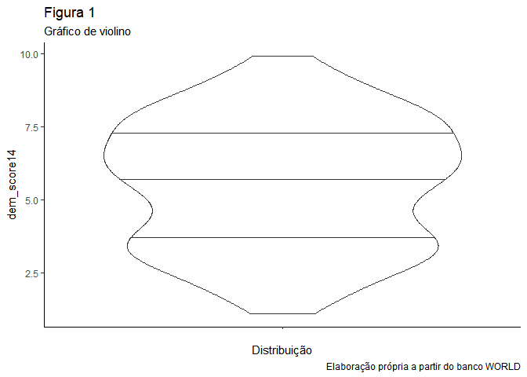<!-- -->

### Descrição gráfica da variável **democ11**

``` r
ggplot(banco, aes(x = "", y = democ11)) + 
  geom_violin(draw_quantiles = c(0.25, 0.5, 0.75)) +
  theme_classic()+
  labs(title = "Figura 2",
       subtitle = "Gráfico de violino",
       x = "Distribuição",
       y = "democ11",
       caption = "Elaboração própria a partir do banco WORLD")
```

    ## Warning: Removed 23 rows containing non-finite values (stat_ydensity).

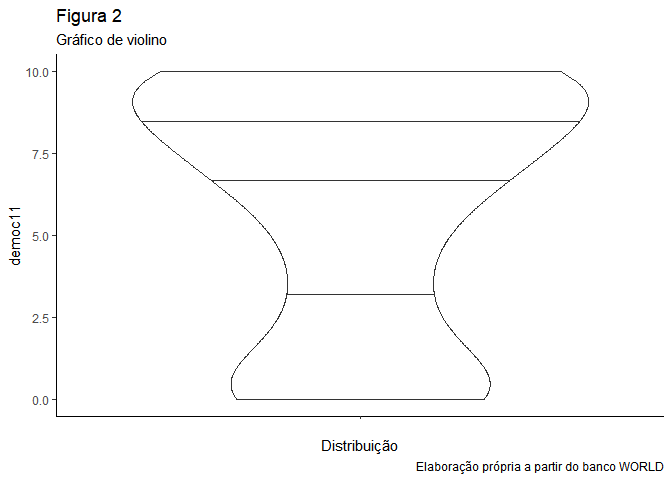<!-- -->

### Descrição gráfica da variável **fhrated04\_rev**

``` r
ggplot(banco, aes(x = "", y = fhrate04_rev)) + 
  geom_violin(draw_quantiles = c(0.25, 0.5, 0.75)) +
  theme_classic()+
  labs(title = "Figura 3",
       subtitle = "Gráfico de violino",
       x = "Distribuição",
       y = "fhrate04_rev",
       caption = "Elaboração própria a partir do banco WORLD")
```

    ## Warning: Removed 14 rows containing non-finite values (stat_ydensity).

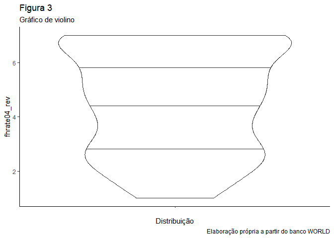<!-- -->

### Descrição gráfica da variável **fhrated08\_rev**

``` r
ggplot(banco, aes(x = "", y = fhrate08_rev)) + 
  geom_violin(draw_quantiles = c(0.25, 0.5, 0.75)) +
  theme_classic()+
  labs(title = "Figura 4",
       subtitle = "Gráfico de violino",
       x = "Distribuição",
       y = "fhrate08_rev",
       caption = "Elaboração própria a partir do banco WORLD")
```

    ## Warning: Removed 15 rows containing non-finite values (stat_ydensity).

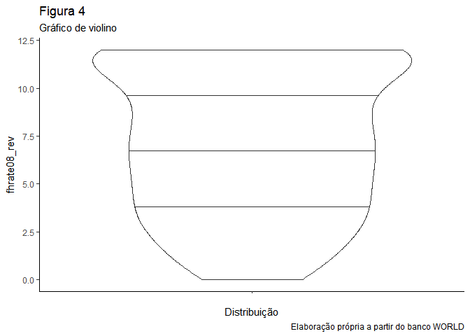<!-- -->

### Descrição gráfica da variável **polity**

``` r
ggplot(banco, aes(x = "", y = polity)) + 
  geom_violin(draw_quantiles = c(0.25, 0.5, 0.75)) +
  theme_classic()+
  labs(title = "Figura 5",
       subtitle = "Gráfico de violino",
       x = "Distribuição",
       y = "polity",
       caption = "Elaboração própria a partir do banco WORLD")
```

    ## Warning: Removed 23 rows containing non-finite values (stat_ydensity).

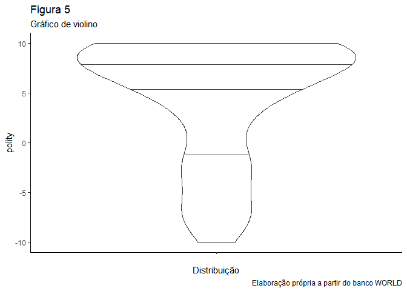<!-- -->

### `dem_score14` - *esta variável numérica pontua os países quanto ao nível de democracia dentro de um intervalo que vai de zero a dez, sendo mais democrático quanto maior for a pontuação. O gráfico de violino da figura 1, demonstra que a maior área de distribuição se encontra acima de cinco, com mediana também acima de cinco e maior frequência entre a mediana e o terceiro quartil, este pouco abaixo de 7,5. Tais informações permitem afirmar que para os critérios utilizados por esta variável a maioria dos países estão classificados com notas acima de cinco, ou seja, com tendências mais democráticas.*

### `democ11` - *variável que pontua os países quanto ao nível democrático dentro do intervalo de zero a dez. O gráfico da figura 2 aponta para uma concentração majoritária de países com pontuação alta. A mediana é ainda mais alta que a da variável dem\_score14, e um terceiro quartil acima de 7,5. Ao contrário da variável anterior, a democ11 apresenta alta frequência no intervalo entre o terceiro quartil e o extremo da população, ou seja, uma proporção maior de países com alta pontuação democrática, distinto da varável dem\_score14. Da mesma forma, observa-se que a frequencia de países com notas abaixo de cinco é muito menor na democ11 que na dem\_score14.*

### `fhrate04_rev` - *a variável em questão pontua o grau de democracia dos países dentro de um intervalo de 1 a 7. O gráfico da figura 3 mostra uma distribuição mais equilibrada que a observada nas variáveis democráticas anteriores. Apresenta mediana acima de 4, e quartis em praticamente 3 e 6. Ou seja, a maior área se encontra com as pontuações mais altas.*

### `fhrate08_rev` - *semelhante à variável anterior, mas com uma escala que varia de 0 a 12, ao invés de 0 a 7. A readequação de escala teve seu efeito observado no gráfico da figura 4, onde pode-se observar uma distribuição mais suave e continuamente crescente na pontuação, sem picos de frequência, exceto entre os valores 10 e 12. O comportamento da mediana e dos quartis se assemelha ao da variável anterior.*

### `polity` - *variável democrática com escala variando entre -10 e 10. Apresenta o 1o quartil pouco abaixo do zero, com mediana igual a cinco e 3o quartil próximo a 7,5. Maiores frequências entre 5 e 10 e frequência quase constante e relativamente baixa nas pontuações abaixo de zero. Assim, pode-se concluir por meio do gráfico da figura 5 que a maior proporção dos países classificados pela variável polity estão na faixa de pontuação democrática de valores positivos, ou seja, a maior parte dos países desta população são democráticos.*

### *Tratando do comportamento das cinco variáveis como um todo, com base nos respectivos gráficos, podemos afirmar que de modo geral, todas apresentam uma maior distribuição na faixa de pontuação mais alta, ou seja, com países com classificação democrática mais positiva que negativa.*

### Avalie a relação entre todas as medidas de democracia e desigualdade, utilizando a variável `gini08`. Descreva graficamente esta variável, a relação entre as duas variáveis, meça a correlação entre elas e faça regressões lineares (interpretando em profundidade os resultados dos coeficientes e medidas de desempenho dos modelos). Enfatize as semelhanças e diferenças entre os resultados. Quais são suas conclusões?

### Descrição gráfica da variável **gini08**

``` r
ggplot(banco, aes(x = "", y = gini08)) + 
  geom_violin(draw_quantiles = c(0.25, 0.5, 0.75)) +
  theme_classic()+
  labs(title = "Figura 6",
       subtitle = "Gráfico de violino",
       x = "Distribuição",
       y = "gini08",
       caption = "Elaboração própria a partir do banco WORLD")
```

    ## Warning: Removed 45 rows containing non-finite values (stat_ydensity).

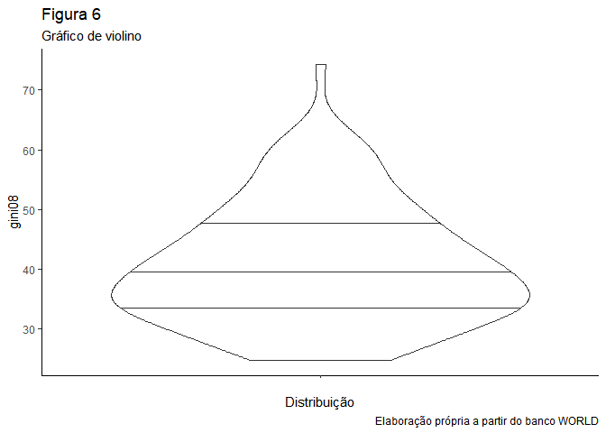<!-- -->

### Descrição gráfica da relação das variáveis **gini08** e `dem_score14`

``` r
ggplot(banco, aes(gini08, dem_score14)) +
  geom_jitter()+
theme_classic()+
  labs(title = "Figura 7",
       subtitle = "Gráfico de pontos",
       x = "gini08",
       y = "dem_score14",
       caption = "Elaboração própria a partir do banco WORLD")+
  geom_smooth(method = "lm")
```

    ## `geom_smooth()` using formula 'y ~ x'

    ## Warning: Removed 45 rows containing non-finite values (stat_smooth).

    ## Warning: Removed 45 rows containing missing values (geom_point).

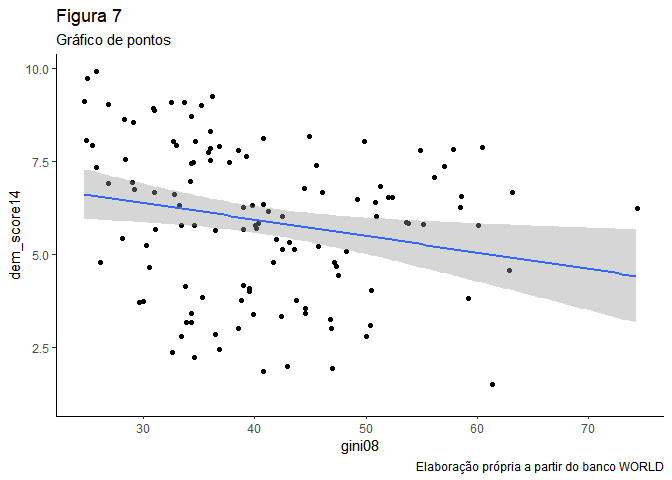<!-- -->

### Correlação entre as variáveis **gini08** e `dem_score14`

``` r
cor.test(banco$gini08, banco$dem_score14)
```

    ## 
    ##  Pearson's product-moment correlation
    ## 
    ## data:  banco$gini08 and banco$dem_score14
    ## t = -2.4621, df = 120, p-value = 0.01523
    ## alternative hypothesis: true correlation is not equal to 0
    ## 95 percent confidence interval:
    ##  -0.38215203 -0.04321115
    ## sample estimates:
    ##        cor 
    ## -0.2192877

### *A correlação de Pearson apresenta p-valor dentro do aceitável, com significância estatística, e um intervalo de confiança que não passa pelo zero. O índice de correlação é de -0,219, com covariância ou relação negativa entre as variáveis.*

### Regressão linear das variáveis **gini08** e `dem_score14`

``` r
rl1 <- lm(dem_score14 ~ gini08, data = banco)
summary (rl1)
```

    ## 
    ## Call:
    ## lm(formula = dem_score14 ~ gini08, data = banco)
    ## 
    ## Residuals:
    ##     Min      1Q  Median      3Q     Max 
    ## -4.0728 -1.7583  0.3513  1.6742  3.3600 
    ## 
    ## Coefficients:
    ##             Estimate Std. Error t value Pr(>|t|)    
    ## (Intercept)  7.71756    0.75639  10.203   <2e-16 ***
    ## gini08      -0.04448    0.01807  -2.462   0.0152 *  
    ## ---
    ## Signif. codes:  0 '***' 0.001 '**' 0.01 '*' 0.05 '.' 0.1 ' ' 1
    ## 
    ## Residual standard error: 2.003 on 120 degrees of freedom
    ##   (45 observations deleted due to missingness)
    ## Multiple R-squared:  0.04809,    Adjusted R-squared:  0.04015 
    ## F-statistic: 6.062 on 1 and 120 DF,  p-value: 0.01523

``` r
confint(rl1, level = 0.95)
```

    ##                   2.5 %      97.5 %
    ## (Intercept)  6.21996464  9.21514871
    ## gini08      -0.08024753 -0.00871069

### *A regressão mostra um valor estimado de 7,717 e um p-valor de significância estatística forte para o intercepto-y, e um p-valor menos forte, mas ainda ainda com significância estatística para o parâmetro de inclinação da reta, cujo valor estimado foi de -0,044. A variação do intercepto quando tomamos o valor estimado e o erro-padrão já adequado ao intervalo de confiança de 95%, ou seja, multiplicado por dois, fica entre 6,22 e 9,22, já a inclinação fica entre -0,08 e -0,009, com arredondamentos. O R-squared nos informa que esse modelo responderia por apenas 4,81% do comportamento da variável dependente. O erro residual padrão, ou RMSE, que nos indica o erro médio, ou a distância média entre os valores observados e os estimados, é de 2,003.*

### Descrição gráfica da relação das variáveis **gini08** e `democ11`

``` r
ggplot(banco, aes(gini08, democ11)) +
  geom_jitter()+
  theme_classic()+
  labs(title = "Figura 8",
       subtitle = "Gráfico de pontos",
       x = "gini08",
       y = " democ11",
       caption = "Elaboração própria a partir do banco WORLD")+
  geom_smooth(method = "lm")
```

    ## `geom_smooth()` using formula 'y ~ x'

    ## Warning: Removed 52 rows containing non-finite values (stat_smooth).

    ## Warning: Removed 52 rows containing missing values (geom_point).

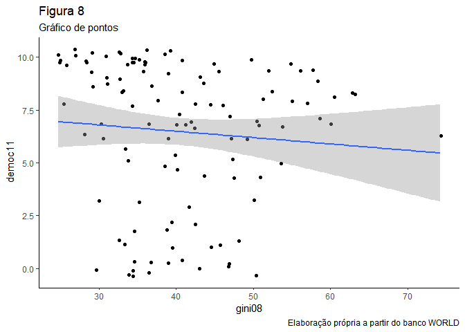<!-- -->

### Correlação entre as variáveis **gini08** e `democ11`

``` r
cor.test(banco$gini08, banco$democ11)
```

    ## 
    ##  Pearson's product-moment correlation
    ## 
    ## data:  banco$gini08 and banco$democ11
    ## t = -0.90439, df = 113, p-value = 0.3677
    ## alternative hypothesis: true correlation is not equal to 0
    ## 95 percent confidence interval:
    ##  -0.26378781  0.09988899
    ## sample estimates:
    ##         cor 
    ## -0.08477203

### *A correlação de Pearson apresenta p-valor sem significância estatística e um intervalo de confiança que passa pelo zero. O índice de correlação é de -0,0847, com relação negativa entre as variáveis.*

### Regressão linear das variáveis **gini08** e `democ11`

``` r
rl2 <- lm(democ11 ~ gini08, data = banco)
summary (rl2)
```

    ## 
    ## Call:
    ## lm(formula = democ11 ~ gini08, data = banco)
    ## 
    ## Residuals:
    ##    Min     1Q Median     3Q    Max 
    ## -6.796 -2.213  1.302  3.049  3.958 
    ## 
    ## Coefficients:
    ##             Estimate Std. Error t value Pr(>|t|)    
    ## (Intercept)  7.68568    1.38306   5.557 1.85e-07 ***
    ## gini08      -0.02994    0.03311  -0.904    0.368    
    ## ---
    ## Signif. codes:  0 '***' 0.001 '**' 0.01 '*' 0.05 '.' 0.1 ' ' 1
    ## 
    ## Residual standard error: 3.47 on 113 degrees of freedom
    ##   (52 observations deleted due to missingness)
    ## Multiple R-squared:  0.007186,   Adjusted R-squared:  -0.0016 
    ## F-statistic: 0.8179 on 1 and 113 DF,  p-value: 0.3677

``` r
confint(rl2, level = 0.95)
```

    ##                   2.5 %      97.5 %
    ## (Intercept)  4.94558726 10.42576632
    ## gini08      -0.09552709  0.03564705

### *A regressão mostra um valor estimado de 7,685 para o intercepto-y e um p-valor de significância estatística forte para o mesmo coeficiente. A regressão apresenta também um p-valor insuficiente, ou sem significância estatística, para o parâmetro de inclinação da reta. A variação do intercepto quando tomamos o valor estimado e o erro-padrão já adequado ao intervalo de confiança de 95%, ou seja, multiplicado por dois, fica entre 4,94 e 10,42, já a inclinação fica entre -0,095 e 0,03, com arredondamentos. O R-squared nos informa que esse modelo responderia por apenas 0,7% do comportamento da variável dependente. O erro residual padrão, ou RMSE, que nos indica o erro médio, ou a distância média entre os valores observados e os estimados, é de 3,47.*

### Descrição gráfica da relação das variáveis **gini08** e `fhrated04_rev`

``` r
ggplot(banco, aes(gini08, fhrate04_rev)) +
  geom_jitter()+
  theme_classic()+
  labs(title = "Figura 9",
       subtitle = "Gráfico de pontos",
       x = "gini08",
       y = "fhrate04_rev",
       caption = "Elaboração própria a partir do banco WORLD")+
       geom_smooth(method = "lm")
```

    ## `geom_smooth()` using formula 'y ~ x'

    ## Warning: Removed 45 rows containing non-finite values (stat_smooth).

    ## Warning: Removed 45 rows containing missing values (geom_point).

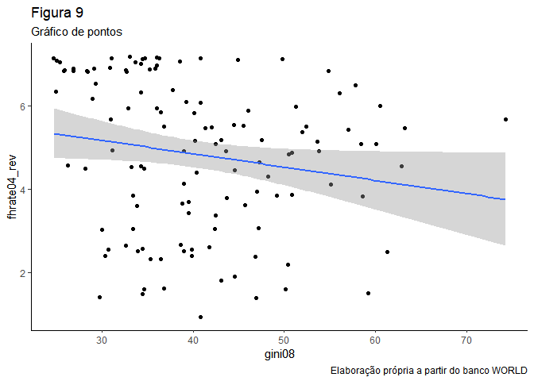<!-- -->

\#\#\#Correlação entre as variáveis **gini08** e `fhrate04_rev`

``` r
cor.test(banco$gini08, banco$fhrate04_rev)
```

    ## 
    ##  Pearson's product-moment correlation
    ## 
    ## data:  banco$gini08 and banco$fhrate04_rev
    ## t = -1.9869, df = 120, p-value = 0.04921
    ## alternative hypothesis: true correlation is not equal to 0
    ## 95 percent confidence interval:
    ##  -0.3452745300 -0.0007294745
    ## sample estimates:
    ##        cor 
    ## -0.1784673

### *A correlação de Pearson apresenta p-valor com significância estatística próxima do limite usualmente aceito e um intervalo de confiança que não passa pelo zero. O índice de correlação é de -0,1784, com covariação ou relação negativa entre as variáveis.*

### Regressão linear das variáveis **gini08** e `fhrate04_rev`

``` r
rl3 <- lm(fhrate04_rev ~ gini08, data = banco)
summary (rl3)
```

    ## 
    ## Call:
    ## lm(formula = fhrate04_rev ~ gini08, data = banco)
    ## 
    ## Residuals:
    ##     Min      1Q  Median      3Q     Max 
    ## -3.8312 -1.3896  0.4312  1.6729  2.6199 
    ## 
    ## Coefficients:
    ##             Estimate Std. Error t value Pr(>|t|)    
    ## (Intercept)  6.13654    0.67419   9.102 2.35e-15 ***
    ## gini08      -0.03199    0.01610  -1.987   0.0492 *  
    ## ---
    ## Signif. codes:  0 '***' 0.001 '**' 0.01 '*' 0.05 '.' 0.1 ' ' 1
    ## 
    ## Residual standard error: 1.786 on 120 degrees of freedom
    ##   (45 observations deleted due to missingness)
    ## Multiple R-squared:  0.03185,    Adjusted R-squared:  0.02378 
    ## F-statistic: 3.948 on 1 and 120 DF,  p-value: 0.04921

``` r
confint(rl3, level = 0.95)
```

    ##                   2.5 %       97.5 %
    ## (Intercept)  4.80168759  7.471400187
    ## gini08      -0.06387567 -0.000112373

### *A regressão mostra um valor estimado de 6,136 para o intercepto-y e um p-valor de significância estatística forte para ele. A operação também apresenta um p-valor menos forte, mas ainda ainda com significância estatística aceitável para o parâmetro de inclinação da reta, cujo valor estimado foi de -0,032. A variação do intercepto quando tomamos o valor estimado e o erro-padrão já adequado ao intervalo de confiança de 95%, ou seja, multiplicado por dois, fica entre 4,801 e 7,471, já a inclinação fica entre -0,064 e -0,0001, com arredondamentos. O R-squared nos informa que esse modelo responderia por apenas 3,18% do comportamento da variável dependente. O erro residual padrão, ou RMSE, que nos indica o erro médio, ou a distância média entre os valores observados e os estimados, é de 1,786.*

### Descrição gráfica da relação das variáveis **gini08** e `fhrated08_rev`

``` r
ggplot(banco, aes(gini08, fhrate08_rev)) +
  geom_jitter()+
  theme_classic()+
  labs(title = "Figura 10",
       subtitle = "Gráfico de pontos",
       x = "gini08",
       y = "fhrate08_rev",
       caption = "Elaboração própria a partir do banco WORLD")+
  geom_smooth(method = "lm")
```

    ## `geom_smooth()` using formula 'y ~ x'

    ## Warning: Removed 46 rows containing non-finite values (stat_smooth).

    ## Warning: Removed 46 rows containing missing values (geom_point).

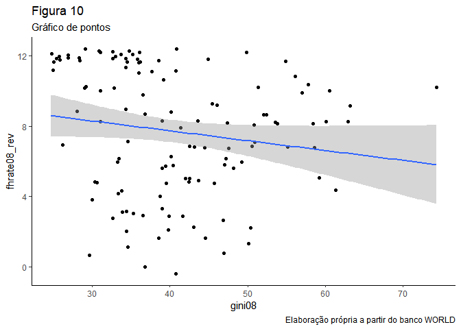<!-- -->

### Correlação entre as variáveis **gini08** e `fhrate08_rev`

``` r
cor.test(banco$gini08, banco$fhrate08_rev)
```

    ## 
    ##  Pearson's product-moment correlation
    ## 
    ## data:  banco$gini08 and banco$fhrate08_rev
    ## t = -1.7432, df = 119, p-value = 0.08387
    ## alternative hypothesis: true correlation is not equal to 0
    ## 95 percent confidence interval:
    ##  -0.32708386  0.02129614
    ## sample estimates:
    ##        cor 
    ## -0.1578002

### *A correlação de Pearson apresenta p-valor sem significância estatística e um intervalo de confiança que passa pelo zero. O índice de correlação é de -0,157, com relação negativa entre as variáveis.*

### Regressão linear das variáveis **gini08** e `fhrate08_rev`

``` r
rl4 <- lm(fhrate08_rev ~ gini08, data = banco)
summary (rl4)
```

    ## 
    ## Call:
    ## lm(formula = fhrate08_rev ~ gini08, data = banco)
    ## 
    ## Residuals:
    ##     Min      1Q  Median      3Q     Max 
    ## -7.9157 -2.5971  0.6712  3.4091  5.0961 
    ## 
    ## Coefficients:
    ##             Estimate Std. Error t value Pr(>|t|)    
    ## (Intercept)  9.97288    1.34188   7.432 1.79e-11 ***
    ## gini08      -0.05590    0.03207  -1.743   0.0839 .  
    ## ---
    ## Signif. codes:  0 '***' 0.001 '**' 0.01 '*' 0.05 '.' 0.1 ' ' 1
    ## 
    ## Residual standard error: 3.554 on 119 degrees of freedom
    ##   (46 observations deleted due to missingness)
    ## Multiple R-squared:  0.0249, Adjusted R-squared:  0.01671 
    ## F-statistic: 3.039 on 1 and 119 DF,  p-value: 0.08387

``` r
confint(rl4, level = 0.95)
```

    ##                  2.5 %       97.5 %
    ## (Intercept)  7.3158302 12.629937649
    ## gini08      -0.1193971  0.007595494

### *A regressão mostra um valor estimado de 9,972 para o intercepto-y e um p-valor de significância estatística forte para o mesmo coeficiente. A regressão apresenta também um p-valor insuficiente, ou sem significância estatística, para o parâmetro de inclinação da reta, cujo valor estimado foi de -0,0559. A variação do intercepto quando tomamos o valor estimado e o erro-padrão já adequado ao intervalo de confiança de 95%, ou seja, multiplicado por dois, fica entre 7,316 e 12,629, já a inclinação fica entre -0,119 e 0,007, com arredondamentos. O R-squared nos informa que esse modelo responderia por apenas 2,5% do comportamento da variável dependente. O erro residual padrão, ou RMSE, que nos indica o erro médio, ou a distância média entre os valores observados e os estimados, é de 3,554.*

### Descrição gráfica da relação das variáveis **gini08** e `polity`

``` r
ggplot(banco, aes(gini08, polity)) +
  geom_jitter()+
  theme_classic()+
  labs(title = "Figura 11",
       subtitle = "Gráfico de pontos",
       x = "gini08",
       y = "polity",
       caption = "Elaboração própria a partir do banco WORLD")+
  geom_smooth(method = "lm")
```

    ## `geom_smooth()` using formula 'y ~ x'

    ## Warning: Removed 52 rows containing non-finite values (stat_smooth).

    ## Warning: Removed 52 rows containing missing values (geom_point).

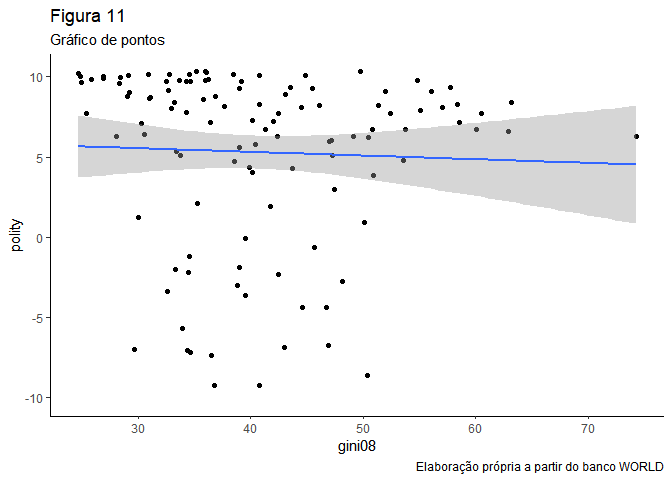<!-- -->

### Correlação entre as variáveis **gini08** e `polity`

``` r
cor.test(banco$gini08, banco$polity)
```

    ## 
    ##  Pearson's product-moment correlation
    ## 
    ## data:  banco$gini08 and banco$polity
    ## t = -0.43417, df = 113, p-value = 0.665
    ## alternative hypothesis: true correlation is not equal to 0
    ## 95 percent confidence interval:
    ##  -0.2222590  0.1433725
    ## sample estimates:
    ##         cor 
    ## -0.04080936

### *A correlação de Pearson apresenta p-valor sem significância estatística e um intervalo de confiança que passa pelo zero. O índice de correlação é de -0,040, com relação negativa entre as variáveis.*

### Regressão linear das variáveis **gini08** e `polity`

``` r
rl5 <- lm(polity ~ gini08, data = banco)
summary (rl5)
```

    ## 
    ## Call:
    ## lm(formula = polity ~ gini08, data = banco)
    ## 
    ## Residuals:
    ##     Min      1Q  Median      3Q     Max 
    ## -14.374  -1.300   2.364   4.087   5.040 
    ## 
    ## Coefficients:
    ##             Estimate Std. Error t value Pr(>|t|)   
    ## (Intercept)  6.21813    2.20594   2.819  0.00569 **
    ## gini08      -0.02292    0.05280  -0.434  0.66499   
    ## ---
    ## Signif. codes:  0 '***' 0.001 '**' 0.01 '*' 0.05 '.' 0.1 ' ' 1
    ## 
    ## Residual standard error: 5.535 on 113 degrees of freedom
    ##   (52 observations deleted due to missingness)
    ## Multiple R-squared:  0.001665,   Adjusted R-squared:  -0.007169 
    ## F-statistic: 0.1885 on 1 and 113 DF,  p-value: 0.665

``` r
confint(rl5, level = 0.95)
```

    ##                  2.5 %      97.5 %
    ## (Intercept)  1.8477696 10.58848167
    ## gini08      -0.1275342  0.08168441

### *A regressão mostra um valor estimado de 6,218 para o intercepto-y e um p-valor de significância estatística suficiente para o mesmo coeficiente. A regressão apresenta também um p-valor insuficiente, ou sem significância estatística, para o parâmetro de inclinação da reta, cujo valor estimado foi de -0,0229. A variação do intercepto quando tomamos o valor estimado e o erro-padrão já adequado ao intervalo de confiança de 95%, ou seja, multiplicado por dois, fica entre 1,847 e 10,588, já a inclinação fica entre -0,127 e 0,081, com arredondamentos. O R-squared nos informa que esse modelo responderia por apenas 0,16% do comportamento da variável dependente. O erro residual padrão, ou RMSE, que nos indica o erro médio, ou a distância média entre os valores observados e os estimados, é de 5,535.*

### *ANÁLISE GERAL DA RELAÇÃO ENTRE A VARIÁVEL `gini08` E AS VARIÁVEIS DE DEMOCRACIA*

### *Após a aplicação dos testes de correlação e de regressão linear pode-se observar que todas as covariações identificadas são negativas, mas que em apenas dois casos há significância estatística, com valores-p aceitáveis para inferências estatísticas válidas, quais sejam, os modelos que envolvem os binômios gini08 x dem\_score14 e gini08 x fhrate04\_rev. Para esses dois casos o R-Square nos permite perceber que os modelos em questão explicam apenas 4,8% e 3,2% do comportamento da variável dependente, respectivamente. De modo geral, tem-se que o efeito da variável desigualdade (gini08) na democracia não pode ser observado em três dos cinco modelos testados e teve nível de correlação significativo (21,9% e 17,8%, respectivamente) no caso das variáveis cujos testes apresentaram validade estatística.*

### Avalie a relação entre todas as medidas de democracia e crescimento econômico, utilizando a variável `gdppcap08`. Descreva graficamente esta variável, a relação entre as duas variáveis, meça a correlação entre elas e faça regressões lineares (interpretando em profundidade os resultados dos coeficientes e medidas de desempenho dos modelos). Enfatize as semelhanças e diferenças entre os resultados. Quais são suas conclusões?

### Descrição gráfica da variável **gdppcap08**

``` r
ggplot(banco, aes(x = "", y = gdppcap08)) + 
  geom_violin(draw_quantiles = c(0.25, 0.5, 0.75)) +
  theme_classic()+
  labs(title = "Figura 12",
       subtitle = "Gráfico de violino",
       x = "Distribuição",
       y = "gdppcap08",
       caption = "Elaboração própria a partir do banco WORLD")
```

    ## Warning: Removed 15 rows containing non-finite values (stat_ydensity).

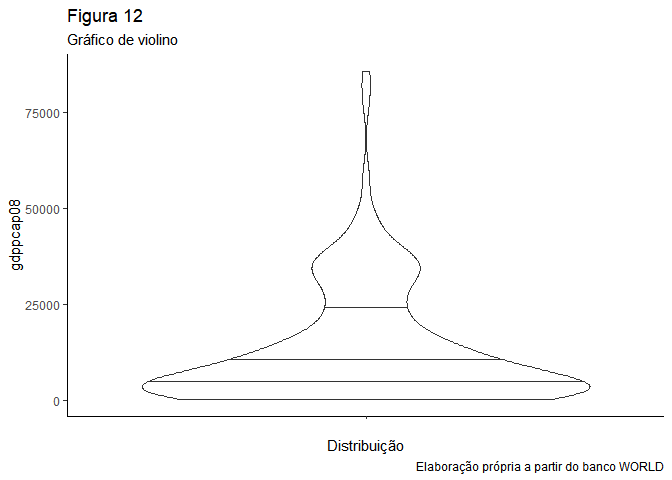<!-- -->

### Descrição gráfica da relação das variáveis **gdppcap08** e `dem_score14`

``` r
ggplot(banco, aes(gdppcap08, dem_score14)) +
  geom_jitter()+
theme_classic()+
  labs(title = "Figura 13",
       subtitle = "Gráfico de pontos",
       x = "gdppcap08",
       y = "dem_score14",
       caption = "Elaboração própria a partir do banco WORLD")+
  geom_smooth(method = "lm")
```

    ## `geom_smooth()` using formula 'y ~ x'

    ## Warning: Removed 15 rows containing non-finite values (stat_smooth).

    ## Warning: Removed 15 rows containing missing values (geom_point).

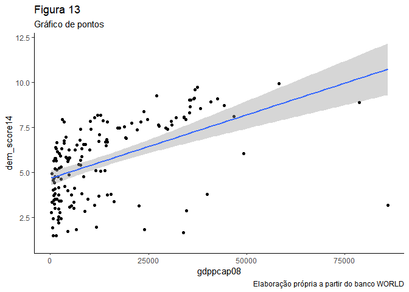<!-- -->

### Correlação entre as variáveis **gdppcap08** e `dem_score14`

``` r
cor.test(banco$gdppcap08, banco$dem_score14)
```

    ## 
    ##  Pearson's product-moment correlation
    ## 
    ## data:  banco$gdppcap08 and banco$dem_score14
    ## t = 7.1713, df = 150, p-value = 3.159e-11
    ## alternative hypothesis: true correlation is not equal to 0
    ## 95 percent confidence interval:
    ##  0.3763618 0.6150148
    ## sample estimates:
    ##       cor 
    ## 0.5052872

### *A correlação de Pearson apresenta p-valor com significância estatística forte e um intervalo de confiança que não passa pelo zero. O índice de correlação é de 0,505, com covariação ou relação positiva entre as variáveis.*

### Regressão linear das variáveis **gdppcap08** e `dem_score14`

``` r
rl11 <- lm(dem_score14 ~ gdppcap08, data = banco)
summary (rl11)
```

    ## 
    ## Call:
    ## lm(formula = dem_score14 ~ gdppcap08, data = banco)
    ## 
    ## Residuals:
    ##     Min      1Q  Median      3Q     Max 
    ## -7.5428 -1.3420  0.6982  1.2843  3.0329 
    ## 
    ## Coefficients:
    ##              Estimate Std. Error t value Pr(>|t|)    
    ## (Intercept) 4.678e+00  2.017e-01  23.197  < 2e-16 ***
    ## gdppcap08   7.040e-05  9.817e-06   7.171 3.16e-11 ***
    ## ---
    ## Signif. codes:  0 '***' 0.001 '**' 0.01 '*' 0.05 '.' 0.1 ' ' 1
    ## 
    ## Residual standard error: 1.864 on 150 degrees of freedom
    ##   (15 observations deleted due to missingness)
    ## Multiple R-squared:  0.2553, Adjusted R-squared:  0.2504 
    ## F-statistic: 51.43 on 1 and 150 DF,  p-value: 3.159e-11

``` r
confint(rl11, level = 0.95)
```

    ##                    2.5 %       97.5 %
    ## (Intercept) 4.279401e+00 5.076314e+00
    ## gdppcap08   5.100126e-05 8.979475e-05

### *A regressão mostra p-valor de significância estatística forte para o intercepto-y. A operação também apresenta um p-valor forte para o parâmetro de inclinação da reta. O R-squared nos informa que esse modelo responderia por apenas 25,53% do comportamento da variável dependente. O erro residual padrão, ou RMSE, que nos indica o erro médio, ou a distância média entre os valores observados e os estimados, é de 1,864.*

### Descrição gráfica da relação das variáveis **gdppcap08** e `democ11`

``` r
ggplot(banco, aes(gdppcap08, democ11)) +
  geom_jitter()+
theme_classic()+
  labs(title = "Figura 14",
       subtitle = "Gráfico de pontos",
       x = "gdppcap08",
       y = "democ11",
       caption = "Elaboração própria a partir do banco WORLD")+
  geom_smooth(method = "lm")
```

    ## `geom_smooth()` using formula 'y ~ x'

    ## Warning: Removed 25 rows containing non-finite values (stat_smooth).

    ## Warning: Removed 25 rows containing missing values (geom_point).

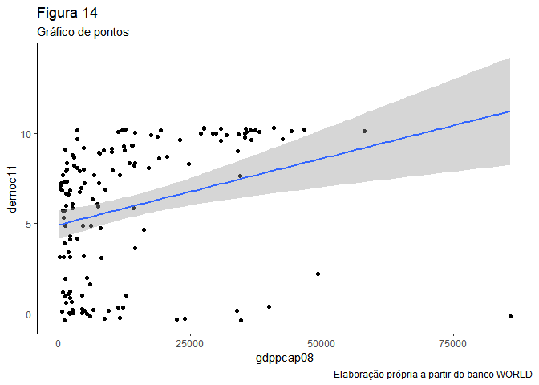<!-- -->

### Correlação entre as variáveis **gdppcap08** e `democ11`

``` r
cor.test(banco$gdppcap08, banco$democ11)
```

    ## 
    ##  Pearson's product-moment correlation
    ## 
    ## data:  banco$gdppcap08 and banco$democ11
    ## t = 3.6037, df = 140, p-value = 0.000435
    ## alternative hypothesis: true correlation is not equal to 0
    ## 95 percent confidence interval:
    ##  0.1330147 0.4351981
    ## sample estimates:
    ##      cor 
    ## 0.291358

### *A correlação de Pearson apresenta p-valor com significância estatística forte e um intervalo de confiança que não passa pelo zero. O índice de correlação é de 0,291, com covariação ou relação positiva entre as variáveis.*

### Regressão linear das variáveis **gdppcap08** e `democ11`

``` r
rl12 <- lm(democ11 ~ gdppcap08, data = banco)
summary (rl12)
```

    ## 
    ## Call:
    ## lm(formula = democ11 ~ gdppcap08, data = banco)
    ## 
    ## Residuals:
    ##     Min      1Q  Median      3Q     Max 
    ## -11.258  -3.030   1.723   2.783   4.803 
    ## 
    ## Coefficients:
    ##              Estimate Std. Error t value Pr(>|t|)    
    ## (Intercept) 4.939e+00  4.026e-01  12.270  < 2e-16 ***
    ## gdppcap08   7.359e-05  2.042e-05   3.604 0.000435 ***
    ## ---
    ## Signif. codes:  0 '***' 0.001 '**' 0.01 '*' 0.05 '.' 0.1 ' ' 1
    ## 
    ## Residual standard error: 3.57 on 140 degrees of freedom
    ##   (25 observations deleted due to missingness)
    ## Multiple R-squared:  0.08489,    Adjusted R-squared:  0.07835 
    ## F-statistic: 12.99 on 1 and 140 DF,  p-value: 0.000435

``` r
confint(rl12, level = 0.95)
```

    ##                    2.5 %       97.5 %
    ## (Intercept) 4.143600e+00 5.7353437948
    ## gdppcap08   3.321747e-05 0.0001139613

### *A regressão mostra p-valor de significância estatística forte para o intercepto-y. A operação também apresenta um p-valor forte para o parâmetro de inclinação da reta. O R-squared nos informa que esse modelo responderia por apenas 8,48% do comportamento da variável dependente. O erro residual padrão, ou RMSE, que nos indica o erro médio, ou a distância média entre os valores observados e os estimados, é de 3,57.*

### Descrição gráfica da relação das variáveis **gdppcap08** e `fhrate04_rev`

``` r
ggplot(banco, aes(gdppcap08, fhrate04_rev)) +
  geom_jitter()+
theme_classic()+
  labs(title = "Figura 15",
       subtitle = "Gráfico de pontos",
       x = "gdppcap08",
       y = "fhrate04_rev",
       caption = "Elaboração própria a partir do banco WORLD")+
  geom_smooth(method = "lm")
```

    ## `geom_smooth()` using formula 'y ~ x'

    ## Warning: Removed 15 rows containing non-finite values (stat_smooth).

    ## Warning: Removed 15 rows containing missing values (geom_point).

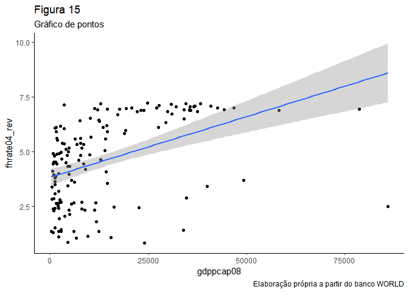<!-- -->

### Correlação entre as variáveis **gdppcap08** e `fhrate04_rev`

``` r
cor.test(banco$gdppcap08, banco$fhrate04_rev)
```

    ## 
    ##  Pearson's product-moment correlation
    ## 
    ## data:  banco$gdppcap08 and banco$fhrate04_rev
    ## t = 6.0129, df = 150, p-value = 1.331e-08
    ## alternative hypothesis: true correlation is not equal to 0
    ## 95 percent confidence interval:
    ##  0.3027442 0.5605748
    ## sample estimates:
    ##       cor 
    ## 0.4407043

### *A correlação de Pearson apresenta p-valor com significância estatística forte e um intervalo de confiança que não passa pelo zero. O índice de correlação é de 0,440, com covariação ou relação positiva entre as variáveis.*

### Regressão linear das variáveis **gdppcap08** e `fhrate04_rev`

``` r
rl13 <- lm(fhrate04_rev ~ gdppcap08, data = banco)
summary (rl13)
```

    ## 
    ## Call:
    ## lm(formula = fhrate04_rev ~ gdppcap08, data = banco)
    ## 
    ## Residuals:
    ##     Min      1Q  Median      3Q     Max 
    ## -6.0897 -1.4154  0.5914  1.2481  2.9773 
    ## 
    ## Coefficients:
    ##              Estimate Std. Error t value Pr(>|t|)    
    ## (Intercept) 3.828e+00  1.894e-01  20.210  < 2e-16 ***
    ## gdppcap08   5.545e-05  9.222e-06   6.013 1.33e-08 ***
    ## ---
    ## Signif. codes:  0 '***' 0.001 '**' 0.01 '*' 0.05 '.' 0.1 ' ' 1
    ## 
    ## Residual standard error: 1.751 on 150 degrees of freedom
    ##   (15 observations deleted due to missingness)
    ## Multiple R-squared:  0.1942, Adjusted R-squared:  0.1888 
    ## F-statistic: 36.16 on 1 and 150 DF,  p-value: 1.331e-08

``` r
confint(rl13, level = 0.95)
```

    ##                    2.5 %       97.5 %
    ## (Intercept) 3.454144e+00 4.202754e+00
    ## gdppcap08   3.722775e-05 7.366986e-05

### *A regressão mostra p-valor de significância estatística forte para o intercepto-y. A operação também apresenta um p-valor forte para o parâmetro de inclinação da reta. O R-squared nos informa que esse modelo responderia por apenas 19,42% do comportamento da variável dependente. O erro residual padrão, ou RMSE, que nos indica o erro médio, ou a distância média entre os valores observados e os estimados, é de 1,751.*

### Descrição gráfica da relação das variáveis **gdppcap08** e `fhrate08_rev`

``` r
ggplot(banco, aes(gdppcap08, fhrate08_rev)) +
  geom_jitter()+
theme_classic()+
  labs(title = "Figura 16",
       subtitle = "Gráfico de pontos",
       x = "gdppcap08",
       y = "fhrate08_rev",
       caption = "Elaboração própria a partir do banco WORLD")+
  geom_smooth(method = "lm")
```

    ## `geom_smooth()` using formula 'y ~ x'

    ## Warning: Removed 16 rows containing non-finite values (stat_smooth).

    ## Warning: Removed 16 rows containing missing values (geom_point).

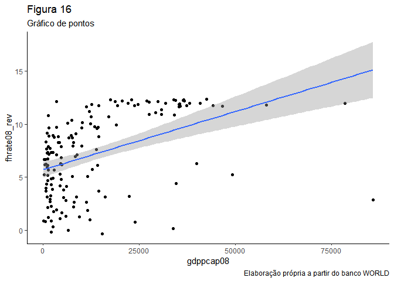<!-- -->

### Correlação entre as variáveis **gdppcap08** e `fhrate08_rev`

``` r
cor.test(banco$gdppcap08, banco$fhrate08_rev)
```

    ## 
    ##  Pearson's product-moment correlation
    ## 
    ## data:  banco$gdppcap08 and banco$fhrate08_rev
    ## t = 6.0508, df = 149, p-value = 1.115e-08
    ## alternative hypothesis: true correlation is not equal to 0
    ## 95 percent confidence interval:
    ##  0.3061176 0.5638582
    ## sample estimates:
    ##     cor 
    ## 0.44413

### *A correlação de Pearson apresenta p-valor com significância estatística forte e um intervalo de confiança que não passa pelo zero. O índice de correlação é de 0,444, com covariação ou relação positiva entre as variáveis.*

### Regressão linear das variáveis **gdppcap08** e `fhrate08_rev`

``` r
rl14 <- lm(fhrate08_rev ~ gdppcap08, data = banco)
summary (rl14)
```

    ## 
    ## Call:
    ## lm(formula = fhrate08_rev ~ gdppcap08, data = banco)
    ## 
    ## Residuals:
    ##     Min      1Q  Median      3Q     Max 
    ## -12.124  -2.345   1.164   2.510   5.918 
    ## 
    ## Coefficients:
    ##              Estimate Std. Error t value Pr(>|t|)    
    ## (Intercept) 5.698e+00  3.739e-01  15.237  < 2e-16 ***
    ## gdppcap08   1.098e-04  1.814e-05   6.051 1.11e-08 ***
    ## ---
    ## Signif. codes:  0 '***' 0.001 '**' 0.01 '*' 0.05 '.' 0.1 ' ' 1
    ## 
    ## Residual standard error: 3.438 on 149 degrees of freedom
    ##   (16 observations deleted due to missingness)
    ## Multiple R-squared:  0.1973, Adjusted R-squared:  0.1919 
    ## F-statistic: 36.61 on 1 and 149 DF,  p-value: 1.115e-08

``` r
confint(rl14, level = 0.95)
```

    ##                    2.5 %       97.5 %
    ## (Intercept) 4.958685e+00 6.4364793856
    ## gdppcap08   7.393055e-05 0.0001456336

### *A regressão mostra p-valor de significância estatística forte para o intercepto-y. A operação também apresenta um p-valor forte para o parâmetro de inclinação da reta. O R-squared nos informa que esse modelo responderia por apenas 19,73% do comportamento da variável dependente. O erro residual padrão, ou RMSE, que nos indica o erro médio, ou a distância média entre os valores observados e os estimados, é de 3,438.*

### Descrição gráfica da relação das variáveis **gdppcap08** e `polity`

``` r
ggplot(banco, aes(gdppcap08, polity)) +
  geom_jitter()+
theme_classic()+
  labs(title = "Figura 17",
       subtitle = "Gráfico de pontos",
       x = "gdppcap08",
       y = "polity",
       caption = "Elaboração própria a partir do banco WORLD")+
  geom_smooth(method = "lm")
```

    ## `geom_smooth()` using formula 'y ~ x'

    ## Warning: Removed 25 rows containing non-finite values (stat_smooth).

    ## Warning: Removed 25 rows containing missing values (geom_point).

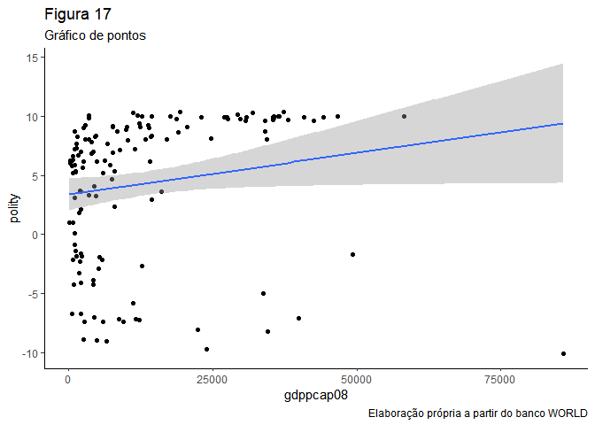<!-- -->

### Correlação entre as variáveis **gdppcap08** e `polity`

``` r
cor.test(banco$gdppcap08, banco$polity)
```

    ## 
    ##  Pearson's product-moment correlation
    ## 
    ## data:  banco$gdppcap08 and banco$polity
    ## t = 2.0332, df = 140, p-value = 0.04392
    ## alternative hypothesis: true correlation is not equal to 0
    ## 95 percent confidence interval:
    ##  0.004758504 0.325013386
    ## sample estimates:
    ##      cor 
    ## 0.169353

### *A correlação de Pearson apresenta p-valor com significância estatística suficiente e um intervalo de confiança que não passa pelo zero. O índice de correlação é de 0,169, com covariação ou relação positiva entre as variáveis.*

### Regressão linear das variáveis **gdppcap08** e `polity`

``` r
rl15 <- lm(polity ~ gdppcap08, data = banco)
summary (rl15)
```

    ## 
    ## Call:
    ## lm(formula = polity ~ gdppcap08, data = banco)
    ## 
    ## Residuals:
    ##     Min      1Q  Median      3Q     Max 
    ## -19.426  -4.207   2.847   4.332   6.378 
    ## 
    ## Coefficients:
    ##              Estimate Std. Error t value Pr(>|t|)    
    ## (Intercept) 3.375e+00  6.833e-01   4.940  2.2e-06 ***
    ## gdppcap08   7.047e-05  3.466e-05   2.033   0.0439 *  
    ## ---
    ## Signif. codes:  0 '***' 0.001 '**' 0.01 '*' 0.05 '.' 0.1 ' ' 1
    ## 
    ## Residual standard error: 6.059 on 140 degrees of freedom
    ##   (25 observations deleted due to missingness)
    ## Multiple R-squared:  0.02868,    Adjusted R-squared:  0.02174 
    ## F-statistic: 4.134 on 1 and 140 DF,  p-value: 0.04392

``` r
confint(rl15, level = 0.95)
```

    ##                    2.5 %       97.5 %
    ## (Intercept) 2.024106e+00 4.7257627510
    ## gdppcap08   1.945306e-06 0.0001389914

### *A regressão mostra p-valor de significância estatística forte para o intercepto-y. A operação também apresenta um p-valor suficiente para o parâmetro de inclinação da reta. O R-squared nos informa que esse modelo responderia por apenas 2,86% do comportamento da variável dependente. O erro residual padrão, ou RMSE, que nos indica o erro médio, ou a distância média entre os valores observados e os estimados, é de 6,059.*

### *ANÁLISE GERAL DA RELAÇÃO ENTRE A VARIÁVEL `gdppcap08` E AS VARIÁVEIS DE DEMOCRACIA*

### *Ao contrário da relação entre a variável gini08 e as variáveis democráticas, quando relacionamos a variável gdppcap08, referente ao pib per capta, com os diferentes modelos de rankings democráticos, observamos que todos os casos passam no teste de significância estatística no R de Pearson e na Regressão linear, estabelecendo uma covariância sempre positiva entre pib per capta e democracia, além de apresentar nível de correlação em geral alto, chegando a 50,5% para a variável dem\_score14, 44% para as variáveis fhrate04\_rev e fhrate08\_rev, e entre 30% e 17% para as outras duas variáveis democráticas. Além disso, quando observamos o R-squared, com exceção da variável polity (0,028) e da democ11(0,085), todas as outras apresentam um modelo que explica entre 19% e 26% da variação da variável dependente, com bom poder explicativo.Ou seja, quando comparada a variável gini08, a gdppcap08 se sai melhor na associação com as variáveis democráticas.*

### Avalie a relação entre todas as medidas de democracia e produção de petróleo, utilizando a variável `oil`. Descreva graficamente esta variável, a relação entre as duas variáveis, meça a correlação entre elas e faça regressões lineares (interpretando em profundidade os resultados dos coeficientes e medidas de desempenho dos modelos). Enfatize as semelhanças e diferenças entre os resultados. Quais são suas conclusões?

### Descrição gráfica da variável **oil**

``` r
ggplot(banco, aes(x = "", y = oil)) + 
  geom_violin(draw_quantiles = c(0.25, 0.5, 0.75)) +
  theme_classic()+
  labs(title = "Figura 18",
       subtitle = "Gráfico de violino",
       x = "Distribuição",
       y = "oil",
       caption = "Elaboração própria a partir do banco WORLD")
```

    ## Warning: Removed 2 rows containing non-finite values (stat_ydensity).

    ## Warning in regularize.values(x, y, ties, missing(ties)): collapsing to unique
    ## 'x' values

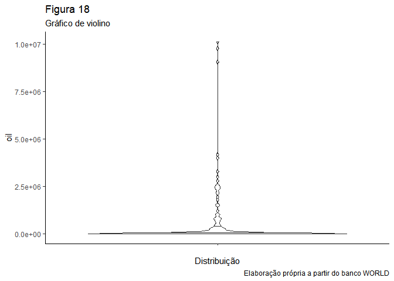<!-- -->

### Descrição gráfica da relação das variáveis **oil** e `dem_score14`

``` r
ggplot(banco, aes(oil, dem_score14)) +
  geom_jitter()+
theme_classic()+
  labs(title = "Figura 19",
       subtitle = "Gráfico de pontos",
       x = "oil",
       y = "dem_score14",
       caption = "Elaboração própria a partir do banco WORLD")+
  geom_smooth(method = "lm")
```

    ## `geom_smooth()` using formula 'y ~ x'

    ## Warning: Removed 2 rows containing non-finite values (stat_smooth).

    ## Warning: Removed 2 rows containing missing values (geom_point).

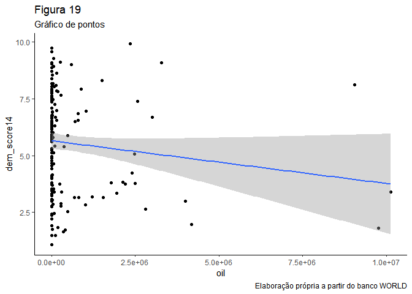<!-- -->

### Correlação entre as variáveis **oil** e `dem_score14`

``` r
cor.test(banco$oil, banco$dem_score14)
```

    ## 
    ##  Pearson's product-moment correlation
    ## 
    ## data:  banco$oil and banco$dem_score14
    ## t = -1.6344, df = 163, p-value = 0.1041
    ## alternative hypothesis: true correlation is not equal to 0
    ## 95 percent confidence interval:
    ##  -0.27443572  0.02631799
    ## sample estimates:
    ##        cor 
    ## -0.1269762

### *A correlação de Pearson apresenta p-valor sem significância estatística e um intervalo de confiança que passa pelo zero. O índice de correlação é de -0,126, com relação negativa entre as variáveis.*

### Regressão linear das variáveis **oil** e `dem_score14`

``` r
rl21 <- lm(dem_score14 ~ oil, data = banco)
summary (rl21)
```

    ## 
    ## Call:
    ## lm(formula = dem_score14 ~ oil, data = banco)
    ## 
    ## Residuals:
    ##    Min     1Q Median     3Q    Max 
    ## -4.574 -1.934  0.144  1.797  4.718 
    ## 
    ## Coefficients:
    ##               Estimate Std. Error t value Pr(>|t|)    
    ## (Intercept)  5.654e+00  1.795e-01  31.503   <2e-16 ***
    ## oil         -1.881e-07  1.151e-07  -1.634    0.104    
    ## ---
    ## Signif. codes:  0 '***' 0.001 '**' 0.01 '*' 0.05 '.' 0.1 ' ' 1
    ## 
    ## Residual standard error: 2.177 on 163 degrees of freedom
    ##   (2 observations deleted due to missingness)
    ## Multiple R-squared:  0.01612,    Adjusted R-squared:  0.01009 
    ## F-statistic: 2.671 on 1 and 163 DF,  p-value: 0.1041

``` r
confint(rl21, level = 0.95)
```

    ##                     2.5 %       97.5 %
    ## (Intercept)  5.299786e+00 6.008613e+00
    ## oil         -4.154234e-07 3.916825e-08

### *A regressão mostra um p-valor de significância estatística forte para o intercepto-y. A regressão apresenta também um p-valor insuficiente, ou sem significância estatística, para o parâmetro de inclinação da reta. O R-squared nos informa que esse modelo responderia por apenas 1,61% do comportamento da variável dependente. O erro residual padrão, ou RMSE, que nos indica o erro médio, ou a distância média entre os valores observados e os estimados, é de 2,177.*

### Descrição gráfica da relação das variáveis **oil** e `democ11`

``` r
ggplot(banco, aes(oil, democ11)) +
  geom_jitter()+
theme_classic()+
  labs(title = "Figura 20",
       subtitle = "Gráfico de pontos",
       x = "oil",
       y = "democ11",
       caption = "Elaboração própria a partir do banco WORLD")+
  geom_smooth(method = "lm")
```

    ## `geom_smooth()` using formula 'y ~ x'

    ## Warning: Removed 23 rows containing non-finite values (stat_smooth).

    ## Warning: Removed 23 rows containing missing values (geom_point).

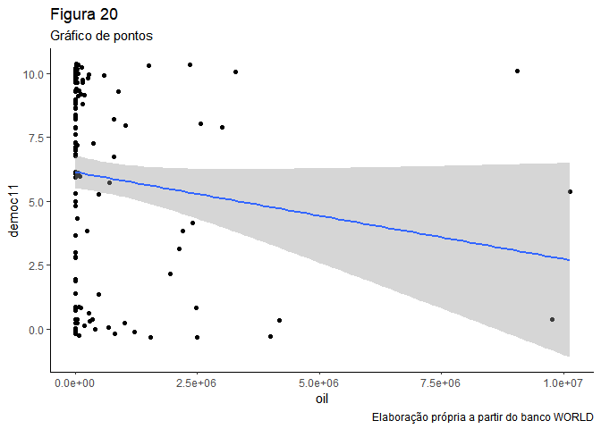<!-- -->

### Correlação entre as variáveis **oil** e `democ11`

``` r
cor.test(banco$oil, banco$democ11)
```

    ## 
    ##  Pearson's product-moment correlation
    ## 
    ## data:  banco$oil and banco$democ11
    ## t = -1.718, df = 142, p-value = 0.08798
    ## alternative hypothesis: true correlation is not equal to 0
    ## 95 percent confidence interval:
    ##  -0.29928445  0.02138076
    ## sample estimates:
    ##        cor 
    ## -0.1426942

### *A correlação de Pearson apresenta p-valor sem significância estatística e um intervalo de confiança que passa pelo zero. O índice de correlação é de -0,142, com relação negativa entre as variáveis.*

### Regressão linear das variáveis **oil** e `democ11`

``` r
rl22 <- lm(democ11 ~ oil, data = banco)
summary (rl22)
```

    ## 
    ## Call:
    ## lm(formula = democ11 ~ oil, data = banco)
    ## 
    ## Residuals:
    ##     Min      1Q  Median      3Q     Max 
    ## -6.1387 -3.2230  0.8616  2.8893  6.9421 
    ## 
    ## Coefficients:
    ##               Estimate Std. Error t value Pr(>|t|)    
    ## (Intercept)  6.139e+00  3.259e-01  18.837   <2e-16 ***
    ## oil         -3.402e-07  1.980e-07  -1.718    0.088 .  
    ## ---
    ## Signif. codes:  0 '***' 0.001 '**' 0.01 '*' 0.05 '.' 0.1 ' ' 1
    ## 
    ## Residual standard error: 3.685 on 142 degrees of freedom
    ##   (23 observations deleted due to missingness)
    ## Multiple R-squared:  0.02036,    Adjusted R-squared:  0.01346 
    ## F-statistic: 2.951 on 1 and 142 DF,  p-value: 0.08798

``` r
confint(rl22, level = 0.95)
```

    ##                     2.5 %       97.5 %
    ## (Intercept)  5.494487e+00 6.782938e+00
    ## oil         -7.316555e-07 5.125498e-08

### *A regressão mostra um p-valor de significância estatística forte para o intercepto-y. A regressão apresenta também um p-valor insuficiente, ou sem significância estatística, para o parâmetro de inclinação da reta. O R-squared nos informa que esse modelo responderia por apenas 2,03% do comportamento da variável dependente. O erro residual padrão, ou RMSE, que nos indica o erro médio, ou a distância média entre os valores observados e os estimados, é de 3,685.*

### Descrição gráfica da relação das variáveis **oil** e `fhrate04_rev`

``` r
ggplot(banco, aes(oil, fhrate04_rev)) +
  geom_jitter()+
theme_classic()+
  labs(title = "Figura 21",
       subtitle = "Gráfico de pontos",
       x = "oil",
       y = "fhrate04_rev",
       caption = "Elaboração própria a partir do banco WORLD")+
  geom_smooth(method = "lm")
```

    ## `geom_smooth()` using formula 'y ~ x'

    ## Warning: Removed 15 rows containing non-finite values (stat_smooth).

    ## Warning: Removed 15 rows containing missing values (geom_point).

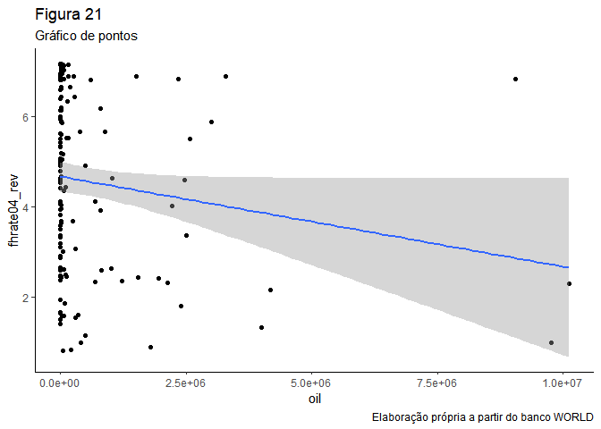<!-- -->

### Correlação entre as variáveis **oil** e `fhrate04_rev`

``` r
cor.test(banco$oil, banco$fhrate04_rev)
```

    ## 
    ##  Pearson's product-moment correlation
    ## 
    ## data:  banco$oil and banco$fhrate04_rev
    ## t = -1.9244, df = 150, p-value = 0.0562
    ## alternative hypothesis: true correlation is not equal to 0
    ## 95 percent confidence interval:
    ##  -0.306837012  0.004083069
    ## sample estimates:
    ##        cor 
    ## -0.1552185

### *A correlação de Pearson apresenta p-valor sem significância estatística e um intervalo de confiança que passa pelo zero. O índice de correlação é de -0,155, com relação negativa entre as variáveis.*

### Regressão linear das variáveis **oil** e `fhrate04_rev`

``` r
rl23 <- lm(fhrate04_rev ~ oil, data = banco)
summary (rl23)
```

    ## 
    ## Call:
    ## lm(formula = fhrate04_rev ~ oil, data = banco)
    ## 
    ## Residuals:
    ##     Min      1Q  Median      3Q     Max 
    ## -3.6658 -1.7613  0.3246  1.8334  4.1268 
    ## 
    ## Coefficients:
    ##               Estimate Std. Error t value Pr(>|t|)    
    ## (Intercept)  4.675e+00  1.663e-01  28.109   <2e-16 ***
    ## oil         -1.990e-07  1.034e-07  -1.924   0.0562 .  
    ## ---
    ## Signif. codes:  0 '***' 0.001 '**' 0.01 '*' 0.05 '.' 0.1 ' ' 1
    ## 
    ## Residual standard error: 1.934 on 150 degrees of freedom
    ##   (15 observations deleted due to missingness)
    ## Multiple R-squared:  0.02409,    Adjusted R-squared:  0.01759 
    ## F-statistic: 3.703 on 1 and 150 DF,  p-value: 0.0562

``` r
confint(rl23, level = 0.95)
```

    ##                     2.5 %       97.5 %
    ## (Intercept)  4.346763e+00 5.004077e+00
    ## oil         -4.033407e-07 5.331137e-09

### *A regressão mostra um p-valor de significância estatística forte para o intercepto-y. A regressão apresenta também um p-valor insuficiente, ou sem significância estatística, para o parâmetro de inclinação da reta. O R-squared nos informa que esse modelo responderia por apenas 2,40% do comportamento da variável dependente. O erro residual padrão, ou RMSE, que nos indica o erro médio, ou a distância média entre os valores observados e os estimados, é de 1,934.*

### Descrição gráfica da relação das variáveis **oil** e `fhrate08_rev`

``` r
ggplot(banco, aes(oil, fhrate08_rev)) +
  geom_jitter()+
theme_classic()+
  labs(title = "Figura 22",
       subtitle = "Gráfico de pontos",
       x = "oil",
       y = "fhrate08_rev",
       caption = "Elaboração própria a partir do banco WORLD")+
  geom_smooth(method = "lm")
```

    ## `geom_smooth()` using formula 'y ~ x'

    ## Warning: Removed 16 rows containing non-finite values (stat_smooth).

    ## Warning: Removed 16 rows containing missing values (geom_point).

<!-- -->

### Correlação entre as variáveis **oil** e `fhrate08_rev`

``` r
cor.test(banco$oil, banco$fhrate08_rev)
```

    ## 
    ##  Pearson's product-moment correlation
    ## 
    ## data:  banco$oil and banco$fhrate08_rev
    ## t = -1.8779, df = 149, p-value = 0.06235
    ## alternative hypothesis: true correlation is not equal to 0
    ## 95 percent confidence interval:
    ##  -0.304387817  0.007867529
    ## sample estimates:
    ##       cor 
    ## -0.152052

### *A correlação de Pearson apresenta p-valor sem significância estatística e um intervalo de confiança que passa pelo zero. O índice de correlação é de -0,152, com relação negativa entre as variáveis.*

### Regressão linear das variáveis **oil** e `fhrate08_rev`

``` r
rl24 <- lm(fhrate08_rev ~ oil, data = banco)
summary (rl24)
```

    ## 
    ## Call:
    ## lm(formula = fhrate08_rev ~ oil, data = banco)
    ## 
    ## Residuals:
    ##     Min      1Q  Median      3Q     Max 
    ## -7.3506 -3.3777 -0.3643  3.6243  8.0856 
    ## 
    ## Coefficients:
    ##               Estimate Std. Error t value Pr(>|t|)    
    ## (Intercept)  7.378e+00  3.286e-01  22.449   <2e-16 ***
    ## oil         -3.824e-07  2.037e-07  -1.878   0.0624 .  
    ## ---
    ## Signif. codes:  0 '***' 0.001 '**' 0.01 '*' 0.05 '.' 0.1 ' ' 1
    ## 
    ## Residual standard error: 3.808 on 149 degrees of freedom
    ##   (16 observations deleted due to missingness)
    ## Multiple R-squared:  0.02312,    Adjusted R-squared:  0.01656 
    ## F-statistic: 3.526 on 1 and 149 DF,  p-value: 0.06235

``` r
confint(rl24, level = 0.95)
```

    ##                     2.5 %       97.5 %
    ## (Intercept)  6.728350e+00 8.027147e+00
    ## oil         -7.848549e-07 1.998791e-08

### *A regressão mostra um p-valor de significância estatística forte para o intercepto-y. A regressão apresenta também um p-valor insuficiente, ou sem significância estatística, para o parâmetro de inclinação da reta. O R-squared nos informa que esse modelo responderia por apenas 2,31% do comportamento da variável dependente. O erro residual padrão, ou RMSE, que nos indica o erro médio, ou a distância média entre os valores observados e os estimados, é de 3,808.*

### Descrição gráfica da relação das variáveis **oil** e `polity`

``` r
ggplot(banco, aes(oil, polity)) +
  geom_jitter()+
theme_classic()+
  labs(title = "Figura 23",
       subtitle = "Gráfico de pontos",
       x = "oil",
       y = "polity",
       caption = "Elaboração própria a partir do banco WORLD")+
  geom_smooth(method = "lm")
```

    ## `geom_smooth()` using formula 'y ~ x'

    ## Warning: Removed 23 rows containing non-finite values (stat_smooth).

    ## Warning: Removed 23 rows containing missing values (geom_point).

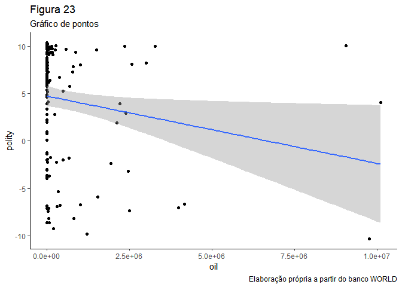<!-- -->

### Correlação entre as variáveis **oil** e `polity`

``` r
cor.test(banco$oil, banco$polity)
```

    ## 
    ##  Pearson's product-moment correlation
    ## 
    ## data:  banco$oil and banco$polity
    ## t = -2.195, df = 142, p-value = 0.02979
    ## alternative hypothesis: true correlation is not equal to 0
    ## 95 percent confidence interval:
    ##  -0.33480603 -0.01811182
    ## sample estimates:
    ##        cor 
    ## -0.1811511

### *A correlação de Pearson apresenta p-valor com significância estatística suficiente e um intervalo de confiança que não passa pelo zero. O índice de correlação é de -0,181, com covariação ou relação negativa entre as variáveis.*

### Regressão linear das variáveis **oil** e `polity`

``` r
rl25 <- lm(polity ~ oil, data = banco)
summary (rl25)
```

    ## 
    ## Call:
    ## lm(formula = polity ~ oil, data = banco)
    ## 
    ## Residuals:
    ##     Min      1Q  Median      3Q     Max 
    ## -13.890  -4.906   2.248   4.505  11.681 
    ## 
    ## Coefficients:
    ##               Estimate Std. Error t value Pr(>|t|)    
    ## (Intercept)  4.752e+00  5.327e-01   8.922 2.09e-15 ***
    ## oil         -7.105e-07  3.237e-07  -2.195   0.0298 *  
    ## ---
    ## Signif. codes:  0 '***' 0.001 '**' 0.01 '*' 0.05 '.' 0.1 ' ' 1
    ## 
    ## Residual standard error: 6.024 on 142 degrees of freedom
    ##   (23 observations deleted due to missingness)
    ## Multiple R-squared:  0.03282,    Adjusted R-squared:  0.026 
    ## F-statistic: 4.818 on 1 and 142 DF,  p-value: 0.02979

``` r
confint(rl25, level = 0.95)
```

    ##                     2.5 %        97.5 %
    ## (Intercept)  3.699314e+00  5.805297e+00
    ## oil         -1.350287e-06 -7.061476e-08

### *A regressão mostra p-valor de significância estatística forte para o intercepto-y. A operação também apresenta um p-valor suficiente para o parâmetro de inclinação da reta. O R-squared nos informa que esse modelo responderia por apenas 3,28% do comportamento da variável dependente. O erro residual padrão, ou RMSE, que nos indica o erro médio, ou a distância média entre os valores observados e os estimados, é de 6,024.*

### *ANÁLISE GERAL DA RELAÇÃO ENTRE A VARIÁVEL `oil` E AS VARIÁVEIS DE DEMOCRACIA*

### *A relação da variável oil com as variáveis democráticas não alcança significância estatística em quatro dos cinco casos, sendo o modelo do binômio oil x polity o único a apresentar um p-valor aceitável. A covariação é negativa - quanto maior a produção de petróleo, menor a pontuação na escala democrática - e de valor -0,181. Além disso, quando observamos o R-squared, percebemos que o modelo explica apenas 3,2% da variação da variável dependente, contribuindo pouco para a compreensão do fenômeno democracia. De modo geral, o comportamento da variável oil para com as variáveis democráticas se assemelha mais em sua fragilidade com o do gini08, enquanto que a variável gdppcap08 demonstra muito mais robustez estatística em sua relação com a democracia em suas várias formas de classificação.*

### Avalie a relação entre crescimento econômico e produção de petróleo. Descreva a relação entre as duas variáveis, meça a correlação entre elas e faça regressões lineares (interpretando em profundidade os resultados dos coeficientes e medidas de desempenho dos modelos). Enfatize as semelhanças e diferenças entre os resultados. Quais são suas conclusões?

### Descrição gráfica da relação das variáveis **oil** e `gdppcap08`

``` r
ggplot(banco, aes(oil, gdppcap08)) +
  geom_jitter()+
theme_classic()+
  labs(title = "Figura 24",
       subtitle = "Gráfico de pontos",
       x = "oil",
       y = "gdppcap08",
       caption = "Elaboração própria a partir do banco WORLD")+
  geom_smooth(method = "lm")
```

    ## `geom_smooth()` using formula 'y ~ x'

    ## Warning: Removed 16 rows containing non-finite values (stat_smooth).

    ## Warning: Removed 16 rows containing missing values (geom_point).

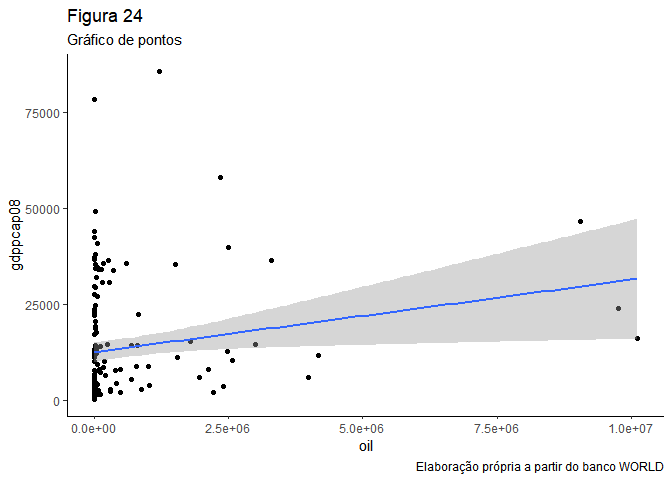<!-- -->

### Correlação entre as variáveis **oil** e `gdppcap08`

``` r
cor.test(banco$oil, banco$gdppcap08)
```

    ## 
    ##  Pearson's product-moment correlation
    ## 
    ## data:  banco$oil and banco$gdppcap08
    ## t = 2.3051, df = 149, p-value = 0.02254
    ## alternative hypothesis: true correlation is not equal to 0
    ## 95 percent confidence interval:
    ##  0.02661893 0.33534756
    ## sample estimates:
    ##       cor 
    ## 0.1855584

### *A correlação de Pearson apresenta p-valor com significância estatística suficiente e um intervalo de confiança que não passa pelo zero. O índice de correlação é de 0,185, com covariação ou relação positiva entre as variáveis.*

### Regressão linear das variáveis **oil** e `gdppcap08`

``` r
rl31 <- lm(gdppcap08 ~ oil, data = banco)
summary (rl31)
```

    ## 
    ## Call:
    ## lm(formula = gdppcap08 ~ oil, data = banco)
    ## 
    ## Residuals:
    ##    Min     1Q Median     3Q    Max 
    ## -15541 -10735  -6347   6549  70967 
    ## 
    ## Coefficients:
    ##              Estimate Std. Error t value Pr(>|t|)    
    ## (Intercept) 1.262e+04  1.319e+03   9.566   <2e-16 ***
    ## oil         1.884e-03  8.173e-04   2.305   0.0225 *  
    ## ---
    ## Signif. codes:  0 '***' 0.001 '**' 0.01 '*' 0.05 '.' 0.1 ' ' 1
    ## 
    ## Residual standard error: 15280 on 149 degrees of freedom
    ##   (16 observations deleted due to missingness)
    ## Multiple R-squared:  0.03443,    Adjusted R-squared:  0.02795 
    ## F-statistic: 5.313 on 1 and 149 DF,  p-value: 0.02254

``` r
confint(rl31, level = 0.95)
```

    ##                    2.5 %       97.5 %
    ## (Intercept) 1.000943e+04 1.522147e+04
    ## oil         2.689153e-04 3.498722e-03

### *A regressão mostra p-valor de significância estatística forte para o intercepto-y. A operação também apresenta um p-valor suficiente para o parâmetro de inclinação da reta. O R-squared nos informa que esse modelo responderia por apenas 3,44% do comportamento da variável dependente. O erro residual padrão, ou RMSE, que nos indica o erro médio, ou a distância média entre os valores observados e os estimados, é de 15280.*

### *ANÁLISE GERAL DA RELAÇÃO ENTRE A VARIÁVEL `oil` E A VARIÁVEL `gdppcap08`*

### *A relação da variável oil com a variável pib per capita (gdppcap08) possui significância estatística moderada, covariação positiva e fraco poder explicativo do modelo em relação à variação da variável dependente, como nos mostra o R-squared.*

### A partir das suas conclusões sobre a relação entre democracia, economia e produção de petróleo, quais considerações são possíveis fazer sobre a relação CAUSAL entre estas variáveis? Lembre dos 4 “hurdles” do livro *Fundamentals of Political Science Research*

### *No tocante a existência ou não de relação causal entre desigualdade e democracia com base nas variáveis utilizadas neste trabalho, bem como utilizando o filtro dos 4 critérios do livro Fundamentals, temos que o binômio `gini08xdemocracia` passa pelo teste da teoria causal crível, mas não atende adequadamente o quesito da variável independente causar a dependente e não o contrário, visto que a relação talvez possa ser invertida. Também possui alguma covariação atestada estatisticamente e não é conclusivo quanto à existência de uma terceira variável que torne a relação espúria. Logo, não se poderia afirmar que a relação desigualdade x democracia é causal.*

### *Já quanto ao binômio `gdppcap08xdemocracia` podemos dizer que se enquadra no critério de teoria causal crível, mas não atende de forma ainda definitiva o critério de ser apenas x quem causa y, e não o contrário. Também apresenta forte covariação estatística, contudo não é definitivo quanto à existência de variável z que torne espúria a relação. Deste modo, os critérios dois e quatro sofrem fragilidades, que dificultam afirmar de pronto que a relação riqueza x democracia é causal.*

### *O binômio `produção de petróleo (oil) x democracia`, falha já no primeiro critério de causalidade, uma vez que não constitui teoria causal crível de qualidade. Da mesma forma, o estabelecimento de relação de dependência entre as duas variáveis gera falha em atender o segundo critério. Quanto à covariação, que é o terceiro critério de causalidade, o binômio consegue atender, ainda que com dificuldade, apoiando-se em apenas uma das variáveis de democracia (polity). A possibilidade de existência de variável z que torne a relação espúria é real, e neste caso, sequer a relaçao causal existe, logo, ela já é espúria sem necessidade de uma variável externa. Sendo assim, não há causalidade entre produção de petróleo e democracia.*

### *Por último, no tocante ao binômio `petróleo (oil) x pib per capta (gdppcap08)` temos a presença de uma teoria causal crível, atendendo ao primeiro critério de causalidade, uma relação clara entre as variáveis independentes e dependentes, que atende ao segundo critério de causalidade, x causa y, e não y causa x. Também é identificada a existência de covariação com significância estatística, cumprindo o terceiro critério, além da não existência de uma variável z que torne a relação entre x e y espúria. Desta forma, podemos concluir que existe relação causal entre a produção de petróleo e o pib per capita dos países.*
