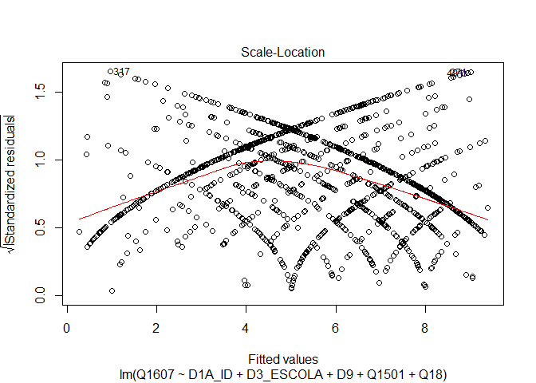

Exercício 7
================
Artur Gueiros

### No exercício anterior foram feitos alguns modelos bivariados. Agora faça uma regressão multivariada mostrando como a nota atribuída a Jair Bolsonaro (variável Q1607) pode ser explicada pelas variáveis idade (D1A\_ID), educação (D3\_ESCOLA), renda (D9), nota atribuída ao PT (Q1501) e auto-atribuição ideológica (Q18) dos respondentes. Interprete o resultado a partir das informações dadas pelo sumário da regressão.

``` r
library(tidyverse)
library(haven)
library(scales)

link <- "https://github.com/MartinsRodrigo/Analise-de-dados/blob/master/04622.sav?raw=true"

download.file(link, "04622.sav", mode = "wb")

banco_eseb18 <- read_spss("04622.sav") 

banco_eseb18$Q1607 <- as.numeric(banco_eseb18$Q1607)
banco_eseb18 <- banco_eseb18 %>% filter (Q1607 <=10)

banco_eseb18$D9 <- as.numeric(banco_eseb18$D9)
banco_eseb18 <- banco_eseb18 %>%  filter(D9 < "9999998") 

banco_eseb18$Q1501 <- as.numeric(banco_eseb18$Q1501)
banco_eseb18 <- banco_eseb18 %>% filter (Q1501 <= 10)

banco_eseb18$Q18 <- as.numeric(banco_eseb18$Q18)
banco_eseb18 <- banco_eseb18 %>% filter (Q18 <= 10)


library(dotwhisker)

regressao_exerc7_1 <- lm( Q1607 ~ D1A_ID + D3_ESCOLA +  D9 + Q1501 + Q18, data = banco_eseb18)

summary(regressao_exerc7_1)
```

    ## 
    ## Call:
    ## lm(formula = Q1607 ~ D1A_ID + D3_ESCOLA + D9 + Q1501 + Q18, data = banco_eseb18)
    ## 
    ## Residuals:
    ##     Min      1Q  Median      3Q     Max 
    ## -9.0176 -2.5841  0.4915  2.1784  9.0477 
    ## 
    ## Coefficients:
    ##               Estimate Std. Error t value Pr(>|t|)    
    ## (Intercept)  5.743e+00  4.768e-01  12.044  < 2e-16 ***
    ## D1A_ID       5.816e-03  6.216e-03   0.936  0.34968    
    ## D3_ESCOLA   -1.543e-01  4.469e-02  -3.453  0.00057 ***
    ## D9          -3.067e-05  2.793e-05  -1.098  0.27230    
    ## Q1501       -4.154e-01  2.359e-02 -17.608  < 2e-16 ***
    ## Q18          3.244e-01  2.627e-02  12.349  < 2e-16 ***
    ## ---
    ## Signif. codes:  0 '***' 0.001 '**' 0.01 '*' 0.05 '.' 0.1 ' ' 1
    ## 
    ## Residual standard error: 3.336 on 1456 degrees of freedom
    ## Multiple R-squared:  0.2831, Adjusted R-squared:  0.2806 
    ## F-statistic:   115 on 5 and 1456 DF,  p-value: < 2.2e-16

``` r
confint(regressao_exerc7_1)
```

    ##                     2.5 %        97.5 %
    ## (Intercept)  4.807218e+00  6.677845e+00
    ## D1A_ID      -6.378648e-03  1.800966e-02
    ## D3_ESCOLA   -2.419686e-01 -6.665908e-02
    ## D9          -8.546072e-05  2.411486e-05
    ## Q1501       -4.616620e-01 -3.691133e-01
    ## Q18          2.728670e-01  3.759211e-01

``` r
dwplot(regressao_exerc7_1, 
       vline = geom_vline(xintercept = 0, colour = "grey60", linetype = 2))
```

<!-- -->

A regressão do modelo apresenta p-valor com boa significância
estatística, com r-quadrado indicando que o modelo explica 28,31% da
variância da variável dependente, neste caso a nota atribuída a
Bolsonaro. Os coeficientes de regressão das variáveis independentes
idade e renda não possuem significância estatística, conforme seus
p-valores. O erro quadrático médio padrão, RMSE é de 3,336,
relativamente alto para um intervalo de variância que vai de 0 a 10. O
intervalo de confiança do intercepto varia entre 4,80 e 6,67.

### Em que medida os resultados se mantém ou se alteram quando comparados com os resultados do exercício anterior, quando foram utilizadas apenas regressões bivariadas?

O poder de explicação do novo modelo muiltivariado é bem maior que os
modelos bivariados tomados isoladamente. Temos agora um r-quadrado
indicando 28,31% de poder explicativo da variável dependente, enquanto
que nos modelos anteriores a variável de maior poder explicativo (nota
atribuída ao PT) chegava a apenas 16,8%. A variável renda se mostrou sem
significância estatística nos dois modelos, e a variável idade que já
era de pouca influência, mostrou-se sem significância quando aplicada no
modelo multivariado. Quanto ao RMSE observamos uma diminuição do seu
valor no modelo multivariado, saindo de valores entre 3,61 e 3,96 nos
modelos bivariados para 3,33 no multivariado, o que mostra que o novo
modelo é também mais preciso que seus anteriores bivariados.

### A partir da exposição de gráficos e testes, avalie se o modelo se adequa aos pressupostos que uma regressão linear exige.

LINEARIDADE DOS PARÂMETROS

``` r
plot(regressao_exerc7_1, 1)
```

<!-- -->

O pressuposto da linearidade não é atendido.

HOMOCEDASTICIDADE

``` r
plot(regressao_exerc7_1, 3)
```

<!-- -->

``` r
library(lmtest)
bptest(regressao_exerc7_1)
```

    ## 
    ##  studentized Breusch-Pagan test
    ## 
    ## data:  regressao_exerc7_1
    ## BP = 57.067, df = 5, p-value = 4.898e-11

``` r
library(car)
ncvTest(regressao_exerc7_1)
```

    ## Non-constant Variance Score Test 
    ## Variance formula: ~ fitted.values 
    ## Chisquare = 23.31391, Df = 1, p = 1.376e-06

O pressuposto da homocedasticidade não é atendido.

AUTOCORRELAÇÃO ENTRE RESÍDUOS

``` r
acf(regressao_exerc7_1$residuals)
```

<!-- -->

``` r
durbinWatsonTest(regressao_exerc7_1)
```

    ##  lag Autocorrelation D-W Statistic p-value
    ##    1      0.05506583      1.887184   0.026
    ##  Alternative hypothesis: rho != 0

O pressuposto da não existência de autocorrelação entre os resíduos é
atendido.

NORMALIDADE DOS RESÍDUOS

``` r
plot(regressao_exerc7_1, 2)
```

<!-- -->

``` r
library(MASS)
sresid <- studres(regressao_exerc7_1) 
shapiro.test(sresid)          
```

    ## 
    ##  Shapiro-Wilk normality test
    ## 
    ## data:  sresid
    ## W = 0.98814, p-value = 1.522e-09

O pressuposto da normalidade dos resíduos não foi atendido.

### Caso algum pressuposto não seja satisfeito, quais são as consequências específicas para o modelo estimado?

LINEARIDADE DOS PARÂMETROS - O gráfico para testar a linearidade dos
parâmetros indica que o pressuposto não é atendido neste modelo, uma
vez que a linha vermelha não está alinhada com o eixo x, deslocando-se
do mesmo à medida os fitted values aumentam. O resultado impede que a
estimação por MQO produza o melhor estimador linear não-viesado. Faz
crescer a diferença entre os parâmetros estimados e os observados.

HOMOCEDASTICIDADE - Tanto o gráfico quanto os teste BP e NCV indicam
heterocedasticidade, pois não identificamos distribuição uniforme,
minimamente simétrica ao longo do eixo x, nem os p-valores dos testes
são altos, acima do nível de significância, de modo a apontar para
possível presença do zero. O resultado indica que haverá problemas no
intervalo de confiança e no teste de hipóteses, afeta a confiabildiade
dos testes de confiança.

AUTOCORRELAÇÃO DOS RESÍDUOS - Os testes aplicados para identificar a
existência de autocorrelação entre os termos estocásticos deram
negativo, com o as linhas verticais dentro dos limites das linhas
tracejadas azuis, e com a estatística DurbinWatson dentro do intervalo
de 1,5 a 2,5. Ou seja, não há problema de autocorrelação entre os
resíduos, evitando-se assim, problemas na confiabilidade dos testes de
significância e intervalos de confiança advindos desse pressuposto.

NORMALIDADE DOS RESÍDUOS - Tanto o gráfico quanto o teste shapiro
apontam para o não atendimento do pressuposto da normalidade dos
resíduos, o que favorece estimadores enviesados e ineficientes.

### Considerando o 4o hurdle do livro *Fundamentals…*, faça um modelo de regressão extra adicionando uma variável **numérica** que foi omitida do modelo anterior, mas que possa ter relação causal com a variável dependente (e talvez alguma associação com as independentes anteriores). Justifique a variável extra e analise o resultado.

``` r
banco_eseb18$Q2 <- as.numeric(banco_eseb18$Q2)

glimpse(banco_eseb18$Q2)
```

    ##  num [1:1462] 3 3 4 3 4 3 4 2 3 3 ...

``` r
regressao_exerc7_2 <- lm( Q1607 ~ D1A_ID + D3_ESCOLA +  D9 + Q1501 + Q18 + Q2, data = banco_eseb18)

summary(regressao_exerc7_2)
```

    ## 
    ## Call:
    ## lm(formula = Q1607 ~ D1A_ID + D3_ESCOLA + D9 + Q1501 + Q18 + 
    ##     Q2, data = banco_eseb18)
    ## 
    ## Residuals:
    ##    Min     1Q Median     3Q    Max 
    ## -8.665 -2.636  0.491  2.209  8.603 
    ## 
    ## Coefficients:
    ##               Estimate Std. Error t value Pr(>|t|)    
    ## (Intercept)  6.668e+00  5.572e-01  11.968  < 2e-16 ***
    ## D1A_ID       3.609e-03  6.236e-03   0.579  0.56282    
    ## D3_ESCOLA   -1.781e-01  4.517e-02  -3.943 8.42e-05 ***
    ## D9          -3.623e-05  2.790e-05  -1.299  0.19429    
    ## Q1501       -4.111e-01  2.355e-02 -17.455  < 2e-16 ***
    ## Q18          3.175e-01  2.627e-02  12.084  < 2e-16 ***
    ## Q2          -2.569e-01  8.066e-02  -3.185  0.00148 ** 
    ## ---
    ## Signif. codes:  0 '***' 0.001 '**' 0.01 '*' 0.05 '.' 0.1 ' ' 1
    ## 
    ## Residual standard error: 3.325 on 1455 degrees of freedom
    ## Multiple R-squared:  0.2881, Adjusted R-squared:  0.2851 
    ## F-statistic: 98.12 on 6 and 1455 DF,  p-value: < 2.2e-16

``` r
confint(regressao_exerc7_2)
```

    ##                     2.5 %        97.5 %
    ## (Intercept)  5.575360e+00  7.761232e+00
    ## D1A_ID      -8.622616e-03  1.584096e-02
    ## D3_ESCOLA   -2.667097e-01 -8.950665e-02
    ## D9          -9.095099e-05  1.849635e-05
    ## Q1501       -4.573512e-01 -3.649438e-01
    ## Q18          2.659695e-01  3.690511e-01
    ## Q2          -4.150724e-01 -9.864724e-02

A variável extra Q2 representa a intensidade com que as pessoas
acompanham a política nos noticiários (TV, rádio, jornais, internet). O
nível de informação política pode vir a influenciar a nota em Bolsonaro,
de modo que um cidadão que não acompanha política pode se portar de modo
distinto daquele que a acompanha de forma intensiva. Como variável
independente ela pode contribuir para o aperfeiçoamento do modelo
multivariado elaborado, ajudando-o a controlar também por ela.

O modelo que inclui a variável Q2 tem p-valor geral com significância
estatística. Não apresenta significância para os coeficientes das
variáveis idade e renda, segundo o r-quadrado esse modelo explica
28,81% da variância da variável dependente, e tem RMSE de 3,325, com
intercepto variando no intervalo de confiança entre 5,57 e 7,76.

### Compare o resultado obtido com o modelo e conclusões anteriores.

o modelo que inclui a variável Q2 apresenta resultados ligeiramente
melhores que o anterior, com r-squared um pouco mais representativo,
0,2831 para 0,2881, e erro padrão um pouco menor (3,336 no anterior e
3,325 no novo). O novo modelo tem poder explicativo um pouco maior e
erro padrão um pouco menor. Em suma, a inclusão da variável, apesar de
contribuir pouco, resultou num modelo levemente mais abrangente e
preciso que o anterior.
