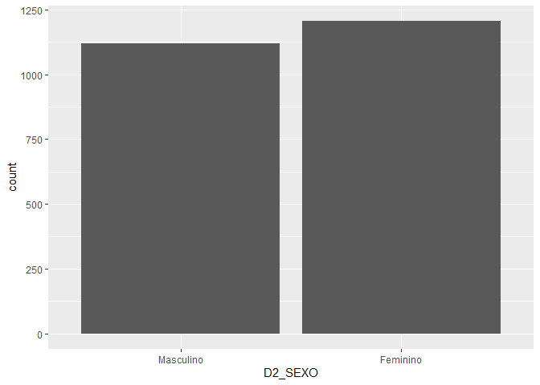

Exercício 8
================
Artur Gueiros

### Continuaremos com a utilização dos dados do ESEB2018. Carregue o banco da mesma forma que nos exercicios anteriores

``` r
library(tidyverse)
library(haven)
library(scales)

link <- "https://github.com/MartinsRodrigo/Analise-de-dados/blob/master/04622.sav?raw=true"

download.file(link, "04622.sav", mode = "wb")

banco <- read_spss("04622.sav") 

banco <- banco %>%
  mutate(D2_SEXO = as_factor(D2_SEXO),
         D10 = as_factor(D10)) %>%
  filter(Q1607 < 11)
```

### Começaremos a utilizar no modelo de regressão variáveis qualitativas/categóricas. A primeira delas é sexo (D2\_SEXO). Represente esta variável graficamente.

``` r
ggplot(banco, aes(D2_SEXO)) +
geom_bar()
```

<!-- -->

### Represente graficamente a associação entre sexo e nota atribuida a Bolsonaro (Q1607)

``` r
ggplot(banco, aes(D2_SEXO, Q1607)) +
geom_violin(draw_quantiles = c(0.25, 0.5, 0.75))
```

<!-- -->

### Teste a associação entre sexo e aprovação de Bolsonaro. Qual é sua conclusão?

Associação entre as variáveis `D2_SEXO` e `Q1607`

``` r
t.test(Q1607 ~ D2_SEXO, data = banco)
```

    ## 
    ##  Welch Two Sample t-test
    ## 
    ## data:  Q1607 by D2_SEXO
    ## t = 5.88, df = 2324, p-value = 4.693e-09
    ## alternative hypothesis: true difference in means is not equal to 0
    ## 95 percent confidence interval:
    ##  0.6392909 1.2790608
    ## sample estimates:
    ## mean in group Masculino  mean in group Feminino 
    ##                6.020536                5.061360

A associação apresenta significância estatística, com intervalo de
confiança indo de 0,63 a 1,27, não passando pelo zero. A média em cada
um dos níveis categóricos masculino e feminino é 6,02 e 5,06,
respectivamente.

### Faça uma regressão bivariada com estas duas variáveis, verificando em que medida sexo explica a nota atribuida a Bolsonaro. Interprete o resultado da regressão (o \(\beta\), o \(\alpha\), p-valores e medidas de desempenho do modelo)

Regressão linear das variáveis `D2_SEXO` e `Q1607`

``` r
regressao_sexo <- lm(Q1607 ~ D2_SEXO, data = banco)
summary (regressao_sexo)
```

    ## 
    ## Call:
    ## lm(formula = Q1607 ~ D2_SEXO, data = banco)
    ## 
    ## Residuals:
    ##     Min      1Q  Median      3Q     Max 
    ## -6.0205 -4.0614 -0.0205  3.9795  4.9386 
    ## 
    ## Coefficients:
    ##                 Estimate Std. Error t value Pr(>|t|)    
    ## (Intercept)       6.0205     0.1178  51.112  < 2e-16 ***
    ## D2_SEXOFeminino  -0.9592     0.1636  -5.863 5.18e-09 ***
    ## ---
    ## Signif. codes:  0 '***' 0.001 '**' 0.01 '*' 0.05 '.' 0.1 ' ' 1
    ## 
    ## Residual standard error: 3.942 on 2324 degrees of freedom
    ## Multiple R-squared:  0.01458,    Adjusted R-squared:  0.01415 
    ## F-statistic: 34.38 on 1 and 2324 DF,  p-value: 5.178e-09

``` r
confint(regressao_sexo, level = 0.95)
```

    ##                     2.5 %     97.5 %
    ## (Intercept)      5.789550  6.2515214
    ## D2_SEXOFeminino -1.279962 -0.6383893

O intercepto tem significância estatística e valor estimado de 6,02, com
intervalo de confiança de 95% entre 5,78 e 6,25. O coeficente de
regressão ou parâmetro de inclinação tem valor estimado de -0.9592 e
também apresenta p-valor com forte significância estatística, com
intervalo de confiança não passando pelo zero. O r-quadrado indica que o
modelo explica 1,4% da variação da variável dependente, enquanto que o
erro padrão residual de 3,942 é alto para a medida da variável
dependente. O p-valor geral do modelo também apresenta significância
estatística. A variável dummy omitida é o sexo masculino. O modelo
parece sólido estatisticamente, mas possui pouco poder explicativo.

### Outra variável categórica bastante presente no debate sobre voto na última eleição é religião (D10). Represente esta variável graficamente.

``` r
ggplot(banco, aes(D10, ..count../sum(..count..) )) +
  geom_bar(na.rm = T) +
  scale_y_continuous(labels = percent)
```

<!-- -->

``` r
ggplot(banco, aes(,D10)) +
  geom_bar(na.rm = T)
```

<!-- -->

### Crie no banco de dados uma variável de religião modificada chamada `religiao` com as categorias “Evangélica”, “Católica”, “Não tem religião”, e agregue todas as outras na categoria “Outras”.

``` r
Outras <- levels(banco$D10)[-c(3,5,13)]

banco <- banco %>%
  mutate(religiao = case_when(D10 %in% Outras ~ "Outras",
                              D10 == "Católica" ~ "Católica",
                              D10 == "Evangélica" ~ "Evangélica",
                              D10 == "Não tem religião" ~ "Não tem religião"))
```

### Represente graficamente a associação entre religiao e nota atribuida a Bolsonaro

``` r
ggplot(banco, aes(religiao, ..count../sum(..count..) )) +
  geom_bar() +
  scale_y_continuous(labels = percent)
```

<!-- -->

### Para fazer o teste estatistico da associação entre as variáveis, não podemos usar o teste-t pois neste caso a variável categórica possui diversos níveis. O adequado é utilizar o teste de ANOVA ou o teste de Kruskal. Abaixo ilustramos como fazer esse teste. O Kruskal-test indica se há diferença entre alguma das categorias da variável e a variável contínua, mas não especifica como as diferentes categorias se diferenciam. Isso pode ser obtido com o teste de Wilcox, que compara os agrupamentos par a par. Como você interpreta esse resultado?

``` r
kruskal.test(Q1607 ~ religiao, data = banco)
```

    ## 
    ##  Kruskal-Wallis rank sum test
    ## 
    ## data:  Q1607 by religiao
    ## Kruskal-Wallis chi-squared = 61.013, df = 3, p-value = 3.571e-13

``` r
pairwise.wilcox.test(banco$Q1607, banco$religiao,
                     p.adjust.method = "BH")
```

    ## 
    ##  Pairwise comparisons using Wilcoxon rank sum test 
    ## 
    ## data:  banco$Q1607 and banco$religiao 
    ## 
    ##                  Católica Evangélica Não tem religião
    ## Evangélica       7.4e-06  -          -               
    ## Não tem religião 0.043    8.3e-06    -               
    ## Outras           1.2e-05  4.4e-11    0.126           
    ## 
    ## P value adjustment method: BH

*Kruskal-Wallis* O p-valor do teste de Kruskal-Wallis de 3.571e-13
(menor que um nível de significância de 0,05) nos leva a rejeitar a
hipótese nula de que não existe diferença entre a avaliação de
Bolsonaro dependendo de cada religião. Ou seja, há diferença entre as
categorias da variável religião e a variável dependente.

*Wilcox* Avaliando os p-valores das comparações duas a duas, podemos ver
que o teste de Wilcox revelou só não haver diferença significativa entre
a avaliação de Bolsonaro e as categorias “outras” e “não tem religião”
(p-valor = 0,126). O teste apresentou evidências de diferença
significativa entre a nota dada a Bolsonaro e as religiões “evangélica”
e “católica” (p-valor = 7.4e-06), “não tem religião” e “católica”
(p-valor = 0.043), “não tem religião” e “evangélica” (p-valor =
8.3e-06), “outras” e “católica” (p-valor = 1.2e-05) e entre “outras” e
“evangélicas” (p-valor = 4.4e-11).

### Faça uma regressão linear para verificar em que medida religião explica a avaliação de Bolsonaro. Interprete o resultado da regressão (cada um dos \(\beta\)s, o \(\alpha\), p-valores e medidas de desempenho do modelo)

``` r
regressao_religiao <- lm(Q1607 ~ religiao, data = banco)
summary (regressao_religiao)
```

    ## 
    ## Call:
    ## lm(formula = Q1607 ~ religiao, data = banco)
    ## 
    ## Residuals:
    ##    Min     1Q Median     3Q    Max 
    ## -6.259 -4.107  0.559  3.741  5.893 
    ## 
    ## Coefficients:
    ##                          Estimate Std. Error t value Pr(>|t|)    
    ## (Intercept)                5.4410     0.1146  47.470  < 2e-16 ***
    ## religiaoEvangélica         0.8184     0.1838   4.452 8.93e-06 ***
    ## religiaoNão tem religião  -0.6325     0.3081  -2.053   0.0402 *  
    ## religiaoOutras            -1.3339     0.2859  -4.665 3.26e-06 ***
    ## ---
    ## Signif. codes:  0 '***' 0.001 '**' 0.01 '*' 0.05 '.' 0.1 ' ' 1
    ## 
    ## Residual standard error: 3.921 on 2322 degrees of freedom
    ## Multiple R-squared:  0.0261, Adjusted R-squared:  0.02484 
    ## F-statistic: 20.74 on 3 and 2322 DF,  p-value: 2.936e-13

``` r
confint(regressao_religiao, level = 0.95)
```

    ##                               2.5 %      97.5 %
    ## (Intercept)               5.2162572  5.66579408
    ## religiaoEvangélica        0.4578709  1.17889504
    ## religiaoNão tem religião -1.2366115 -0.02841855
    ## religiaoOutras           -1.8945985 -0.77316710

Como resultado da regressão temos que o valor estimado do intercepto é
5,44, com erro padrão de 0,11, o que equivale a dizer que se todas as
variáveis independentes forem zero, a nota de bolsonaro será entre 5,21
e 5,66, num intervalo de confiança de 95%. Todos os parâmetros do modelo
apresentam significância estatística, haja vista seus p-valores com uma
ou três estrelas. Por se tratar de um modelo que envolve variável
categórica como variável independente, o R omite uma das categorias,
trantando-a como categoria de referência, nesse caso, foi a religião
católica, da variável religião. A partir daí, podemos interpretar que
os coeficientes de regressão estimados das categorias “evangélica”, “não
tem religião” e “outras” são todos em relação à categoria “católica”. Na
categoria evangélica, para cada movimento de uma unidade de medida da
variável independente religião há um efeito de 0,81 na nota de Bolsonaro
em relação ao que seria com a religião católica, numa correlação
positiva. Já para as categorias “não tem religião” e “outras”, as
associações à avaliação de Bolsonaro são negativas quando comparadas ao
observado na religião católica, nas medidas de -,063 e -1,33,
respectivamente. Quanto ao desempenho, o R-quadrado nos mostra que o
modelo explica 2,6% da variância da variável dependente, enquanto que o
RMSE de 3,921, por ser alto para o intervalo de medida da variável
dependente, aponta para uma ineficiência no poder preditivo do modelo. O
p-valor geral do modelo possui significância estatística forte.

### Faça uma regressao linear avaliando ao mesmo tempo em que medida religiao e sexo explicam a avaliacao de Bolsonaro. Interprete o resultado de cada um dos coeficientes a partir da representação gráfica destes.

``` r
library(dotwhisker)

regressao_sexo_religiao <- lm(Q1607 ~ religiao + D2_SEXO, data = banco)
summary (regressao_sexo_religiao)
```

    ## 
    ## Call:
    ## lm(formula = Q1607 ~ religiao + D2_SEXO, data = banco)
    ## 
    ## Residuals:
    ##     Min      1Q  Median      3Q     Max 
    ## -6.8130 -3.9448  0.1915  3.7365  6.3682 
    ## 
    ## Coefficients:
    ##                          Estimate Std. Error t value Pr(>|t|)    
    ## (Intercept)                5.9493     0.1401  42.477  < 2e-16 ***
    ## religiaoEvangélica         0.8637     0.1825   4.732 2.36e-06 ***
    ## religiaoNão tem religião  -0.6813     0.3057  -2.229   0.0259 *  
    ## religiaoOutras            -1.3130     0.2837  -4.629 3.88e-06 ***
    ## D2_SEXOFeminino           -1.0045     0.1616  -6.215 6.07e-10 ***
    ## ---
    ## Signif. codes:  0 '***' 0.001 '**' 0.01 '*' 0.05 '.' 0.1 ' ' 1
    ## 
    ## Residual standard error: 3.889 on 2321 degrees of freedom
    ## Multiple R-squared:  0.04204,    Adjusted R-squared:  0.04039 
    ## F-statistic: 25.46 on 4 and 2321 DF,  p-value: < 2.2e-16

``` r
confint(regressao_sexo_religiao, level = 0.95)
```

    ##                               2.5 %      97.5 %
    ## (Intercept)               5.6746301  6.22393694
    ## religiaoEvangélica        0.5057662  1.22158996
    ## religiaoNão tem religião -1.2807278 -0.08181084
    ## religiaoOutras           -1.8692530 -0.75671984
    ## D2_SEXOFeminino          -1.3214476 -0.68754476

``` r
dwplot(regressao_sexo_religiao, 
       vline = geom_vline(xintercept = 0, colour = "grey60", linetype = 2))
```

<!-- -->

O gráfico nos permite afirmar que todas as variáveis independentes do
modelo apresentam significância estatística, uma vez que nenhum dos
casos passa pelo eixo vertical que representa o zero. As categorias
feminino, na variável sexo, e religiao\_evangélica na variável religião,
são as que possuem menor erro padrão, e portanto fornecem uma estimativa
mais assertiva. Outra informação dada pelo gráfico é que a correlação da
categoria religiao\_evangélica, da variável religião, é positiva para
com a variável dependente, enquanto que as outras categorias da mesma
variável têm associação negativa, assim como a categoria feminino da
variável sexo. O programa estatístico R, ao rodar a regressão do modelo,
adotou como categorias omitidas a religião católica, na variável
religião, e a categoria masculino, na variável sexo.
